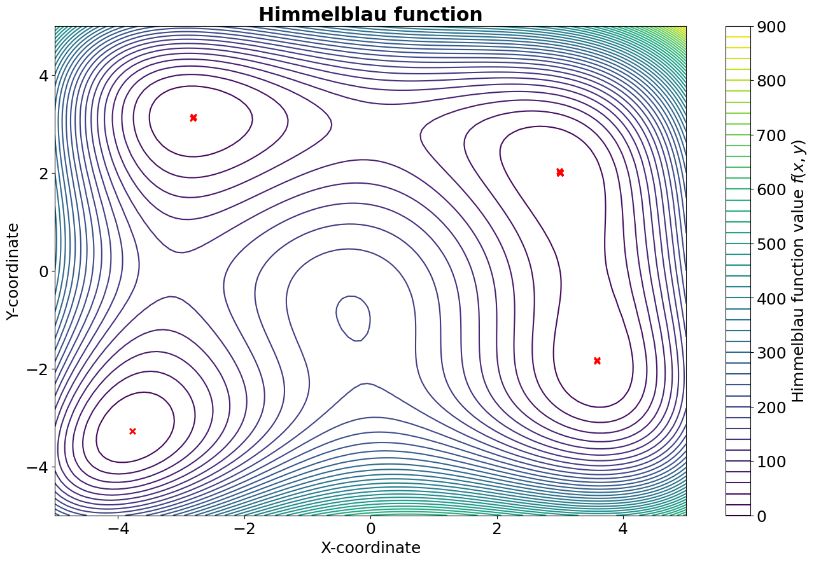
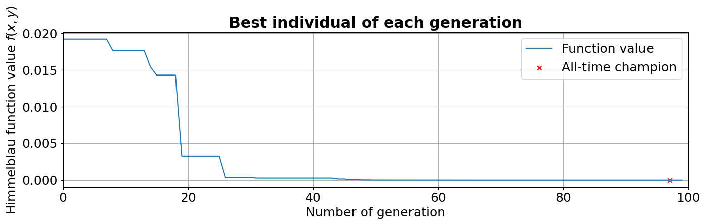
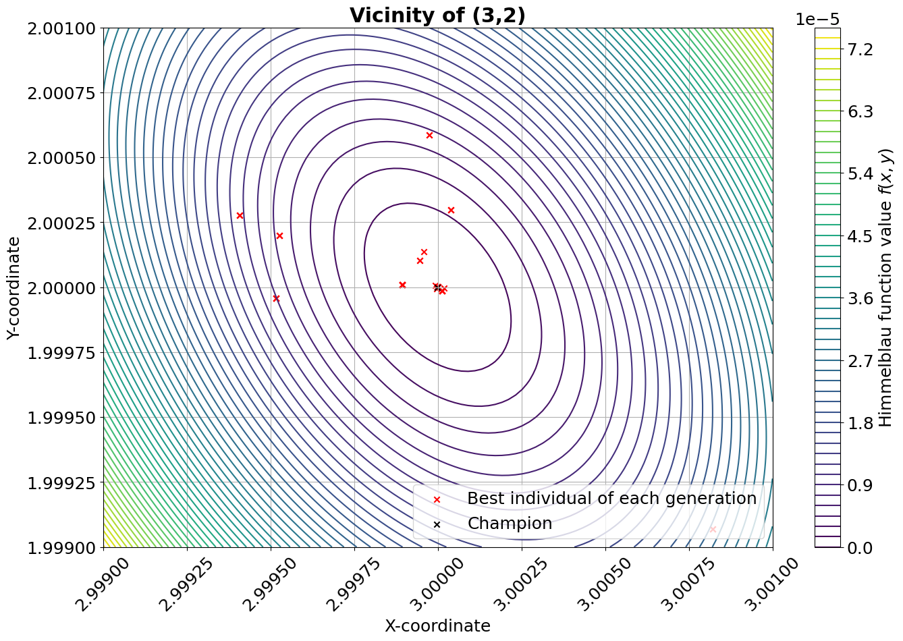

.. _`optimization_pygmo`:

***********************
Optimization with PyGMO
***********************

The following paragraphs will give some information on how to
optimize an astrodynamics problem written with tudatpy through the
usage of `PyGMO`_. The aim of this page is not to provide comprehensive
documentation to the usage of PyGMO (such a guide already exists, see previous link),
but rather to introduce the reader to the logic behind PyGMO and illustrate how
to employ it jointly with tudatpy.

.. _`PyGMO`: https://esa.github.io/pygmo2/index.html

.. contents:: Content of this page
   :local:

About PyGMO
######################

The "basic" idea
----------------

PyGMO is a Python scientific library derived from `PaGMO`_ (Parallel Global Multiobjective Optimization),
an open-source software developed at the European Space Agency by F. Biscani and D. Izzo [Biscani2020]_.
The flexible and complete framework of PaGMO (and of its equivalent PyGMO) can be applied to
"single-objective, multiple-objective, continuous, integer, box-constrained, non linear constrained, stochastic,
deterministic optimization problems".
Both programs are based on the concept of the *island model*, which in short is a computational strategy that allows to
run the optimization process in parallel (hence its name) by using multithreading techniques.

.. _`PaGMO`: https://esa.github.io/pagmo2/index.html

Installing PyGMO
----------------

PyGMO is not part of the standard tudatpy distribution, but it can easily be added to any tudatpy environment.
Here we will assume that you already have a standard tudatpy environment (called ``tudat-space``) installed.
If that is not the case, please follow the "Installing Tudat(Py)" instructions in :ref:`getting_started_installation`.

In order to make PyGMO available inside the ``tudat-space`` environment, the following steps need to be taken.
First, activate the ``tudat-space`` environment:

.. code:: bash

    $ conda activate tudat-space

Next, use conda to install the PyGMO package *to this environment*:

.. code:: bash

    (tudat-space) $ conda install pygmo

.. warning::

    Please ensure to install PyGMO in your given tudatpy environment. Do not add the PyGMO package to your base environment.

.. note::

    If adding pygmo to an existing conda environment returns errors, create a new conda environment with pygmo added as a
    dependency. 

    .. code:: yaml

        name: tudat-space
        channels:
          - conda-forge
          - tudat-team
        dependencies:
          - tudatpy
          - matplotlib
          - scipy
          - pandas
          - jupyterlab
          - pygmo # <-- Add this line to your environment.yaml

Lastly, you should verify that the package is now available in your tudatpy environment.
You can do so via your IDE or by using the following command in your terminal:

.. code:: bash

    (tudat-space) $ conda list | grep pygmo

which should return the name, version, build and channel of the pygmo installation in the given environment.

First steps
-----------

There are a number of basic elements concurring to the solution of an optimization problem using PyGMO.
These will be listed below and briefly explained; each of them correspond to an equivalent base class in PyGMO.

1. *A problem*. This represents the problem for which an optimal solution must be found.
This is usually known, in PyGMO terminology, as User-Defined Problem (UDP);
it is usually more interesting to code and solve a custom problem, but there are certain problems that
are defined within PyGMO and can be readily used.

2. *An algorithm*. This is the procedure to solve the optimization problem.
Similarly, this is known as User-Defined Algorithm (UDA); differently from the problem,
it is often more convenient to take advantage of the many UDAs offered by PyGMO. Nonetheless, it is always
possible to code a custom solver.

3. *One (or more) individuals*. Optimizers rely not on one, but many decision vectors that may interact (heuristic
optimizers) or may not (analytical solvers) interact with each other. A set of individuals form a *population*.
In PyGMO, it is more frequent to deal with an entire population, rather than with a single individual.

There are also two other fundamental blocks that conclude the structure of the island model.
One is the *island* itself, which represents the main parallelization block to achieve simultaneous
computation; the other one is the *archipelago*, consisting of a set of islands. These are useful
to solve more advanced and computationally-demanding problems, therefore their usage will not be analyzed in
detail here.

Optimizing a simple problem
###########################

In this example, we will attempt to optimize a simple problem: the minimization of a
known analytical function. We chose `Himmelblau's function`_  as it is often employed
to test the performance of optimization algorithms:

.. _`Himmelblau's function`: https://en.wikipedia.org/wiki/Himmelblau%27s_function

.. math:: f(x,y) = (x^2 + y - 11)^2 + (x + y^2 - 7)

subject to the bounds:

.. math:: \begin{align*} &-5 < x < 5 \\ &-5 < y < 5 \end{align*}

There are four equal minima which can be found analytically. These are:

.. math:: \begin{align*} f(3, 2) &= 0 \\ f(−2.805118,3.283186) &= 0 \\ f(−3.779310,−3.283186) &= 0 \\ f(3.584458,−1.848126) &= 0 \end{align*}

Below, we will explain how to write the code for this specific UDP and solve it with PyGMO.
The original code, which is broken down into parts for the sake of clarity, is available :download:`here <_static/pygmo_himmelblau_test.py>`.

1. Creation of the UDP class
----------------------------

First, we create a Python class to describe the problem. This class will be fed later
to PyGMO, therefore it must be compatible. To be PyGMO-compatible, a UDP class must
have two methods:

- ``fitness(np.array)``: it takes a vector of size :math:`n` as input and returns a list with :math:`p` values
  as output. :math:`n` and :math:`p` are respectively the dimension of the problem (in our case, :math:`n = 2`)
  and the number of objectives (in our case, :math:`p = 1` because it is a single-objective optimization).

- ``get_bounds()``: it takes no input and returns a tuple of two :math:`n`-dimensional lists, defining respectively the
  lower and upper boundaries of each variable. The dimension of the problem (i.e. the value of :math:`n`) is
  automatically inferred by the return type of the this function.

.. literalinclude:: ./_static/himmelblau_udp.py
             :language: python

.. seealso::
   For more information, see the PyGMO documentation about
   `defining an UDP class <https://esa.github.io/pygmo2/tutorials/coding_udp_simple.html>`_.

2. Creation of a PyGMO problem
------------------------------

Once the UDP class is created, we must create a PyGMO problem object by passing
an instance of our class to ``pygmo.problem``. Note that an instance of the UDP class
must be passed as input to pygmo.problem() and NOT the class itself. It is also possible to use a PyGMO UDP, i.e.
a problem that is already defined in PyGMO, but it will not be shown in this tutorial. In this example,
we will use only one generation. More information about the PyGMO problem class is available
`on the PyGMO website <https://esa.github.io/pygmo2/tutorials/using_problem.html>`_.

.. literalinclude:: ./_static/pygmo_problem.py
             :language: python

3. Selection of the algorithm
-----------------------------

Now we must choose a specific optimization algorithm to be passed to ``pygmo.algorithm``. For this example, we will use
the Differential Evolution algorithm (DE). Many different algorithms are available
through PyGMO, including heuristic methods and local optimizers. It is also possible to create a User-Defined Algorithm
(UDA), but in this tutorial we will use an algorithm readily available in PyGMO. Since the algorithm internally uses a
random number generator, a seed can be passed as an optional input argument to ensure reproducibility.

.. seealso::
   For more information, see the PyGMO documentation about `available algorithms <https://esa.github.io/pygmo2/overview
   .html#list-of-algorithms>`_ and the `PyGMO algorithm class <https://esa.github.io/pygmo2/tutorials/using_algorithm.html>`_.

.. note::
    During the actual optimization process, fixing the seed is probably what you do **not** want to do.

.. literalinclude:: ./_static/pygmo_algorithm.py
             :language: python

4. Initialization of a population
---------------------------------

As a final preliminary step, a population of individuals must be initialized with ``pygmo.population``. Each individual has an associated
decision vector which can change (evolution), the resulting fitness vector, and an unique ID to allow their tracking.
The population is initialized starting from a specific problem to ensure that all individuals are
compatible with the UDP. The default population size is 0; in this example, we use 1000 individuals.
Similarly to what was done for the algorithm, since the population initialization is random,
a seed can be passed as an optional input argument to ensure reproducibility.

.. literalinclude:: ./_static/pygmo_population.py
             :language: python

.. seealso::
   For more information, see the page from the PyGMO documentation about
   `the PyGMO population class <https://esa.github.io/pygmo2/tutorials/using_population.html>`_.

5. Evolve the population
------------------------

To actually solve the problem, it is necessary to *evolve* the population.
This can be done by calling the ``evolve()`` method of the ``pygmo.algorithm`` object. We do so 100 times
in a recursive manner. At each evolution stage, it is possible to retrieve the full population through the ``get_x()``
method and, analogously, the related fitness values with ``get_f()``. If we are only interested in the best individual
of each evolution stage, we can find its index through the ``pop.best_idx()`` method. On the contrary, the ``champion_x``
(and the related ``champion_f``) attributes retrieves the decision variable vector and its fitness value. Note that the
*champion* is the best individual across all evolutionary stages (not necessarily the best individual found at the last
evolution).

.. literalinclude:: ./_static/pygmo_evolution.py
             :language: python

.. seealso::
   For more information, see the PyGMO documentation about
   `evolving a PyGMO population <https://esa.github.io/pygmo2/tutorials/evolving_a_population.html>`_.

6. Visualization of the results
-------------------------------

In the following figure, a contour plot of the Himmelblau's function is reported, where the red X represent the best
individuals of each generation. As it can be seen, the algorithm manages to locate all four identical minima.

In the plot below, instead, we can see how the fitness of the best individual improves while the population is evolved.
It can be seen, as anticipated before, that the champion is found a few generations before the last one.

The figure below illustrates indicatively the performance of the algorithm in the vicinity of one of the four minima.

7. Performance of the algorithm
-------------------------------

Since this is supposed to be an introductory example, a performance analysis of the algorithm is not presented here.
However, it is interesting to provide a quick comparison between the optimization conducted with PyGMO's DE algorithm
two other simple analytical methods, namely a grid search and a Monte-Carlo search (both of them were run with 1000
points per variable). In the table below, referred to the minimum located at (3,2), the results are summarized in terms
of accuracy and computational expenses.
As it can be noticed, the DE algorithm reaches a fitness level several orders of magnitude below the other two methods,
despite using only 10% of the computational resources.

.. tabularcolumns:: |l|c|c|c|

+-----------------------------------------------+------------------------------+-----------------------------------------------------+----------------------------+
| **Optimization method**                       | **Fitness value**            | **Decision variable difference wrt (3,2)**          | **Function evaluations**   |
+-----------------------------------------------+------------------------------+-----------------------------------------------------+----------------------------+
| PyGMO's DE (100 gens, 1000 individuals)       | :math:`1.292 \cdot 10^{-11}` | :math:`(-6.365 \cdot 10^{-7}, +2.382 \cdot 10^{-7})`| :math:`1.01 \cdot 10^{5}`  |
+-----------------------------------------------+------------------------------+-----------------------------------------------------+----------------------------+
| Grid search (1000 points per variable)        | :math:`4.215 \cdot 10^{-4}`  | :math:`(-2.002 \cdot 10^{-3}, -3.003 \cdot 10^{-3})`| :math:`1.00 \cdot 10^{6}`  |
+-----------------------------------------------+------------------------------+-----------------------------------------------------+----------------------------+
| Monte-Carlo search (1000 points per variable) | :math:`7.095 \cdot 10^{-4}`  | :math:`(+4.595 \cdot 10^{-3}, -9.645 \cdot 10^{-4})`| :math:`1.00 \cdot 10^{6}`  |
+-----------------------------------------------+------------------------------+-----------------------------------------------------+----------------------------+

.. [Biscani2020] Biscani et al., (2020). A parallel global multiobjective framework for optimization: pagmo.
   Journal of Open Source Software, 5(53), 2338, https://doi.org/10.21105/joss.02338.
