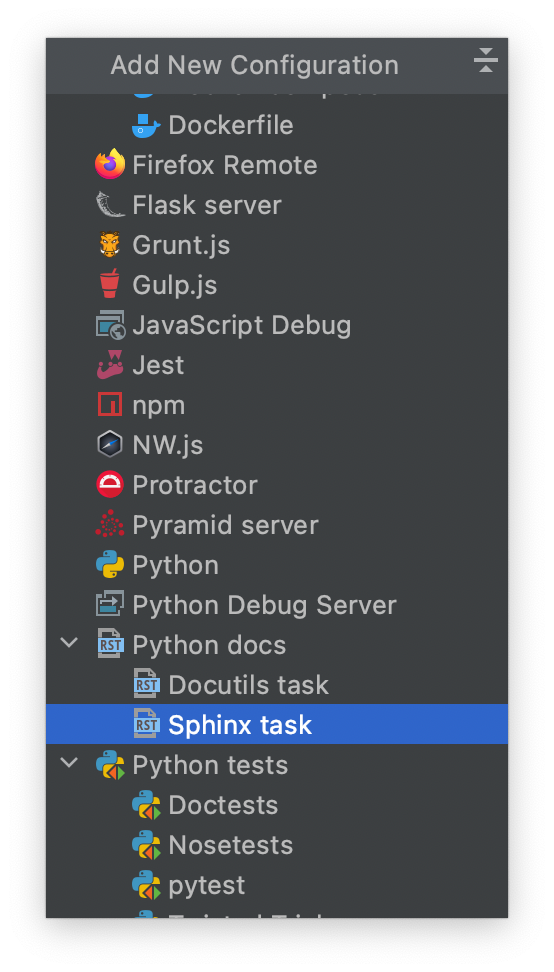

**********************************
Getting Started with Documentation
**********************************

Compiling Documentation Locally
################################

This example is a step-by-step guide on how to compile the tudat-space documentation
locally on your system using ``sphinx``.

.. note::

    This procedure requires that Anaconda or Miniconda is installed. For
    information regarding the use of the conda ecosystem, please see :ref:`Getting Started with Conda`.

1. Create an environment that will be satisfy all dependencies required for building documentation, then activate it.

.. code:: bash

    conda create -y --name tudat-docs python=3.7 & conda activate tudat-docs

2. Install all dependencies for building the documentation. The ``-y`` flag instructs the ``conda-install`` command to install packages without asking for confirmation.

.. code:: batch

    :: Windows systems
    conda install sphinx -y & ^
    conda install sphinx_rtd_theme -y & ^
    conda install sphinx-tabs -y & ^
    conda install sphinx-copybutton -y & ^
    pip install rtcat_sphinx_theme & ^
    pip install sphinxcontrib-contentui

.. code:: bash

    # Unix systems (Mac & Linux)
    conda install sphinx -y & \
    conda install sphinx_rtd_theme -y & \
    conda install sphinx-tabs -y & \
    conda install sphinx-copybutton -y & \
    pip install rtcat_sphinx_theme & \
    pip install sphinxcontrib-contentui

3. Enter the root directory of a repository containing a ``docs`` directory, which contains a ``source`` subdirectory. The following command is specific to cloning and entering the ``tudat-space`` repository.

.. code:: bash

    git clone https://github.com/tudat-team/tudat-space.git & cd tudat-space

4. Build the documentation using the ``sphinx-build`` command, specifying that html is to be built with the supplied source and output build directory.

.. code:: bash

    sphinx-build -b html docs/source docs/build

5. View the local build of the documentation by opening the ``docs/build/index.html`` with your preferred browser.

.. tip:: **[PyCharm/CLion]** You can do this in by right clicking ``index.html`` in the Project tree and selecting ``Open with Browser``.

Compiling Documentation with PyCharm
####################################

If you are using PyCharm, the compilation of the documentation after each edit can be simplified by setting up a
run configuration tailored for sphinx. The procedure is described below.

1. From the main toolbar, click on ``Run > Edit Configurations``;
2. In the window that has just opened, click on the ``+`` button (upper-left) to add a new configuration;
3. From the drop-down menu, select ``Python docs > Sphinx task``;

4. Give a name to the new run configuration;
5. Make sure that the field ``Command`` is set on ``html``;
6. For the ``input`` and ``output`` fields, select the ``source`` and ``build`` folders respectively.

.. figure:: _static/sphinx_config_pycharm_step2.png

Make sure that the correct run configuration is selected. If so, pressing *Run* will be equivalent to executing the
following command from the command line:

.. code:: bash

    sphinx-build -b html docs/source docs/build

Documenting Python objects with docstrings
##########################################
