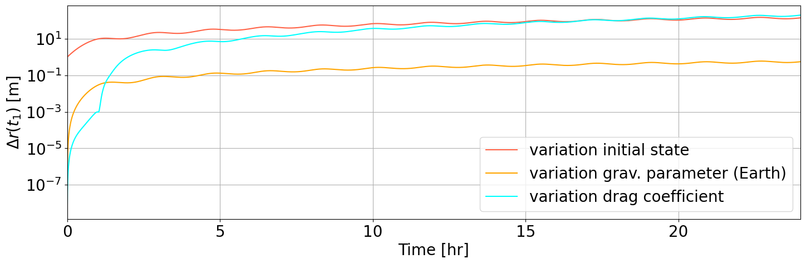
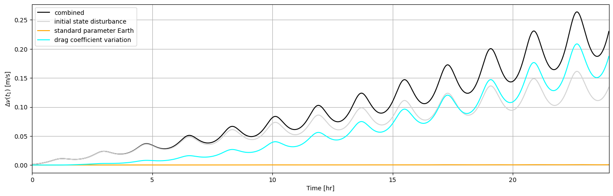

.. _propagating_variational_equations:

Propagating Variational Equations
===========================================

#! parameter variations vs state disturbance semantics

In this example, we will propagate variational equations and show how to use the resulting state transition & sensitivity matrices to propagate variations through the orbiter's state.

Basic Setup
###########################
Again, we are considering the Delfi-C3 Earth orbiter.
The basic setup of the problem is therefore identical to that of the first minimal usecase of the perturbed earth orbiter __link__:

*  Import Statements and Setup
    - import tudatpy kernels
    - setting up spice kernels

*  Environment Setup
    - creating bodies
    - creating vehicles
    - creating interfaces

*  Propagation Setup
    - creating acceleration models
    - defining initial system state
    - setting dependent variables to save
    - creating propagator settings
    - creating integrator setting

The code used for the basic setup is provided in the cell below.

.. code-block:: python

    #######################################################################
    # # # # # # # # # # #         SPICE SETUP         # # # # # # # # # # #
    #######################################################################

    # Load spice kernels.
    spice_interface.load_standard_kernels()

    # Set simulation start and end epochs.
    simulation_start_epoch = 0.0
    simulation_end_epoch = constants.JULIAN_DAY

    #######################################################################
    # # # # # # # # # # #      ENVIRONMENT SETUP      # # # # # # # # # # #
    #######################################################################

    # #########        CREATE BODIES        ######### #

    # Make list of selected celestial bodies to be created.
    bodies_to_create = ["Sun", "Earth", "Moon", "Mars", "Venus"]

    # Set global frame orientation (around Sun by default).
    global_frame_orientation = "J2000"

    # Create body settings at default for all bodies_to_create.
    body_settings = environment_setup.get_default_body_settings(
        bodies_to_create,
        base_frame_orientation=global_frame_orientation
    )

    # Create system of selected celestial bodies from body_settings.
    bodies = environment_setup.create_system_of_bodies(body_settings)

    # #########        CREATE VEHICLE        ######### #

    # Create vehicle object.
    bodies.create_empty_body( "Delfi-C3" )
    bodies.get_body( "Delfi-C3").set_constant_mass( 2.2 )

    # #########      CREATE INTERFACES       ######### #

    # Define aerodynamic interface for vehicle.
    reference_area = 0.05
    drag_coefficient = 1.2
    aero_coefficient_settings = environment_setup.aerodynamic_coefficients.constant(
        reference_area,[drag_coefficient,0,0]
    )
    # Create aerodynamic interface for vehicle.
    environment_setup.add_aerodynamic_coefficient_interface(
                bodies, "Delfi-C3", aero_coefficient_settings
    )

    # Define radiation pressure interface for vehicle.
    reference_area_radiation = 0.05
    radiation_pressure_coefficient = 1.2
    occulting_bodies = ["Earth"]
    radiation_pressure_settings = environment_setup.radiation_pressure.cannonball(
        "Sun", reference_area_radiation, radiation_pressure_coefficient, occulting_bodies
    )
    # Create radiation pressure interface for vehicle.
    environment_setup.add_radiation_pressure_interface(
                bodies, "Delfi-C3", radiation_pressure_settings
    )

    #######################################################################
    # # # # # # # # # # #      PROPAGATION SETUP      # # # # # # # # # # #
    #######################################################################

    # Define bodies that are to be propagated.
    bodies_to_propagate = ["Delfi-C3"]
    # Define central bodies (w.r.t. which the vehicle state vector is defined)
    central_bodies = ["Earth"]

    # #########     CREATE ACCELERATION MODELS     ######### #

    # Define accelerations acting on Delfi-C3 by Sun and Earth in a dictionary.
    accelerations_settings_delfi_c3 = dict(
        Sun=
        [
            propagation_setup.acceleration.cannonball_radiation_pressure(),
            propagation_setup.acceleration.point_mass_gravity()
        ],
        Earth=
        [
            propagation_setup.acceleration.spherical_harmonic_gravity(5, 5),
            propagation_setup.acceleration.aerodynamic()
        ]
    )

    # Define point mass accelerations acting on Delfi-C3 by all other bodies.
    for other in set(bodies_to_create).difference({"Sun", "Earth"}):
        accelerations_settings_delfi_c3[other] = [
            propagation_setup.acceleration.point_mass_gravity()
        ]

    # Create global accelerations settings dict
    #  and register acceleration dict of vehicle.
    acceleration_settings = {"Delfi-C3": accelerations_settings_delfi_c3}

    # Create acceleration models.
    acceleration_models = propagation_setup.create_acceleration_models(
        bodies,
        acceleration_settings,
        bodies_to_propagate,
        central_bodies
    )

    # #########    DEFINE INITIAL SYSTEM STATE     ######### #

    # Set initial conditions for the bodies to be propagated (vehicle)
    # The initial conditions are given in Keplerian elements
    #  and later on converted to Cartesian elements.
    # For conversion, the gravitational_parameter of the central
    #  body can be retrieved from the the bodies variable.

    earth_gravitational_parameter = bodies.get_body( "Earth" ).gravitational_parameter

    initial_state = conversion.keplerian_to_cartesian(
        gravitational_parameter = earth_gravitational_parameter,
        semi_major_axis = 7500.0E3,
        eccentricity = 0.1,
        inclination = np.deg2rad(85.3),
        argument_of_periapsis = np.deg2rad(235.7),
        longitude_of_ascending_node = np.deg2rad(23.4),
        true_anomaly = np.deg2rad(139.87)
    )

    # #########   SET DEPENDENT VARIABLES TO SAVE  ######### #

    # Define list of dependent variables to save.
    dependent_variables_to_save = [
        propagation_setup.dependent_variable.total_acceleration( "Delfi-C3" ),
        propagation_setup.dependent_variable.keplerian_state( "Delfi-C3", "Earth" ),
        propagation_setup.dependent_variable.latitude( "Delfi-C3", "Earth" ),
        propagation_setup.dependent_variable.longitude( "Delfi-C3", "Earth" ),
        propagation_setup.dependent_variable.single_acceleration_norm(
            propagation_setup.acceleration.point_mass_gravity_type, "Delfi-C3", "Sun"
        ),
        propagation_setup.dependent_variable.single_acceleration_norm(
            propagation_setup.acceleration.point_mass_gravity_type, "Delfi-C3", "Moon"
        ),
        propagation_setup.dependent_variable.single_acceleration_norm(
            propagation_setup.acceleration.point_mass_gravity_type, "Delfi-C3", "Mars"
        ),
        propagation_setup.dependent_variable.single_acceleration_norm(
            propagation_setup.acceleration.point_mass_gravity_type, "Delfi-C3", "Venus"
        ),
        propagation_setup.dependent_variable.single_acceleration_norm(
            propagation_setup.acceleration.spherical_harmonic_gravity_type, "Delfi-C3", "Earth"
        ),
        propagation_setup.dependent_variable.single_acceleration_norm(
            propagation_setup.acceleration.aerodynamic_type, "Delfi-C3", "Earth"
        ),
        propagation_setup.dependent_variable.single_acceleration_norm(
            propagation_setup.acceleration.cannonball_radiation_pressure_type, "Delfi-C3", "Sun"
        )
    ]

    # #########         PROPAGATOR SETTINGS        ######### #

    # Create propagator settings.
    propagator_settings = propagation_setup.propagator.translational(
        central_bodies,
        acceleration_models,
        bodies_to_propagate,
        initial_state,
        simulation_end_epoch,
        output_variables=dependent_variables_to_save
    )

    # #########         INTEGRATOR SETTINGS        ######### #

    # Define integrator settings.
    fixed_step_size = 10.0
    # Create integrator settings.
    integrator_settings = propagation_setup.integrator.runge_kutta_4(
        simulation_start_epoch,
        fixed_step_size
    )

The problem setup is complete and so from here on we will add the extensions that are specific to the variational equations use case.
Instead of a dynamics simulator, a variational equations solver object is used for the propagation of the orbiter state and the variational equations w.r.t the user-defined variational parameters.
Next, the history of state transition & sensitivity matrices is retrieved from the variational equations solver object.
At last they are used to propagate variations of selected parameters and to assess their impact on the orbiter's trajectory.

Simulator Usage
###########################

Setting Variational Parameters
-------------

Now we will create a list of parameters for which the variational equations are to be propagated.
For the following example we will add the gravitational parameter of Earth and the drag coefficient of the spacecraft (Delfi-C3).

#! what exactly does this line do?
#! estimation_setup.parameter.initial_states( propagator_settings, bodies )
#! state transition always available for all propagated bodies?

.. code-block:: python

    parameter_settings = estimation_setup.parameter.initial_states( propagator_settings, bodies )

    parameter_settings.append( estimation_setup.parameter.gravitational_parameter( "Earth" ) )
    parameter_settings.append( estimation_setup.parameter.constant_drag_coefficient( "Delfi-C3" ) )

Create Dynamics Solver (here: Variational Equations Solver)
-------------

.. code-block:: python

    variational_equations_solver = estimation_setup.SingleArcVariationalEquationsSolver(
        bodies, integrator_settings, propagator_settings, estimation_setup.create_parameters_to_estimate(
            parameter_settings, bodies
        ),
        integrate_on_creation=1
    )

.. note::

  The ``integrate_on_creation=1`` argument is given to ensure that equations are being integrated once the ``variational_equations_solver`` object is constructed. If you use ``integrate_on_creation=0``, you will have to call the integration of the variational equations manually.

Retrieve Results
-------------

You can retrieve the states, state transition matrices and sensitivity matrices at each time step in your simulation by using ``.state_history``, ``.state_transition_matrix_history`` and ``sensitivity_matrix_history``, respectively, on the variational equations solver object.

.. code-block:: python

    states = variational_equations_solver.state_history
    state_transition_matrices = variational_equations_solver.state_transition_matrix_history
    sensitivity_matrices = variational_equations_solver.sensitivity_matrix_history

#! accessing first / last, accessing states, print statement ?

Propagating Variations
###########################

Define Disturbances / Variations
-------------
Before putting the state transition / sensitivity matrices to work, you have to create the disturbance of the vehicle state / the variation of the available parameters that you want to assess.
In this example we will chose an initial state disturbance in x-position and x-velocity. We define this disturbance in a vector of the same size as the vehicle state, such that it is compatible with the state transition matrix.
We will also create vectors for the variation of the two available parameters - Earth standard gravitational parameter and vehicle drag coefficient.
Since we want to assess the variations independently from one another, we define them in separate vectors which match the parameter indices in the sensitivity matrix.

.. code-block:: python

    initial_state_disturbance = [1, 0, 0, 1.0E-3, 0, 0]
    earth_standard_param_variation = [-2.0E+5, 0.0]
    drag_coeff_variation = [0.0, 0.05]

Compute Impact on Orbiter Trajectory
-------------
Using the dot product between state transition / sensitivity matrix and the initial state disturbance / parameter variation vector, the change of the orbiter trajectory is computed at every simulation epoch.
The changes are stored in separate dictionaries.

.. code-block:: python

    delta_initial_state_dict = dict()
    earth_standard_param_dict = dict()
    delta_drag_coeff_dict = dict()

    for epoch in state_transition_matrices:
        delta_initial_state_dict[epoch] = np.dot(state_transition_matrices[epoch], initial_state_disturbance)
        earth_standard_param_dict[epoch] = np.dot(sensitivity_matrices[epoch], earth_standard_param_variation)
        delta_drag_coeff_dict[epoch] = np.dot(sensitivity_matrices[epoch], drag_coeff_variation)

Visualise Impact
###########################

Let's make some plots to visualize our simulation results. In order to make plots in python, import pyplot from matplotlib and adjust some settings for our purposes.

.. code-block:: python
    from matplotlib import pyplot as plt
    font_size = 20
    plt.rcParams.update({'font.size': font_size})

- **Pre-processing**

Now we extract the relevant variables stored in the dictionaries. The times are stored in the keys, and can be extracted using the ``.keys( )`` function.
Using *list comprehensions* in python, you can convert them to more convenient units for your plots.
The actual states (or state deviations) are in the values of the dictionary, and we use ``.values( )`` to extract these, and subsequently stack them vertically using ``np.vstack( )`` in order to select the desired columns.

.. code-block:: python

    time = state_transition_matrices.keys()
    time_hours = [t / 3600 for t in time]

    delta_initial_state = np.vstack(list(delta_initial_state_dict.values()))
    delta_earth_standard_param = np.vstack(list(earth_standard_param_dict.values()))
    delta_drag_coefficient = np.vstack(list(delta_drag_coeff_dict.values()))

- **Magnitude of State Deviation**

For each of the three variations, we want to plot the magnitude of the deviation in position and the deviation in velocity.

.. code-block:: python
    # 1 // due to initial state disturbance
    delta_r1 = np.sqrt(delta_initial_state[:, 0] ** 2 + delta_initial_state[:, 1] ** 2 + delta_initial_state[:, 2] ** 2)
    delta_v1 = np.sqrt(delta_initial_state[:, 3] ** 2 + delta_initial_state[:, 4] ** 2 + delta_initial_state[:, 5] ** 2)
    # 2 // due to gravitational parameter variation
    delta_r2 = np.sqrt(delta_earth_standard_param[:, 0] ** 2 + delta_earth_standard_param[:, 1] ** 2 + delta_earth_standard_param[:, 2] ** 2)
    delta_v2 = np.sqrt(delta_earth_standard_param[:, 3] ** 2 + delta_earth_standard_param[:, 4] ** 2 + delta_earth_standard_param[:, 5] ** 2)
    # 3 // due to initial state disturbance
    delta_r3 = np.sqrt(delta_drag_coefficient[:, 0] ** 2 + delta_drag_coefficient[:, 1] ** 2 + delta_drag_coefficient[:, 2] ** 2)
    delta_v3 = np.sqrt(delta_drag_coefficient[:, 3] ** 2 + delta_drag_coefficient[:, 4] ** 2 + delta_drag_coefficient[:, 5] ** 2)

Assuming uncorrelated occurrence of the initial state disturbance and parameter variations, we can also combine them into a total deviation by taking their root sum squared.

.. code-block:: python
    delta_r = np.sqrt(delta_r1 ** 2 + delta_r2 ** 2 + delta_r3 ** 2)
    delta_v = np.sqrt(delta_v1 ** 2 + delta_v2 ** 2 + delta_v3 ** 2)

- **Create and Save Figures**

The separate and combined magnitudes of the state deviations are subsequently plotted as given by the following piece of code (For more details, visit :ref:`visualize_results`).

#! code-block not rendering

.. code-block:: python
    plt.figure( figsize=(17,5))
    plt.grid()
    plt.plot(time_hours, delta_r1, color='lightgrey', label='initial state disturbance')
    plt.plot(time_hours, delta_r2, color='orange', label='variation grav. parameter (Earth)')
    plt.plot(time_hours, delta_r3, color='cyan', label='variation drag coefficient')
    plt.plot(time_hours, delta_r, color='black', label='combined')
    plt.xlabel('Time [hr]')
    plt.ylabel('$\Delta r (t_1)$ [m]')
    plt.xlim( [min(time_hours), max(time_hours)] )
    plt.legend()
    plt.savefig(fname='position_deviation.png', bbox_inches='tight')

    plt.figure( figsize=(17,5))
    plt.grid()
    plt.plot(time_hours, delta_v1, color='lightgrey', label='initial state disturbance')
    plt.plot(time_hours, delta_v2, color='orange', label='variation grav. parameter (Earth)')
    plt.plot(time_hours, delta_v3, color='cyan', label='variation drag coefficient')
    plt.plot(time_hours, delta_v, color='black', label='combined')
    plt.xlabel('Time [hr]')
    plt.ylabel('$\Delta v (t_1)$ [m/s]')
    plt.xlim( [min(time_hours), max(time_hours)] )
    plt.legend()
    plt.savefig(fname='velocity_deviation.png', bbox_inches='tight')

Which results in the following figures:

