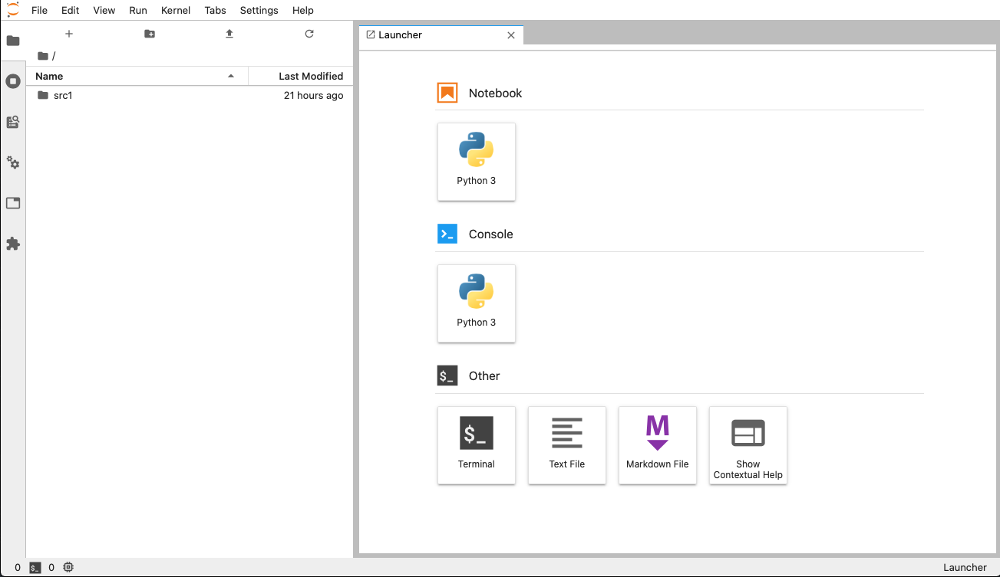
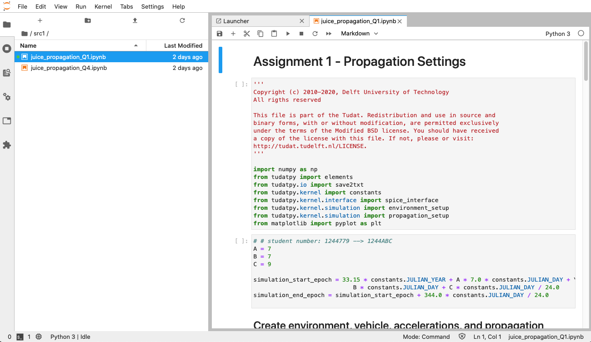
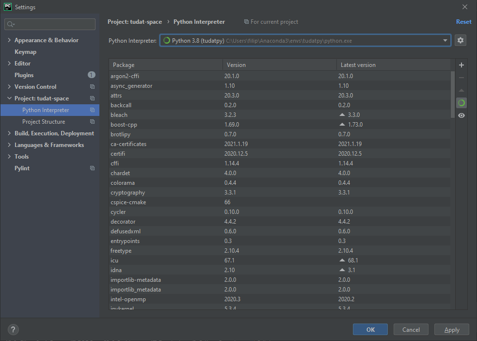

******************************
Getting Started with Tudat(Py)
******************************

This page will guide you through the installation of Tudat(Py). The installation is supported exclusively through the use of the ``conda``
package manager, such as ``Anaconda``. Additional installation procedures are not currently
supported by the team, although there are plans to add additional support in the future. If the current situation does not satisfy your
application then please make a feature request at the respective package at https://github.com/tudat-team or show
support for an existing request.

Installing Anaconda
###################

Install Anaconda on your system, see the `Installation`_ guide provided by the Anaconda documentation.

.. _`Installation`: https://docs.anaconda.com/anaconda/install/

.. note::

    **macOS users are advised to use `homebrew`_ **: this is an excellent packet manager, with the added advantage of making it exceedingly easy to install Anaconda:

    .. code:: bash

        brew install anaconda

    ... or `Miniconda`_, a ligher alternative to Anaconda:

    .. code:: bash

        brew install miniconda

.. _`homebrew`: https://brew.sh
.. _`Miniconda`: https://docs.conda.io/en/latest/miniconda.html

Installing Tudat(Py)
####################

To install Tudat(Py), we recommend the use of a terminal (command line) interface. On Unix system (Linux and Mac), ``conda`` should be integrated with the terminal, and you can open your terminal directly. On Windows, you can find a program called ``Anaconda Prompt`` in the Windows search. The ``Anaconda Prompt`` is equivalent to the terminal use of ``conda`` on Unix. Some Unix commands are made available in this prompt, although most usage is equivalent to the Windows shell (see below for some useful terminal commands).

Open a terminal. Then, first verify that Conda is Installed via using the following command:

.. code-block::

    conda --version

Then, ensure that ``conda`` is updated.

.. code:: bash

    conda update conda

Download this ``environment.yaml`` (:download:`yaml <_static/environment.yaml>`), or use wget to this for you (downloading it to the current directory):

.. code:: bash

    wget https://tudat-space.readthedocs.io/en/latest/_downloads/2ff196b0ef4830f53d754f6a3972d2e8/environment.yaml

In your terminal navigate to the directory containing this file, and use the following command (see below for tips on using the command line):

.. code:: bash

    conda env create -f environment.yaml

Congratulations! You have now installed Tudat and TudatPy, and are ready to get started running your simulations and analyses!

.. note::

    **New to the command-line?** The following commands may be useful to you:

    +-------------------------------------------------------+--------------------------+-----------------------+
    | **Command effect**                                    | **Unix (Linux & macOS)** | **Windows**           |
    +-------------------------------------------------------+--------------------------+-----------------------+
    | Enter a directory using a path (relative or absolute) | ``cd <abs/rel path>``    | ``cd <abs/rel path>`` |
    +-------------------------------------------------------+--------------------------+-----------------------+
    | Step back to the previous directory                   | ``cd ..``                | ``cd ..``             |
    +-------------------------------------------------------+--------------------------+-----------------------+
    | List the contents of the current working directory    | ``ls``                   | ``dir``               |
    +-------------------------------------------------------+--------------------------+-----------------------+

.. warning::

    **Are you a macOS user**? You may encounter an issue while installing tudatpy via conda.
    If you have issues installing via the ``environment.yaml`` in the form of conflicts when installing, please inform us `on tudatpy-feedstock (#2)`_.

    If this is the case, then you can attempt to install tudatpy with this alternative procedure:

    1. Create a new environment.

    .. code:: bash

        conda create --name tudat-space

    In case you need to specify the python version to be used with TudatPy (which is irrespective and independent of the python version you may have installed in your system), you can do this with:

    .. code:: bash

        conda create --name tudat-space python=3.8

    Be aware that the tudat-space environment has a certain number of pre-defined python versions that it can work with; you can check which ones in the `conda_build_config.yaml`_ file.

    2. Activate the environment.

    .. code:: bash

        conda activate tudat-space

    3. Install tudatpy & matplotlib with a manual definition of channels.

    .. code:: bash

        conda install tudatpy matplotlib -c tudat-team -c conda-forge -c defaults

    If conda complains there is no tudat-team channel, just add it:

    .. code:: bash

        conda config --add channels tudat-team

    then re-run the command in item 3.

    If this alternative fix did not work, please inform us `on tudatpy-feedstock (#2)`_.

    You can also try the macOS install (:download:`install-osx.sh <_static/install-osx.sh>`) and uninstall (:download:`uninstall-osx.sh <_static/uninstall-osx.sh>`) scripts.

.. _`on tudatpy-feedstock (#2)`: https://github.com/tudat-team/tudatpy-feedstock/issues/2
.. _`tudatpy-feedstock`: https://github.com/tudat-team/tudatpy-feedstock
.. _`tudatpy`: https://github.com/tudat-team/tudatpy
.. _`conda_build_config.yaml`: https://github.com/tudat-team/tudatpy-feedstock/blob/master/recipe/conda_build_config.yaml

.. note::

    - If there are any other issues with the installation process, please submit an issue
    on the `tudatpy-feedstock`_.
    - If there are issues running tutorials please submit an issue on the `tudatpy`_ repository.

Setting Up a Development Environment
####################################

.. note::

    Your choice of development environment will differ greatly depending on your intended development purpose. **For
    students of Numerical Astrodynamics**, Jupyter(Lab/Notebook) will be used for assignments, and for examples during lectures. PyCharm may be used for examples during lectures.

Setting up JupyterLab in a Conda Environment
--------------------------------------------

1. Activate your desired conda environment to be used by JupyterLab:

.. code-block:: bash

    conda activate tudat-space

2. Install JupyterLab on the desired environment:

.. code-block:: bash

    conda install jupyterlab

3. Launch JupyterLab with its entry-point:

.. code-block:: bash

    jupyter-lab

OR

.. code-block:: bash

    jupyter lab

Getting started with Jupyter Notebooks
---------------------------------------

Your default browser will now open a localhost page in your current directory, as given in the following figure:

Search and open your notebook. Once opened, you should see, for example, the following screen (Numerical Astrodynamics Assignment 1)

The notebook consists of blocks. There are three types of blocks, two of which are important for us: Markdown and Code. Markdown blocks contain mostly text, while Code blocks contain and run python code.

Setting up PyCharm
------------------

PyCharm is a famous Integrated Development Environment (IDE) to work with Python, widely used by developers and
professionals. It is available for download `here`_. The open-source, basic version ("Community") is free to download
and sufficient to write and run Python code; however, if you have a TU Delft account (or another educational email),
you can download and activate the professional version as well. To activate your educational license, please visit this
`webpage`_.

.. _`here`: https://www.jetbrains.com/pycharm/download
.. _`webpage`: https://www.jetbrains.com/shop/eform/students

To start working with PyCharm, you can create a new project. It is possible to set the conda environment to be used
directly from PyCharm. You can follow this procedure to create a new project and use your conda installation of Tudat:

1. Go to ``File`` > ``New project...``

2. From the tab ``PurePython``, select the location of your project (i.e. provide the path to the directory of interest, named ``yourProjectFolderPath`` in the figure below).

.. figure:: _static/pycharm_new_project.png

3. Select ``Existing interpreter`` and click on the three dots to the right to provide the path to the interpreter.

4. Select ``Conda Environment`` on the left bar.

5. Select ``Existing Environment`` and tell Pycharm where the environment ``python(.exe)`` is.

.. note::

    The location of the python interpreter in your active conda environment is the output of the ``which python`` command.

.. figure:: _static/pycharm_set_environment.png

The project interpreter can be viewed and/or modified at any time, even after the project is created, by
navigating to ``File`` > ``Settings`` > ``Project`` > ``Python Interpreter`` (Windows/Linux) or ``PyCharm`` >
``Preferences`` > ``Project`` > ``Python Interpreter`` (macOS). The figure below shows the interpreter panel on
Windows.

After a project is created, it can happen that the *run* button is disabled. This issue can be caused by two reasons:

*   PyCharm is parsing and indexing the source files. This can take a few minutes, depending on the size of the project;
    the processes run in the background by PyCharm can be viewed and monitored from the bar at the bottom of the screen.

*   A *run configuration* is missing. This can be added manually by clicking on ``Add configuration`` next to the *run*
    button in the bar at the top of the editor (not explained here), but it is also possible to let PyCharm set up a
    predefined run configuration by right-clicking on a script and select ``Run`` from the context menu. This is the
    recommended procedure, if the user does not have specific requirements on the run configuration.

If you are working with multiple source files (e.g. your code is split into multiple modules), the best practice is to
let PyCharm know about this, so it will retrieve all the dependencies present in your modules. Otherwise, the IDE will
parse the source code and complain about potential errors, especially while importing other modules: even if the code
runs fine, PyCharm does not know where to look for them. This can be done as follows:

1. Navigate to ``File`` > ``Settings`` > ``Project`` > ``Project Structure``.

2. Select the directory containing your source code and mark it as ``Sources`` (blue folder).

.. note::

    The students of AE4866 Propagation and Optimization in Astrodynamics are encouraged to follow all the steps
    presented above.

