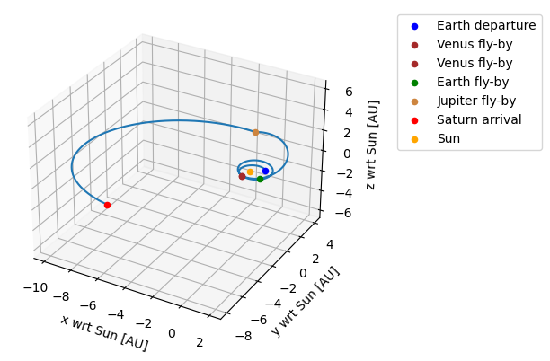
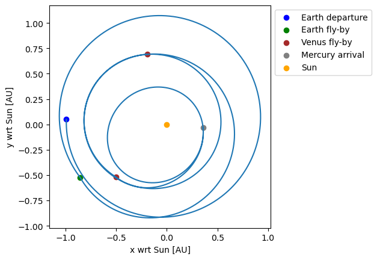

.. _`mga_dsm_analysis`:

Analyzing MGA-DSM trajectories
===============================

In this section, two examples are provided to show how MGA-DSM trajectories are analyzed. The first example does not use
any DSMs, the second example does. The full code, containing both examples, can be found on
`Github <https://github.com/tudat-team/tudatpy-examples/>`_.

An MGA trajectory without DSMs
##############################

The first example transfer is like Cassini's trajectory towards Saturn, but without DSMs in between the GAs.

Import statements and Setup
***************************

The following imports allow the use of the required ``tudatpy`` tools.

.. code-block:: python

    import numpy as np
    from tudatpy.kernel.trajectory_design import transfer_trajectory
    from tudatpy.kernel.numerical_simulation import environment_setup
    from tudatpy.util import result2array
    from tudatpy.kernel import constants

Setup and inputs
******************

A simplified system of bodies suffices for this application, with the Sun as central body. The planets that are visited
for a GA are defined in the list ``transfer_body_order``. The departure and arrival orbit can be specified, but don't
necessarily need to be. If not specified, the departure and arrival planets are considered swing-by nodes. Specifying
:math:`a = \infty` and :math:`e=0` defines departure from / arrival at the edge of the SOI of the corresponding bodies.
In this example, the spacecraft departs from the edge of Earth's SOI and is inserted into a highly elliptical orbit
around Saturn. We can specify *not* using DSMs by using the unpowered and unperturbed leg type.

.. code-block:: python

    bodies = environment_setup.create_simplified_system_of_bodies( )
    central_body = 'Sun'
    transfer_body_order = ['Earth', 'Venus', 'Venus', 'Earth',  'Jupiter',  'Saturn'  ]
    departure_semi_major_axis = np.inf
    departure_eccentricity = 0.
    arrival_semi_major_axis = 1.0895e8 / 0.02
    arrival_eccentricity = 0.98
    leg_type = transfer_trajectory.unpowered_unperturbed_leg_type

Create trajectory
******************

The specified inputs can not be used directly, but they have to be translated to distinct settings, relating to
either the nodes (GAs at planets) or legs (trajectories in between planets), first. These settings are, in turn, used to
create the transfer trajectory object.

.. code-block:: python

    transfer_leg_settings, transfer_node_settings = transfer_trajectory.mga_transfer_settings(
        transfer_body_order,
        leg_type,
        departure_orbit = ( departure_semi_major_axis, departure_eccentricity ),
        arrival_orbit = ( arrival_semi_major_axis, arrival_eccentricity) )

    transfer_trajectory_object = transfer_trajectory.create_transfer_trajectory(
        bodies,
        transfer_leg_settings,
        transfer_node_settings,
        transfer_body_order,
        central_body )

Transfer parameters
*********************

The advantage of having a transfer trajectory object is that it allows for analyzing many different sets of transfer
parameters for the defined transfer settings. For this example *without* DSMs, the transfer parameters only constitute
the times at which the powered GA's are executed, i.e. at the nodes. Since the magnitude and direction of each
:math:`\Delta V` is determined by the planet positions at the node times, there is no need to specify node free
parameters. There are no DSMs in between the planets, i.e. on the legs, so there is also no need to specify leg free
parameters. However, for compatibility reasons it is required to define the free parameters as a list containing empty
arrays.

.. code-block:: python

    node_times = list( )
    node_times.append( ( -789.8117 - 0.5 ) * julian_day )
    node_times.append( node_times[ 0 ] + 158.302027105278 * julian_day )
    node_times.append( node_times[ 1 ] + 449.385873819743 * julian_day )
    node_times.append( node_times[ 2 ] + 54.7489684339665 * julian_day )
    node_times.append( node_times[ 3 ] + 1024.36205846918 * julian_day )
    node_times.append( node_times[ 4 ] + 4552.30796805542 * julian_day )

    leg_free_parameters = list( )
    for i in transfer_leg_settings:
        leg_free_parameters.append( np.zeros(0))

    node_free_parameters = list( )
    for i in transfer_node_settings:
        node_free_parameters.append( np.zeros(0))

Evaluate trajectory
*******************

The transfer parameters are now used to evaluate the transfer trajectory and obtain the quantities we
are interested in: :math:`\Delta V`s and time of flight. The transfer parameter definitions are printed for reference
and the state at 500 instances per leg is retrieved to plot the 3D trajectory.

.. code-block:: python

    transfer_trajectory_object.evaluate( node_times, leg_free_parameters, node_free_parameters )

    delta_v = transfer_trajectory_object.delta_v                   # Total Delta V [m/s]
    time_of_flight = transfer_trajectory_object.time_of_flight     # Total time of flight [s]
    delta_v_per_leg = transfer_trajectory_object.delta_v_per_leg   # List of Delta V's in each leg (here list of zeroes) [m/s]
    delta_v_per_node = transfer_trajectory_object.delta_v_per_node # List of Delta V's at each node [m/s]

    transfer_trajectory.print_parameter_definitions( transfer_leg_settings, transfer_node_settings )

    state_history = result2array(transfer_trajectory_object.states_along_trajectory(500))

An MGA trajectory with DSMs
##############################

For the transfer trajectory *with* DSMs a mission to Mercury is considered. Both departure and arrival are defined at
the SOI of Earth and Mercury, respectively. With respect to a transfer *without* DSMs, only a few modifications are
required. Each leg is now defined by the DSM Velocity-based formulation. This leg type requires that the leg free and
node free parameters are specified. That is, there is a free parameter for each leg and three free parameters for the
departure leg and for each swing-by leg that need to be defined. The specific definitions of these free parameters can
be found in :ref:`transfer_trajectory`.

.. code-block:: python

    transfer_body_order = ['Earth', 'Earth', 'Venus', 'Venus',  'Mercury']
    leg_type = transfer_trajectory.dsm_velocity_based_leg_type

    node_times = list( )
    node_times.append( ( 1171.64503236 - 0.5 ) * julian_day )
    node_times.append( node_times[ 0 ] + 399.999999715 * julian_day )
    node_times.append( node_times[ 1 ] + 178.372255301 * julian_day )
    node_times.append( node_times[ 2 ] + 299.223139512 * julian_day )
    node_times.append( node_times[ 3 ] + 180.510754824 * julian_day )

    leg_free_parameters = list( )
    leg_free_parameters.append( np.array( [ 0.234594654679 ] ) )
    leg_free_parameters.append( np.array( [ 0.0964769387134 ] ) )
    leg_free_parameters.append( np.array( [ 0.829948744508 ] ) )
    leg_free_parameters.append( np.array( [ 0.317174785637 ] ) )

    node_free_parameters = list( )
    node_free_parameters.append( np.array( [ 1408.99421278, 0.37992647165 * 2.0 * 3.14159265358979, np.arccos( 2.0 * 0.498004040298 - 1.0 ) - 3.14159265358979 / 2.0 ] ) )
    node_free_parameters.append( np.array( [ 1.80629232251 * 6.378e6, 1.35077257078, 0.0 ] ) )
    node_free_parameters.append( np.array( [ 3.04129845698 * 6.052e6, 1.09554368115, 0.0 ] ) )
    node_free_parameters.append( np.array( [ 1.10000000891 * 6.052e6, 1.34317576594, 0.0 ] ) )
    node_free_parameters.append( np.array( [ ] ) )

Again, a transfer trajectory object is created and is evaluated with the same approach. The resulting
trajectory is depicted below in the x-y plane.

