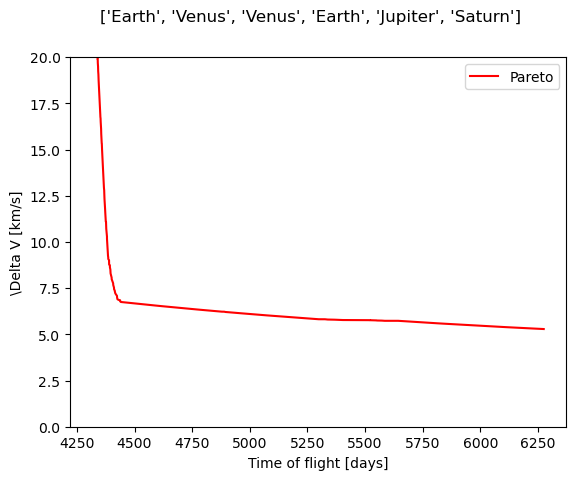
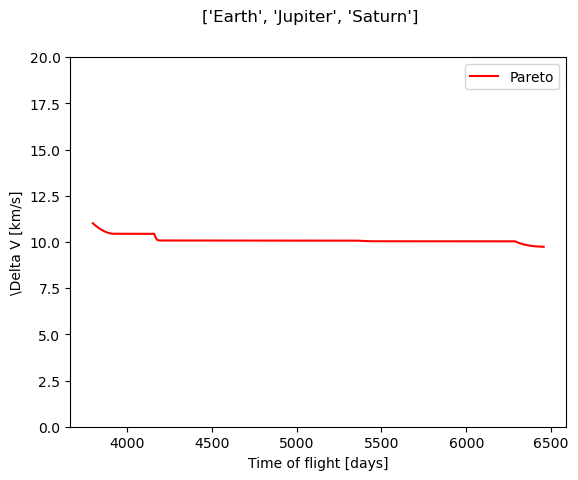
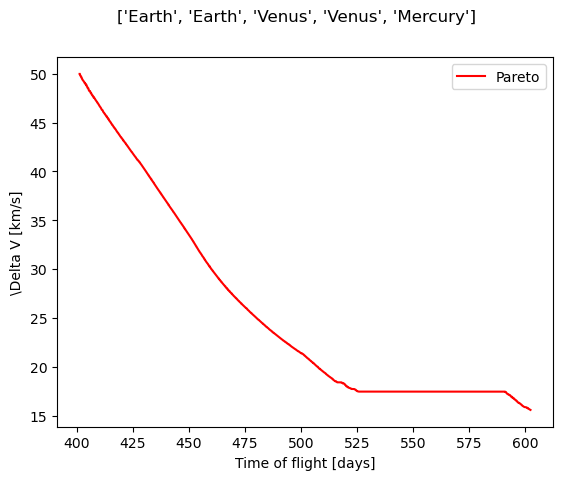

.. _`mga_dsm_optimization`:

*****************************
Optimize MGA-DSM trajectories
*****************************

In the following section, an example of the optimization of MGA-DSM trajectories is provided. If you are unfamiliar with
optimizations within Tudat(py) and/or `Pygmo`_, please visit :ref:`pygmo_basics` first. The optimizer will search for
transfer parameters that yield optimal solutions in terms of two objectives: :math:`\Delta V` and time of flight.

The full code for this example was developed for the Collaborative Design Lab (CDL) and can be found in the
`Download section`_ of the `CDL website`_.

.. _`Pygmo`: https://esa.github.io/pygmo2/index.html
.. _`Download section`: https://cdl-docs.readthedocs.io/en/latest/_src_downloads/downloads.html
.. _`CDL website`: https://cdl-docs.readthedocs.io/en/latest/index.html

Problem settings
-------------------------------------------------
First and foremost, the inputs for the transfer trajectory object are to be defined. Here, we consider the same case as
in the first example of :ref:`mga_dsm_analysis`. The code is setup to allow optimizing multiple transfer body orders
subsequently.

.. code-block:: python

    transfer_body_orders = [['Earth', 'Venus', 'Venus', 'Earth', 'Jupiter', 'Saturn'],
                            ['Earth', 'Jupiter', 'Saturn']]

.. note::
    If you only want to optimize one planet sequence with this example code, do make sure to keep the outer list: ``transfer_body_orders = [['Earth',
    'Venus', 'Venus', 'Earth', 'Jupiter', 'Saturn']]``
.. End of note

As the optimizer will search for good transfer parameters (the node times), it is not required to specify these
explicitly. However, to guide the optimization, it is required to specify the boundaries for these. This is done by
defining a nominal departure date and a departure date margin. In addition, the minimum and maximum times of flight are
defined based on the planets that define the end of a leg.

.. code-block:: python

    departure_date = (-789.8117 - 0.5) * constants.JULIAN_DAY
    departure_date_margin = 180.0 * constants.JULIAN_DAY

    minimum_time_of_flight_dict = {'Mercury': 100,
                                   'Venus': 100,
                                   'Earth': 100,
                                   'Mars': 100,
                                   'Jupiter': 800,
                                   'Saturn': 3000,
                                   'Uranus': 3000,
                                   'Neptune': 3000,
                                   'Pluto': 6000
                                   }

    maximum_time_of_flight_dict = {'Mercury': 1000,
                                   'Venus': 1000,
                                   'Earth': 1000,
                                   'Mars': 1000,
                                   'Jupiter': 4000,
                                   'Saturn': 8000,
                                   'Uranus': 15000,
                                   'Neptune': 30000,
                                   'Pluto': 50000
                                   }

Optimization settings
-------------------------------------------------
The optimization is performed with the NSGA-II algorithm with default settings. A population of 500 individuals is
evolved for 3000 generations with a specific seed to allow for regeneration of the results. In order to force the
optimization towards good solutions, a variable ``maximum_delta_v`` was introduced. Everytime the :math:`\Delta V` is
evaluated, it is compared to this value. If it is exceeded, the solutions is deemed infeasible and penalized by increasing
:math:`\Delta V` and time of flight substantially, such that the optimization algorithm will throw it away. This maximum
:math:`\Delta V` value must be chosen carefully, as a too strict value will cause the optimization to not find feasible
solutions.

.. code-block:: python

    maximum_delta_v = 25e3  # m/s
    algo = pg.algorithm(pg.nsga2(gen=100, cr=0.95, eta_c=10.0, m=0.01, eta_m=50.0, seed=4444))

User-Defined Problem class
-------------------------------------------------
The UDP for this example is presented below. It can also be used for a transfer with DSMs, by simply modifying the
inputs accordingly. The transfer trajectory settings and object are created immediately when the UDP is initialized. The
UDP contains the mandatory methods: ``get_nobj``, ``get_bounds(), ``get_number_of_parameters``
and ``fitness``. In addition, a ``perform_optimization`` method is added, in which the actual optimization is performed
and intermediate generations are saved. In this way the main file code is shorter and all functionality is included
in the UDP. The ``get_bounds()`` method returns the transfer parameters' boundaries according to the leg type that is
used. This is where the departure date margin and minimum and maximum time of flight dictionaries come in. In the
``fitness`` method, the specified inputs are converted to compatible transfe parameters, which in turn are used to
evaluate the transfer trajectory in terms of :math:`\Delta V` and total time of flight.

.. literalinclude:: ./_static/TransferTrajectoryOptimizer_UDPClass.py
             :language: python

Results
-------------------------------------------------
The output of this optimization is a Pareto front per transfer body order. Here, we can see the clear advantage of
performing two GAs at Venus and one at Earth before leaving the inner part of the Solar System for Jupiter and Saturn.

An optimization with DSMs
----------------------------------------------------

The procedure for an optimization of a transfer with DSMs is the same. An important thing to consider though, is the
number of parameters within the problem. The number of parameters within a problem *without* DSMs is equal to the number
of planets that are flown by (including the departure and destination planet). In contrast, the number of parameters
within a problem *with* DSMs is equal to the number of planets that are flown by (including the departure and
destination planet) *plus* four times the number of legs that are flown. The number of parameters for a problem *with*
DSMs is thus significantly larger than for one *without*. This more elaborate problem definition makes it computationally
more expensive to optimize and the population size and number of evolutions have to be chosen accordingly.

The following table presents a good choice of optimization settings for two case studies along with their problem characteristics:

========  ================================================  ============================ ========================= ===================== =====================
  DSM?     Planet sequence                                   Number of parameters         Number of evolutions      Population size       Optimization runtime
========  ================================================  ============================ ========================= ===================== =====================
   No       Earth, Venus, Venus, Earth, Jupiter, Saturn      6                            3000                      500                    ~3 minutes
   Yes      Earth, Earth, Venus, Venus, Mercury              21                           2000                      2000                   ~15 minutes
========  ================================================  ============================ ========================= ===================== =====================
This shows that it is significantly more effective to increase the population size to optimize a more complex problem, than to perform
more evolutions.

Do note, for a problem *without* DSMs it is recommended to pick a large value for the number of generations and be
on the 'safe side' for the optimization, as the cost in runtime is not too large. This is not the case for a problem
*with* DSMs, where an evolution costs significantly more time.

The Pareto front for the transfer to Mercury is depicted below.

Tips & tricks for your own application
===========================================================
It may occur that an optimization does not yield expected or even satisfactory results. This may be because the problem
definition is not ideal, but it may also be that the optimal solutions are simply not found, but do exist. In the latter
case there are a few things that can be done to 'manipulate' the optimization:

* *Pick a different*  ``optimization_seed``
    The seed is used for two purposes: to create the initial population and to initialize the optimization algorithm. By
    specifying a different seed, the starting point for the optimization is different and the final results may be better.

* *Adjust* ``maximum_delta_v``
    As mentioned, it is possible to try and force the optimization towards solutions with lower :math:`\Delta V`. This
    can be done by specifying a maximum :math:`\Delta V`. This value is used in the optimization to apply a penalty to
    all solutions that exceed it, thereby forcing it to continue to search for better solutions. There is a risk
    involved here, if this maximum :math:`\Delta V` is too low, the optimization may not find any solutions satisfying
    it at all and won't give you any solutions that are not penalized.

* *Increase population size*
    Increasing the population size (even only slightly) will yield a different initial population, thereby affecting
    the entire evolution and may therefore yield better solutions (maybe even in less evolutions).

* *Reduce number of parameters*
    It may be the case that a problem *with* DSMs is simply too complex to be optimized efficiently. In that case it may
    be better to reduce the number of parameters, either by not using DSMs or by reducing the number of planets that are
    visited.

Lastly, it was noted that the time of flight range in the Pareto front is rather limited in some cases. In this case it
may be that the optimization has found optimal solutions for this range, but that these are not acceptable and that larger
times of flight need to be explored. This may be achieved with the above tricks (e.g. it is adviced to try setting a maximum
:math:`\Delta V` first), but there is one more trick:

* *Increase minimum times of flight dictionary*
    The time of flights  boundaries as used in the optimization, depending on the planet that defines the end of a leg.
    One can increase the minima (and possibly increase the maxima) to move (and extend) the
    time of flight range of the Pareto front.
