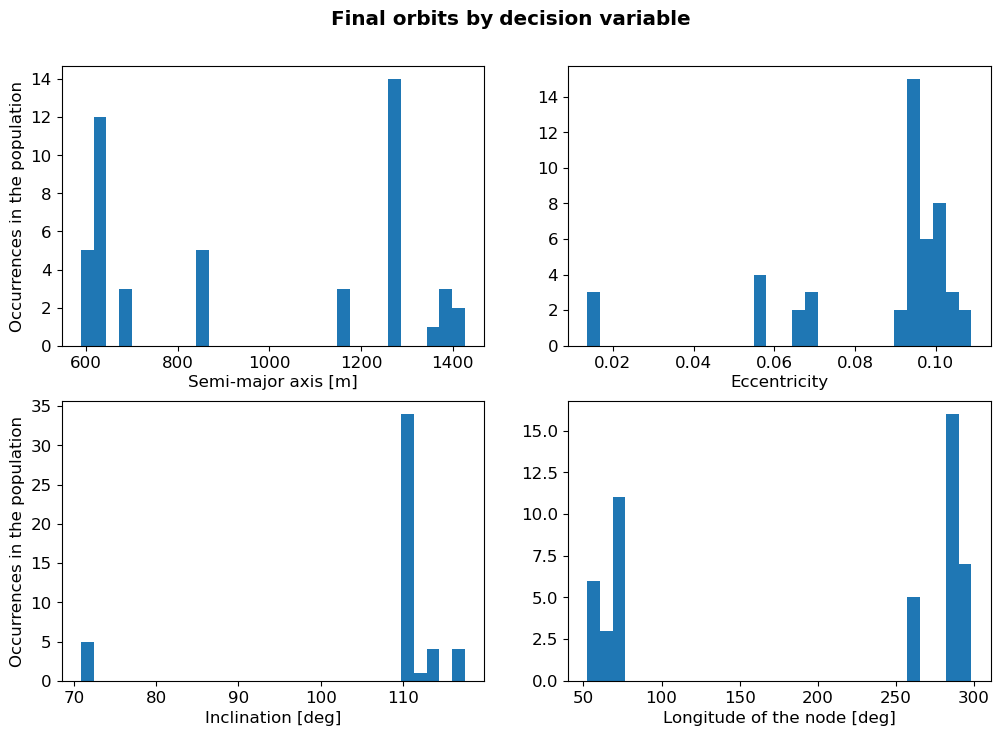

******************************************************************
Optimize orbit for asteroid surface characterization
******************************************************************

In this example it will be shown how to use PyGMO functionalities in the context of an astrodynamics problem.
It is assumed that, before diving into this example, the reader is already acquainted with the basic concepts
of optimizing a problem with PyGMO; in other words, the reader should be familiar with the content of this page:
:ref:`pygmo_basics`.
We will treat here the problem of the design of a mission around an asteroid, named `Itokawa`_. The full code that we
will refer to in this page can be found on `github <https://github.com/tudat-team/tudatpy-examples/blob/master/propagation/linear_sensitivity_analysis.py>`_.

.. _`Itokawa`: https://en.wikipedia.org/wiki/25143_Itokawa

Problem formulation
-------------------

Let's suppose that the mission objectives include the characterization of the asteroid's surface, which generates a
conflict between coverage and resolution. Therefore, the problem falls in the category of multi-objective optimization
and we will expect to generate a Pareto front of optimal solutions. The two **objectives** and their mathematical
formulation are:

1. the spacecraft must be able to observe most of the asteroid's surface (or maximize the mean value of the absolute
   longitude with respect to Itokawa over the full propagation;
2. the spacecraft must be close to the asteroid (or minimize the mean value of the distance from the asteroid's center
   of mass over the full propagation).

Our goal is to define an initial orbit that allows us to reach those objectives.
Therefore, the **design variables** selected are the initial values of:

1. the semi-major axis;
2. the eccentricity;
3. the inclination;
4. the longitude of the node.

At the same time, we must make sure that the spacecraft does not crash on nor escape Itokawa. These are not included in
the simulation as formal PyGMO constraints, but they are implemented in another - equally valid - way:
boundary values are placed on the distance :math:`d` from Itokawa's COM
(:math:`R_I + 150m < d < R_I + 5000m`, where :math:`R_I` is Itokawa's mean radius). If those are
violated, the propagation ends prematurely and, in that case, the value of the fitness is greatly exaggerated so that
the optimizer is inclined to discard those solutions.

Simulation settings
-------------------

Here, the main simulation settings are summarized:

- *nominal mission duration:* 5 days
- *dynamical model:* Itokawa's Spherical Harmonic gravity up to degree 4 and degree 4, point mass gravity of the Sun,
  Jupiter, Saturn, the Earth, Mars and solar radiation pressure
- *integrator settings:* variable step-size Runge-Kutta-Fehlberg 7(8) with relative and absolute tolerances set to
  :math:`10^{-8}`
- *propagator settings:* Cowell propagator

Optimization settings
---------------------

For this example, we use a Non-dominating Sorting Genetic Algorithm, or NSGA-II, available in the PyGMO library
(documentation available `here`_). We use a population of 48 individuals and we evolve the population 50 times.

.. _`here`: https://esa.github.io/pygmo2/algorithms.html#pygmo.nsga2

User-Defined Problem class
--------------------------

Below, we report the code for the problem class, which shows some necessary steps that have to be taken in order to
successfully integrate PyGMO with tudatpy (or vice-versa, depending on the point of view).
In addition to the ``fitness()`` and ``get_bounds()`` methods, there is also a ``get_nobj()``, which returns the number of
objectives and it is mandatory to have for multi-objective optimization problems. Furthermore, while the ``get_bounds()``
method does not present many differences with respect to the simpler Himmelblau example, the fitness method is slighyly
more complicated. Indeed, the orbit parameters are passed as the only input. These are used to create a new initial
orbit. The actual call to the dynamics simulator is also performed *inside* the ``fitness`` method, together with the
computation of the objectives, whose values are eventually returned. On the other hand, the
``get_last_run_dynamics_simulator()`` is used to retrieve the state and dependent variable history from outside the
optimization loop.

.. note::
    As you may have noticed, the input arguments to the class constructor ``__init__()`` are not stored directly as
    attributes, but they are saved through lambda functions. This is done to ensure compatibility with PyGMO, since
    tudatpy objects are not yet designed to be "picklable". `Pickle`_ is a Python package that provides serialization
    and deserialization capabilities; it is internally used by PyGMO to deal with the User-Defined Problem class. It is
    important to use lambda functions to ensure that the UDP is picklable.

    .. _`Pickle`: https://docs.python.org/3/library/pickle.html#what-can-be-pickled-and-unpickled

.. literalinclude:: ./_static/itokawa_udp.py
             :language: python

Results
-------

In the figure below, it is possible to see the propagated orbits corresponding to each individual of the initial and
final generation respectively. While for the initial generation the bundle is clearly random, we can notice that
visible patterns emerge at the final evolution of the optimization process (50th generation). Groups of orbits with
apparently similar orbital elements appear.

.. figure:: _static/orbit_bundles_initial_final_gen.png

It is also useful to look at the values of the objectives for the initial and final generations.
Since the current optimization problem has two objectives,
we can draw a Pareto front. The same plot (objective 2 vs. objective 1) is repeated four times, each with a different
decision variable visualized in the third dimension (i.e., through the colorbar). Again, while for the first generation
the objectives values have a random distribution, the Pareto-like pattern emerges clearly at the last generation.
Furthermore, it can be noticed again that the decision variables present some patterns.

.. figure:: _static/pareto_generation_0.png

.. figure:: _static/pareto_generation_49.png

To better visualize these patterns, we analyze the last generation in more detail by grouping the decision variables
by arbitrary ranges of values and associate a color to such groups. This is done in the figure below. It can be seen
that there are three distinct ranges of semi-major axis values. In addition, there are only two different orbital
planes where all orbits lie: for an inclination smaller than 90 deg, it seems that there is an upper boundary placed
on the value of the semi-major axis. Furthermore, the longitude of the node appears to be tightly coupled with the
inclination. A more accurate representation of these decision variable ranges is available in the histogram at the
bottom of the page.

.. figure:: _static/orbit_bundle_final_gen_by_variable.png

