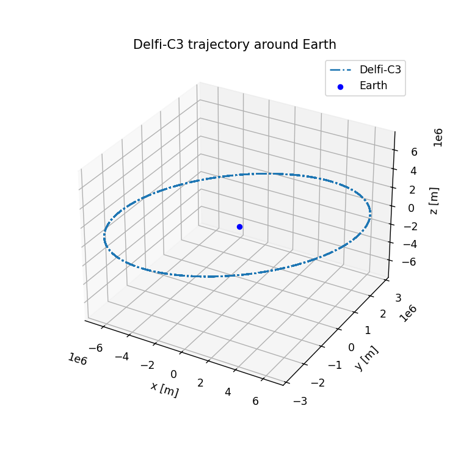
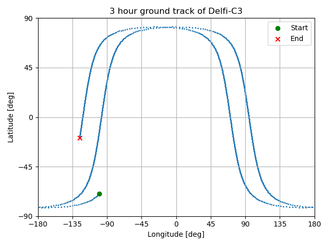

.. _getting_started_quickstart:

###################################
Quickstart: Tudat(Py) in 10 minutes
###################################

This pages aims to get you started with Tudat(Py) and introduce you to some of the key concepts in Tudat. By the end of it, you will be able to use Tudat(Py) for simple tasks such as propagating a spacecraft orbit, as well as expose you to the ecosystem of Tudat(Py) so you can start building more complex simulations. References to the relevant sections of the documentation are provided for more in-depth information.

.. tip:: 
   For a comprehensive list of available functions and classes in TudatPy, have a look at the `TudatPy API documentation <https://py.api.tudat.space/en/latest/>`_.
   This guide links to the API documentation in numerous places, indicated by a white box with black text, like the following: :class:`~tudatpy.numerical_simulation.environment.SystemOfBodies`.

.. contents:: Content of this page
   :local:

What is Tudat(Py)?
******************
The TU Delft Astrodynamics Toolbox (Tudat) is a powerful set of libraries that support astrodynamics and space research and education. It can be used for a wide range of purposes, including high-fidelity :ref:`state propagation <propagation_examples>`, :ref:`state estimation <estimation_examples>` and :ref:`preliminary mission design <mission_design_examples>`. Tudat is implemented in C++, following an object-oriented programming (OOP) style for efficient and modular simulations. Since 2021, most of the Tudat functionality has been exposed via a Python interface -TudatPy- for convenient access. Originally developed at TU Delft, Tudat(Py) is completely open source and :ref:`open for contributions <contribute_to_tudat>`. It is used extensively in :ref:`research projects <research_output>` and teaching activities at TU Delft. 

Installation
************

TudatPy is distributed as a ``conda`` package. To install it, download this ``environment.yaml`` file (:download:`yaml <_static/environment.yaml>`). Then, in your terminal navigate to the directory containing this file and execute the following command:

.. code:: bash

   conda env create -f environment.yaml

With the ``conda`` environment now installed, you can activate it to work in it using:

.. code:: bash

   conda activate tudat-space

.. seealso:: 
   For more in-depth instructions on how to install TudatPy, see the :ref:`installation guide <getting_started_installation>`.
   If you are new to using ``conda`` or Python, have a look at :ref:`getting_started_with_conda` and :ref:`getting_started_with_python`.

.. tip:: 
   To develop Tudat(Py), or make use of the latest features not yet in a conda packages, you can compile TudatPy from the C++ source yourself, see the page on :ref:`using the source code <using_tudat_source>` for details.

Propagating your first orbit
****************************
The following example is based on the `Keplerian satellite orbit example <_src_examples/notebooks/propagation/keplerian_satellite_orbit.html>`_. The goal is to numerically propagate a (quasi-)massless body (spacecraft) under the attraction of a central point-mass. Under this assumption, only the translational motion of this body is propagated, which follows a Keplerian orbit.

Setting up the simulation
==========================
The workflow of a typical propagation in Tudat(Py) is shown in the figure below.

 .. figure:: ../_src_user_guide/_static/tudatpy_high_level.png
    :width: 600

There are two inputs necessary to perform a simulation: a :class:`~tudatpy.numerical_simulation.propagation_setup.propagator.PropagatorSettings` instance and a :class:`~tudatpy.numerical_simulation.environment.SystemOfBodies` instance.
The propagation setup defines the differential equations to be solved and the method to solve them, while the environment setup defines the physical modeling of the environment and system properties, including both celestial and artificial objects.

.. seealso::

   For more information on how to setup your environment and propagation, see the user guide on :ref:`environment_setup` and :ref:`propagation_setup`.

A core principle of Tudat(Py) is the use of ``settings`` objects to define physical models.
A user typically does not create model instances directly, but instead creates (or modifies) a ``settings`` object, which is then translated to a model instance using a so-called "factory function".

Knowing that, we can now start setting up our simulation.
We will first import all necessary modules, including some standard Python modules, like ``numpy`` and ``matplotlib``.

.. code-block:: python

   # Load standard modules
   import numpy as np
   from matplotlib import pyplot as plt

   # Load tudatpy modules
   from tudatpy.interface import spice
   from tudatpy import numerical_simulation
   from tudatpy.numerical_simulation import environment_setup, propagation_setup
   from tudatpy.astro import element_conversion
   from tudatpy import constants
   from tudatpy.util import result2array
   from tudatpy.astro.time_conversion import DateTime

.. seealso::

   For more information about the submodules of Tudat(Py), take a look at :ref:`tudatpy_submodules`.

Setting up the environment
--------------------------

As mentioned before, in Tudat(Py) the physical environment is defined using a :class:`~tudatpy.numerical_simulation.environment.SystemOfBodies` object.
This object contains all the bodies in the simulation along with their physical properties of these bodies.
In this case, we will define only a central body (Earth) and a satellite.

Tudat(Py) relies heavily on the `SPICE toolkit <https://naif.jpl.nasa.gov/naif/>`_ [Acton1996]_ to retrieve ephemeris data and other planetary information for a number of default bodies. Using the following command

.. code-block:: python

   spice.load_standard_kernels()

we load a number of default SPICE kernels into TudatPy.

.. tip:: 
   For a complete list and the order of the default SPICE kernels loaded by TudatPy, see the API documentation on :func:`~tudatpy.interface.spice.load_standard_kernels`.

Define natural bodies
^^^^^^^^^^^^^^^^^^^^^

With the standard kernels loaded, we can define our central body, the Earth.
In this example, the :func:`~tudatpy.numerical_simulation.environment_setup.get_default_body_settings` function is used to create the Earth using a number of default settings, which are distributed with Tudat(Py).

.. code-block:: python

   # Create default body settings for "Earth"
   bodies_to_create = ["Earth"]

   # Create default body settings for bodies_to_create, with "Earth"/"J2000" as the global frame origin and orientation
   global_frame_origin = "Earth"
   global_frame_orientation = "J2000"
   body_settings = environment_setup.get_default_body_settings(
      bodies_to_create, global_frame_origin, global_frame_orientation)

.. seealso:: 
   For more information on these default models (for ephemeris, rotation, shape, atmosphere, etc.), have a look at :ref:`default_env_models`.

Define artificial bodies
^^^^^^^^^^^^^^^^^^^^^^^^

Because our satellite is an artificial body, it is not known to TudatPy by default.
If we were to add it to ``bodies_to_create`` in the previous code block retrieving default settings, TudatPy would throw an error, as our satellite is not a default body.
Instead, we need to create a set of empty body settings for our satellite, using the following code:

.. code-block:: python

   # Create empty body settings for the satellite
   body_settings.add_empty_settings("Delfi-C3")

.. hint:: 
   As we are propagating a satellite in a Keplerian orbit, we do not need to define any additional properties for the satellite.
   For more information on how to define the mass, aerodynamic coefficients or radiation pressure properties of an artificial body, have a look at :ref:`how to create body settings with additional properties <create_new_body_settings>`.

Create the system of bodies
^^^^^^^^^^^^^^^^^^^^^^^^^^^

These body settings are then used to create the system of bodies, using the factory function :func:`~tudatpy.numerical_simulation.environment_setup.create_system_of_bodies`.

.. code-block:: python

   # Create system of bodies
   bodies = environment_setup.create_system_of_bodies(body_settings)

We have now defined our environment in the :class:`~tudatpy.numerical_simulation.environment.SystemOfBodies` instance ``bodies`` and are ready to move on to setting up the propagation.

Setting up the propagation
--------------------------
As mentioned before, the propagation setup defines the differential equations to be solved and the method to solve them.
We will first define what to propagate, and then how to propagate it.
In this case, we would like to propagate our satellite with respect to the Earth:

.. code-block:: python

   # Define bodies that are propagated
   bodies_to_propagate = ["Delfi-C3"]

   # Define central bodies of propagation
   central_bodies = ["Earth"]

Define the acceleration models
^^^^^^^^^^^^^^^^^^^^^^^^^^^^^^

We then define the accelerations acting in our simulation.
This is done by creating a dictionary (``acceleration_settings``), where the keys are the bodies that undergo an acceleration (in this case only on our satellite), and the values are the accelerations acting on these bodies.
The accelerations acting on our satellite are again defined as a dictionary (``acceleration_settings_delfi_c3``), with the keys being the bodies, that exert an acceleration on our satellite, and the values being a list of acceleration(s) that each body exerts.
In this case, we only consider the gravitational point-mass acceleration of the Earth acting on the satellite, thus we get:

.. code-block:: python

   # Define accelerations acting on Delfi-C3
   acceleration_settings_delfi_c3 = dict(
      Earth=[propagation_setup.acceleration.point_mass_gravity()]
   )

   acceleration_settings = {"Delfi-C3": acceleration_settings_delfi_c3}

Similar to before, we use the factory function :func:`~tudatpy.numerical_simulation.propagation_setup.create_acceleration_models` to create the acceleration models from the settings:

.. code-block:: python

   # Create acceleration models
   acceleration_models = propagation_setup.create_acceleration_models(
      bodies, acceleration_settings, bodies_to_propagate, central_bodies)

.. seealso:: 
   In this case, we only considered the influence of a gravitational point-mass attraction.
   To setup a more complex simulation, have a look at :ref:`acceleration_models_setup`.
   To see the full list of available acceleration models, see :ref:`available_acceleration_models` or the `API documentation on accelerations <https://py.api.tudat.space/en/latest/acceleration.html>`_.

Define the initial state
^^^^^^^^^^^^^^^^^^^^^^^^

We would like to simulate our satellite in an elliptical orbit around the Earth.
For the numerical propagation of the translational motion, we need to define the initial state of our satellite in Cartesian elements.
Conveniently, TudatPy has an `element_conversion <https://py.api.tudat.space/en/latest/element_conversion.html>`_ module, which provides a function to convert Keplerian elements to Cartesian elements, :func:`~tudatpy.astro.element_conversion.keplerian_to_cartesian_elementwise`.
In order to convert from Keplerian to Cartesian elements, we also need to know the gravitational parameter of the Earth, which we can simply extract from the environment we created previously:

.. code-block:: python

   # Set initial conditions for the satellite that will be
   # propagated in this simulation. The initial conditions are given in
   # Keplerian elements and later on converted to Cartesian elements
   earth_gravitational_parameter = bodies.get("Earth").gravitational_parameter

   initial_state = element_conversion.keplerian_to_cartesian_elementwise(
      gravitational_parameter = earth_gravitational_parameter,
      semi_major_axis = 6.99276221e+06, # meters
      eccentricity = 4.03294322e-03, # unitless
      inclination = 1.71065169e+00, # radians
      argument_of_periapsis = 1.31226971e+00, # radians
      longitude_of_ascending_node = 3.82958313e-01, # radians
      true_anomaly = 3.07018490e+00, # radians
   )

.. hint:: 
   In Tudat(Py), all quantities are defined in SI units, with all angular measures defined in radian. All epochs are defined as seconds since J2000 in the TDB scale.

This only leaves the epoch of the initial state to be defined. 
We will use Tudat's own :class:`~tudatpy.astro.time_conversion.DateTime` class to define the epoch of the initial state.

.. code-block:: python

   # Set simulation start and end epochs
   simulation_start_epoch = DateTime(2020, 1, 1).epoch()
   simulation_end_epoch   = DateTime(2020, 1, 2).epoch()

.. seealso:: 
   For conversions from other time scales and formats, see :ref:`times_and_dates`.

Define the integrator and propagator
^^^^^^^^^^^^^^^^^^^^^^^^^^^^^^^^^^^^
With the acceleration models and initial state defined, we can now define how to propagate the state, i.e. how the differential equations are solved.
We will use a simple Runge-Kutta 4 integrator, with a fixed step size of 10 seconds.
For the propagator, a Cowell propagator is used, which uses Cartesian elements as the propagated states.
Lastly, we define the termination conditions for the propagation, which in this case is a fixed end epoch.

.. code-block:: python

   # Create numerical integrator settings
   integrator_settings = propagation_setup.integrator.runge_kutta_fixed_step(
      time_step=10.0, coefficient_set=propagation_setup.integrator.rk_4
   )

   propagator_type = propagation_setup.propagator.cowell

   # Create termination settings
   termination_settings = propagation_setup.propagator.time_termination(simulation_end_epoch)

.. note:: 
   Depending on your performance and accuracy requirements, you might want to consider other propagator and integrator combinations.
   Tudat(Py) offers a variety of other integrators, such as higher-order multi-stage and extrapolation integrators, as well as different propagators, such as the Encke, Keplerian, Modified-Equinoctial, and Unified State Model propagators.
   For more information, have a look at :ref:`integrator_setup` and the `API documentation on propagators <https://py.api.tudat.space/en/latest/propagator.html>`_.

We are not only interested in the final state of our satellite, but also the evolution of its ground track over time.
To retrieve this information, Tudat(Py) uses so-called dependent variables, which store information about the conditions of the system during each step of the integration, in addition to the propagated state itself.
We create a list of dependent variables to save, in this case the longitude and latitude of our satellite with respect to the Earth:

.. code-block:: python

   # Define list of dependent variables to save
   dependent_variables_to_save = [
      propagation_setup.dependent_variable.latitude("Delfi-C3", "Earth"),
      propagation_setup.dependent_variable.longitude("Delfi-C3", "Earth"),
   ]

.. seealso:: 
   For a list of available dependent variables, have a look at the `API documentation on dependent variables <https://py.api.tudat.space/en/latest/dependent_variable.html>`_.

Create the propagator settings
^^^^^^^^^^^^^^^^^^^^^^^^^^^^^^

Putting all together, we can finally create the propagator settings:

.. code-block:: python

   # Create propagation settings
   propagator_settings = propagation_setup.propagator.translational(
      central_bodies,
      acceleration_models,
      bodies_to_propagate,
      initial_state,
      simulation_start_epoch,
      integrator_settings,
      termination_settings,
      propagator=propagator_type,
      output_variables=dependent_variables_to_save
   )

Perform the propagation
==========================

Now that we have defined our :class:`~tudatpy.numerical_simulation.propagation_setup.propagator.PropagatorSettings` instance (the ``propagator_settings`` object) and a :class:`~tudatpy.numerical_simulation.environment.SystemOfBodies` instance (the ``bodies`` object), we can finally perform the propagation.
As introduced earlier in `Setting up the simulation`_, the propagation is performed using the :func:`~tudatpy.numerical_simulation.create_dynamics_simulator` function.
Typically, calling this function performs the propagation (unless the optional input argument ``simulate_dynamics_on_creation`` is set to ``False``)

.. code-block:: python

   # Create simulation object and propagate the dynamics
   dynamics_simulator = numerical_simulation.create_dynamics_simulator(
      bodies, propagator_settings
   )

Post-processing the results
---------------------------
The :func:`~tudatpy.numerical_simulation.create_dynamics_simulator` function returns an instance of a :class:`~tudatpy.numerical_simulation.SingleArcSimulator`, which has the attribute ``propagation_results`` of type :class:`~tudatpy.numerical_simulation.propagation.SingleArcSimulationResults`.
The ``propagation_results`` object contains, among other information, the ``state_history`` and ``dependent_variable_history``.
The former stores the state of the system at each step of the integration, while the latter holds the dependent variables.

.. hint:: 
   Both the ``state_history`` and ``dependent_variable_history`` are stored in the form of dictionaries, which contain the epochs of each single integration step as keys and the corresponding quantities as values.

To post-process the results, we will first convert the state and dependent variable history dictionaries to a NumPy array, which can be easily manipulated and plotted.
TudatPy offers a utility function, :func:`~tudatpy.util.result2array`, to convert the dictionaries to NumPy arrays:

.. code-block:: python

   # Extract the resulting state history and convert it to an ndarray
   states = dynamics_simulator.propagation_results.state_history
   states_array = result2array(states)

   # Extract the resulting dependent variable history and convert it to an ndarray
   dependent_variables = dynamics_simulator.propagation_results.dependent_variable_history
   dependent_variables_array = result2array(dependent_variables)

Print the initial and final states
^^^^^^^^^^^^^^^^^^^^^^^^^^^^^^^^^^

.. code-block:: python

   print(
      f"""
   Single Earth-Orbiting Satellite Example.
   The initial position vector of Delfi-C3 is [km]: \n
   {states[simulation_start_epoch][:3] / 1E3} 
   The initial velocity vector of Delfi-C3 is [km/s]: \n
   {states[simulation_start_epoch][3:] / 1E3} \n
   After {simulation_end_epoch - simulation_start_epoch} seconds the position vector of Delfi-C3 is [km]: \n
   {states[simulation_end_epoch][:3] / 1E3}
   And the velocity vector of Delfi-C3 is [km/s]: \n
   {states[simulation_start_epoch][3:] / 1E3}
   """
   )

The expected output is::

   Single Earth-Orbiting Satellite Example.
   The initial position vector of Delfi-C3 is [km]: 
   [-2455.85398258     8.89844018 -6577.35622264] 
   The initial velocity vector of Delfi-C3 is [km/s]: 
   [ 6.47108513  2.97329684 -2.41447086]

   After 86400.0 seconds the position vector of Delfi-C3 is [km]: 
   [-6341.67824913 -2259.72932298 -1943.73703997]
   And the velocity vector of Delfi-C3 is [km/s]: 
   [ 6.47108513  2.97329684 -2.41447086]

Visualize the trajectory
^^^^^^^^^^^^^^^^^^^^^^^^

Finally, let's visualize the trajectory of our satellite in 3D around Earth.
For this, we use the ``states_array`` we previously created with the :func:`~tudatpy.util.result2array` function.
The array contains the epochs as the first column, followed by the Cartesian states (position and velocity, with respect to Earth) in SI units.

.. code-block:: python

   # Define a 3D figure using pyplot
   fig = plt.figure(figsize=(6,6), dpi=125)
   ax = fig.add_subplot(111, projection='3d')
   ax.set_title(f'Delfi-C3 trajectory around Earth')

   # Plot the positional state history
   ax.plot(states_array[:, 1], states_array[:, 2], states_array[:, 3], label=bodies_to_propagate[0], linestyle='-.')
   ax.scatter(0.0, 0.0, 0.0, label="Earth", marker='o', color='blue')

   # Add the legend and labels, then show the plot
   ax.legend()
   ax.set_xlabel('x [m]')
   ax.set_ylabel('y [m]')
   ax.set_zlabel('z [m]')
   plt.show()

This should give you a 3D plot similar to the following:

Similarly, we will use the dependent variables array to plot the ground track of our satellite on Earth.
As with the state history, the dependent variable history is stored in the form of a NumPy array, with the epochs as the first column and the dependent variables as the following columns.
We use the epochs to extract a subset of 3 hours of data, for which we plot the ground track:

.. code-block:: python

   fig, ax = plt.subplots(tight_layout=True)

   latitude = dependent_variables_array[:, 1]
   longitude = dependent_variables_array[:, 2]

   # Extract 3 hours data subset
   relative_time_hours = (dependent_variables_array[:, 0] - simulation_start_epoch) / 3600
   hours_to_extract = 3
   propagation_span_hours = (simulation_end_epoch - simulation_start_epoch) / 3600

   subset = int(len(relative_time_hours) / propagation_span_hours * hours_to_extract)

   latitude = np.rad2deg(latitude[:subset])
   longitude = np.rad2deg(longitude[:subset])

   # Plot ground track
   ax.set_title("3 hour ground track of Delfi-C3")
   ax.scatter(longitude, latitude, s=1)
   ax.scatter(longitude[0], latitude[0], label="Start", color="green", marker="o")
   ax.scatter(longitude[-1], latitude[-1], label="End", color="red", marker="x")

   # Configure plot
   ax.set_xlabel("Longitude [deg]")
   ax.set_ylabel("Latitude [deg]")
   ax.set_xlim([-180, 180])
   ax.set_ylim([-90, 90])
   ax.set_xticks(np.arange(-180, 181, step=45))
   ax.set_yticks(np.arange(-90, 91, step=45))
   ax.legend()
   ax.grid(True)
   plt.show()

This should give you a plot similar to the following:

Congratulations!
You have now successfully propagated a satellite in a Keplerian orbit around the Earth using Tudat(Py) and used the results to visualize its trajectory.

.. seealso:: 
   For more information on how to set up more complex simulations, have a look at the :ref:`examples <getting_started_examples>`.
   They include examples on more complex propagations, such as `including additional perturbation models <_src_examples/notebooks/propagation/perturbed_satellite_orbit.html>`_ or `the effect of a thruster <_src_examples/notebooks/propagation/thrust_between_Earth_Moon.html>`_.

   If you are interested in using TudatPy for state estimation, have a look at the example of using TudatPy for `parameter estimation of Delfi-C3 <_src_examples/notebooks/estimation/full_estimation_example.html>`_.

   Last but not least, if you would like to find the optimal Earth-Mars launch window, you might be interested in using TudatPy to `create Porkchop plots <_src_examples/notebooks/mission_design/earth_mars_transfer_window.html>`_.

Navigating the Tudat(Py) ecosystem
**********************************

The Tudat(Py) ecosystem includes a variety of resources to make the functionality of Tudat more accessible.
On this website, you can find a comprehensive user guide that explains the core concepts of Tudat(Py).
The user guide includes sections on :ref:`state propagation <state_propagation>`, :ref:`state estimation <state_estimation>`, :ref:`mathematics <mathematics>`, and :ref:`preliminary mission design <prelim_mission_design>`.
You can also find a :ref:`list of examples <getting_started_examples>` that demonstrate how to use TudatPy for a variety of tasks.
For more information on the different submodules of TudatPy, the :ref:`tudatpy_submodules` page provides an overview of the available modules and their functionality.

This website is complemented by the `API documentation <https://py.api.tudat.space/en/latest/>`_, which provides a comprehensive overview of all available functions and classes exposed in TudatPy.

As mentioned before, Tudat(Py) is completely open source and welcomes contributions.
The source code is hosted on `GitHub <https://github.com/tudat-team>`_.
For more information on how to contribute to Tudat, have a look at the :ref:`contribute_to_tudat` page.

Good luck with your Tudat(Py) journey!
We are excited to hear what you will create using Tudat(Py).
If you have used Tudat(Py) for a project, research, or teaching, we would love to hear about it and appreciate a citation to the following conference presentation (with a proper journal article coming soon!):

Dirkx, D., Fayolle, M., Garrett, G., Avillez, M., Cowan, K., Cowan, S., Encarnacao, J., Fortuny Lombrana, C., Gaffarel, J., Hener, J., Hu, X., van Nistelrooij, M., Oggionni, F., and Plumaris, M.: The open-source astrodynamics Tudatpy software – overview for planetary mission design and science analysis, Europlanet Science Congress 2022, Granada, Spain, 18–23 Sep 2022, EPSC2022-253, https://doi.org/10.5194/epsc2022-253, 2022.

=================

.. [Acton1996] Acton, (1996). Ancillary data services of NASA's Navigation and Ancillary Information Facility.
   Planetary and Space Science, Volume 44, Issue 1, https://doi.org/10.1016/0032-0633(95)00107-7.
