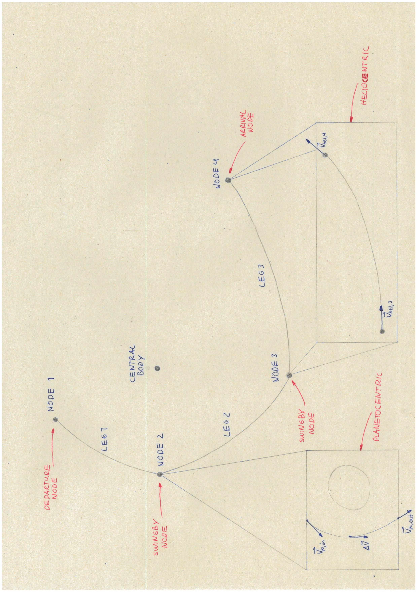

.. _`transfer_trajectory`:

=================================
Multiple Gravity Assists Transfer
=================================

In this section, the preliminary design of multiple-leg interplanetary transfer trajectories is discussed. This module
provides the functionalities for creating transfer trajectories consisting of multiple transfer legs or various types
with powered and unpowered gravity assists. This allows high-thrust or low-thrust transfer trajectories with multiple
flybys to be designed, as well as a hybrid of low- and high-thrust. For per-function details see the `API documentation
<https://py.api.tudat.space/en/latest/transfer_trajectory.html>`_. 

A multiple gravity-assist transfer (MGA) is constituted by a series of nodes and legs. The nodes correspond to the
departure, gravity assist, and arrival planets (bodies), and the legs correspond to the trajectories between the nodes.
Therefore, there is always one more node than leg. Note that the initial or final node may be departure/capture or a
flyby. The legs may be of a number of different types, which is discussed more in-depth later on. 

The module is implemented using simplified dynamical models for the nodes and legs. For the unpowered leg trajectory,
for example, the transfer is for instance defined under the assumptions of the patched-conics approximation. This module
allows for the flexible design of transfers using only analytical and semi-analytical methods, typically without any
required numerical integration. This is particularly useful for preliminary mission design, where having a fast method
is particularly important.

.. note::

    The MGA model also allows defining transfers with a single leg (without any gravity assist).

General Model Description
==========================

Before evaluating any transfer, it is useful to introduce the concept of nodes and legs more. To assist in this, a
schematic representation is given in the figure below. An MGA trajectory is given, with an arbitrary sequence. A number
of nodes can be seen that represent the celestial body used as GA body, as well as a number of legs that connect the
nodes together. A central body is given, as this is required for the heliocentric evaluation of the legs, but more on
that later. A number of different nodes are used and annotated; these are explained below under 'Nodes and Their
parameters'. 

It is crucial to understand that both the nodes and legs have an incoming and outgoing velocity vector and that these
are determined in different frames. The key difference being that the incoming/outgoing velocities of the legs are
evaluated in a heliocentric frame -- assuming the Sun is the central body -- and the incoming/outoing velocities of the
nodes are evaluated in a planetocentric frame -- assuming a planet is the GA target. The velocity vectors are converted
in to the respective frame to evaluate the unknown parameters. Which parameters are unknown depends on the type of leg
and node, which is explained later. For more details on the difference in reference frame and the patching of these
trajectories, see section 4.4.2/3 Musegaas (2012)`_.

.. The short section below could be added, but it may provide too many details.

.. GA evaluation
.. -------------
..
.. To evaluate a GA, a number of equations are used:
..
.. .. math::
..       e = 1 + \frac{r_p}{\mu \mid \vec{V}_{\infty,in}^2 \mid}
..
.. where e is the eccentricity of the planetocentric GA arc, :math:`r_p` is pericenter radius, :math:`\mu` is the gravitational
.. parameter of the GA target, and :math:`\vec{V}_{\infty,in}` is the hyperbolic planetocentric incoming velocity vector.
..
.. .. math::
..       \delta = 2 \arcsin(\frac{1}{e})
..
.. where :math:`\delta` is the declination. With these two equations, one can calculate the declination -- which represents
.. the in-plane angle between the incoming and outgoing hyperbolic planetocentric velocity vectors.

Supported models
================

At present, the types of legs are supported (more details can be found below):

- Unpowered legs: A purely ballistic (Keplerian) trajectory between nodes
- Velocity-based deep-space maneuver (DSM)  legs: A ballistic trajectory betweene nodes, with the addition of a single impulsive maneuver during the leg (parameterized by its velocity)
- Position-based DSM legs: A ballistic trajectory betweene nodes, with the addition of a single impulsive maneuver during the leg (parameterized by its position)
- Spherical-shaping legs: A shape-based low-thrust trajectory using the spherical shaping method
- Hodographic-shaping legs: A shape-based low-thrust trajectory using the hodographic shaping method

At present, the types of nodes are supported (more details can be found below):

- Departure node: Only available for the first node, to incorporate :math:`\Delta V` required to escape from a parking orbit around the first node
- Swingby node: A node assuming a hyperbolic trajectory w.r.t. the node, with the possibility of performing an impulsive maneuver at periapsis (see :ref:`transfer_nodes`).
- Arrival node: Only available for the final node, to incorporate :math:`\Delta V` required to enter a closed orbit around the final node

Each leg and node has its own free parameters, which must be provided by the user to evaluate the performance of the overall trajectory (see below).

General Procedure
=================

To create a transfer trajectory, the user must define settings for the nodes and legs, after which these settings
are processed to create the transfer trajectory. 

First, the transfer trajectory module can be imported with:

.. code-block:: python

    from tudatpy.kernel.trajectory_design import transfer_trajectory

The most commonly-used for procedure for creating an settings of the trajectory is to use factory functions to get the transfer
leg has the same type (e.g. all unpowered, all spherical-shaping, etc.). The factory functions to create a set of
node and leg settings is:

  - Unpowered legs: :func:`~tudatpy.trajectory_design.transfer_trajectory.mga_settings_unpowered_unperturbed_legs`.
  - Velocity-based DSM legs: :func:`~tudatpy.trajectory_design.transfer_trajectory.mga_settings_dsm_velocity_based_legs`.
  - Position-based DSM legs: :func:`~tudatpy.trajectory_design.transfer_trajectory.mga_settings_dsm_position_based_legs`.
  - Spherical-shaping legs: :func:`~tudatpy.trajectory_design.transfer_trajectory.mga_settings_spherical_shaping_legs`.
  - Hodographic-shaping legs: :func:`~tudatpy.trajectory_design.transfer_trajectory.mga_settings_hodographic_shaping_legs` or
    :func:`~tudatpy.trajectory_design.transfer_trajectory.mga_settings_hodographic_shaping_legs_with_recommended_functions` 
    (for manual definition or recommended automatic definition of shaping functions, respectively).

Manually creating settings for single legs and nodes is described :ref:`below <manual_transfer_legs_nodes>`.

The complete procedure for creating and analyzing an MGA transfer consists of the following. The associated code snippets are taken from 
an `this example application`_, for an unpowered leg Cassini (EVVEJS) transfer trajectory:

.. _`this example application`: https://docs.tudat.space/en/latest/_src_getting_started/_src_examples/notebooks/pygmo/cassini1_mga_optimization.html 

- **Define the transfer settings**: The transfer leg settings and node settings a are created. These are defined
  using the body order (bodies through which the spacecraft will pass), the departure and arrival orbit (semi-major axis
  and eccentricity) and other settings specific to each leg type. Selecting the semi-major axis of the departure/arrival
  orbit as :math:`a = \infty` corresponds to having the spacecraft depart/arrive from/to the edge of the initial/final
  body's sphere of influence (e.g. with zero hyperbolic excess velocity). 

.. code-block:: python

    # Define central body
    central_body = 'Sun'

    # Define the order of bodies (nodes) for gravity assists
    transfer_body_order = ['Earth', 'Venus', 'Venus', 'Earth',  'Jupiter',  'Saturn']

    # Define the departure and insertion orbits
    departure_semi_major_axis = np.inf
    departure_eccentricity = 0.

    arrival_semi_major_axis = 1.0895e8 / 0.02
    arrival_eccentricity = 0.98

    # Define the trajectory settings for both the legs and at the nodes
    transfer_leg_settings, transfer_node_settings = transfer_trajectory.mga_settings_unpowered_unperturbed_legs(
        transfer_body_order,
        departure_orbit=(departure_semi_major_axis, departure_eccentricity),
        arrival_orbit=(arrival_semi_major_axis, arrival_eccentricity))

- **Create the transfer trajectory object**: Through :func:`~tudatpy.trajectory_design.transfer_trajectory.create_transfer_trajectory`.

.. code-block:: python

    # Create physical environment
    bodies = ...

    # Create the transfer calculation object
    transfer_trajectory_object = transfer_trajectory.create_transfer_trajectory(
        bodies,
        transfer_leg_settings,
        transfer_node_settings,
        transfer_body_order,
        central_body)
  
- **Evaluate the transfer**: Select the node times, node parameters, and leg parameters, and use them to evaluate the
  transfer through :meth:`~tudatpy.trajectory_design.transfer_trajectory.TransferTrajectory.evaluate`. These parameters
  are described in the following sections. Note that, in the case of an optimization, this function is called repeatedly
  to evaluate the transfer trajectory with differeent properties.

.. code-block:: python

    # Define free parameters
    node_times = ...
    leg_free_parameters = ... # (empty)
    node_free_parameters = ... # (empty)

    # Evaluate the transfer with given parameters
    transfer_trajectory_object.evaluate( node_times, leg_free_parameters, node_free_parameters )

- **Retrieve the results**: Use :class:`~tudatpy.trajectory_design.transfer_trajectory.TransferTrajectory`'s
  properties or functions to retrieve the :math:`\Delta V`, time of flight, state history, acceleration history, etc.

.. code-block:: python

    # Retrieve total Delta V
    total_delta_v = transfer_trajectory_object.delta_v

All available functions and classes are described in detail in the relevant entry of the `API reference`_.
For applications see `this example`_ and `this PyGMO example`_.

.. _`API reference`: https://tudatpy.readthedocs.io/en/latest/transfer_trajectory.html#
.. _`this example`: https://docs.tudat.space/en/latest/_src_getting_started/_src_examples/notebooks/propagation/mga_trajectories.html
.. _`this PyGMO example`: https://docs.tudat.space/en/latest/_src_getting_started/_src_examples/notebooks/pygmo/cassini1_mga_optimization.html

.. _manual_transfer_legs_nodes:

Manually Creating the Transfer Settings
---------------------------------------

While in many casses the transfer settings can be created using the factory functions listed in the previous section, there are some cases
where the manual creation of these should be preferred. These include transfers with mixed types of legs. The
creation of the transfer settings can be divided into two steps: creation of the legs settings and creation of the nodes
settings.

The legs settings are a list with the settings of each leg constituting the transfer. The settings of an individual leg
can be retrieved using the appropriate factory function:

- Unpowered legs: :func:`~tudatpy.trajectory_design.transfer_trajectory.unpowered_leg`.
- Velocity-based DSM legs: :func:`~tudatpy.trajectory_design.transfer_trajectory.dsm_velocity_based_leg`.
- Position-based DSM legs: :func:`~tudatpy.trajectory_design.transfer_trajectory.dsm_position_based_leg`.
- Spherical-shaping legs: :func:`~tudatpy.trajectory_design.transfer_trajectory.spherical_shaping_leg`.
- Hodographic-shaping legs: :func:`~tudatpy.trajectory_design.transfer_trajectory.hodographic_shaping_leg`.

The nodes settings are a list with the settings of each node constituting the transfer. There are three main types of
nodes: departure, swingby, and arrival nodes. The initial node is usually a departure node (although it can also be
a swingby node), the intermediate nodes are always swingby nodes (at the time of writing), and the final is usually an arrival node (although it
can also be a swingby node). Selecting the initial and final nodes as swingby nodes is useful when individually
analyzing different parts of a transfer or when a mission's objective is to do a swingby of the final body.

The settings of an individual node can be retrieved using the appropriate factory function:

- Departure node: :func:`~tudatpy.trajectory_design.transfer_trajectory.departure_node`.
- Swingby node: :func:`~tudatpy.trajectory_design.transfer_trajectory.swingby_node`.
- Arrival node: :func:`~tudatpy.trajectory_design.transfer_trajectory.capture_node`.

.. note::

    The nodes and legs settings should have the same number of elements as the number of, respectively, nodes and legs
    in the transfer.

An example of manual creation of nodes and legs settings can be found below. The transfer body
order, time of flight values per leg, and number of revolutions per leg are given as input. The
definition of the departure and arrival input is necessary as well for the departure and capture
nodes, respectively. Subsequently, as shaping functions have to be given for each leg, a loop is
performed over the number of legs that add the recommended shaping functions as given by
`[Gondelach, 2012] <http://resolver.tudelft.nl/uuid:6a4f1673-88b1-4823-b2ef-9d864c84ab11>`_.
Finally, a node for each planet in the transfer body order must be given: A departure node,
swingby nodes equal to the number of GA's, and a capture node. 

.. tabs::

     .. tab:: Python

      .. toggle-header::
         :header: Required **Show/Hide**

            .. code-block:: python

                from tudatpy.kernel.numerical_simulation import propagation_setup
                from tudatpy.kernel.numerical_simulation import environment_setup
                from tudatpy.kernel.trajectory_design import shape_based_thrust
                from tudatpy.kernel.trajectory_design import transfer_trajectory
                import numpy as np

      .. literalinclude:: /_src_snippets/astrodynamics/manual_node_leg_settings.py
         :language: python

     .. tab:: C++

      .. literalinclude:: /_src_snippets/simulation/environment_setup/req_create_bodies.cpp
         :language: cpp

Having created the legs and nodes settings, the same procedure described above for creating the transfer trajectory
object, evaluating it, and retrieving the computed data can be followed.

To evaluate the transfer one needs to provide a list of transfer parameters. These are: 

- **Node times**
- **Leg parameters**
- **Node parameters**

It is possible to a see a list of the parameters required for a given transfer via the
:func:`~tudatpy.trajectory_design.transfer_trajectory.print_parameter_definitions` function.

The node times *always* need to be specified (regardless of the leg and node times), and correspond to the epoch when the spacecraft reaches each
planet/body. The node and leg parameters, which depend on the specific node and leg type, are described next. Note that, for certain
leg and node types, there are no free parameters and the trajectory is fully defined by the node times (as is the case for an a series of unpowered legs).

Legs and Their Parameters
-------------------------

The parameters associated with each type of leg are listed below. For more detailed descriptions, the reader is referred
to the literature listed in the API reference for the factory function of each leg type.

- **Unpowered legs**: Does not have leg parameters.

- **Velocity-based DSM legs**: 1 leg parameter:

      - Fraction of the leg's time-of-flight at which DSM is applied (:math:`\in [0,1]`).

- **Position-based DSM legs**: 4 leg parameters:

      - Fraction of the leg's time-of-flight at which DSM is applied (:math:`\in [0,1]`).
      - Position of the DSM in spherical coordinates, with respect to a frame with the x-axis aligned with the position
        of the departure body, z-axis aligned with the angular momentum of the departure body, y-axis selected to form a
        right-handed frame. The spherical position is specified as: dimensionless radial position (using as unit of length
        the radial position of the departure body), in-plane angle, out-of-plane angle.

        .. note::

            A leg with position-based DSMs requires more leg parameters than one with velocity-based DSMs. However, a transfer
            constituted by the former will require less node parameters than one constituted by the latter.

- **Spherical-shaping legs**: 1 leg parameter:

      - Integer number of revolution (:math:`\geq 0`).

- **Hodographic-shaping legs**: at least 1 leg parameter:

      - Integer number of revolution (:math:`\geq 0`).
      - Free coefficients of shaping functions (number of coefficients is greater or equal to zero).

Finally, and before moving on to the description of the node parameters, it is important to analyze the boundary conditions used
for the evaluation of each leg of the transfer. These conditions are dealt with internally by the model; hence, the user never
has direct contact with them. Nevertheless, understanding them is essential for describing the node parameters.

Four types of boundary conditions are possible: initial position, initial velocity,
final position, and final velocity. A given leg will receive some of these as input and produce the others as output.
The inputs and outputs associated with each leg type are summarized in the following table. For example, a velocity-based
DSM leg receives as input its initial position, initial velocity, and final position, and outputs its final velocity.

+----------------------+-----------------------+-----------------------+---------------------+---------------------+
|                      | Leg initial position  | Leg initial velocity  | Leg final position  | Leg final velocity  |
+======================+=======================+=======================+=====================+=====================+
| Unpowered            | Input                 | Output                | Input               | Output              |
+----------------------+-----------------------+-----------------------+---------------------+---------------------+
| DSM-Velocity         | Input                 | Input                 | Input               | Output              |
+----------------------+-----------------------+-----------------------+---------------------+---------------------+
| DSM-Position         | Input                 | Output                | Input               | Output              |
+----------------------+-----------------------+-----------------------+---------------------+---------------------+
| Spherical shaping    | Input                 | Input                 | Input               | Input               |
+----------------------+-----------------------+-----------------------+---------------------+---------------------+
| Hodographic shaping  | Input                 | Input                 | Input               | Input               |
+----------------------+-----------------------+-----------------------+---------------------+---------------------+

.. _transfer_nodes:

Nodes and Their Parameters
---------------------------

As already mentioned, there are three main types of nodes: departure, swingby, and arrival nodes. These are the only
types with which the user has direct contact. However, internally, these are further divided into subtypes. While a user does
not need to understand these subtypes for using the MGA model, the user does need to if he/she wishes to understand what
a given node is doing behind the scenes and what node parameters are required for a given transfer.

The various node subtypes are described next. The node subtype used in a given instance depends on the types of the legs
that precede and follow it; more specifically, it depends on the inputs and outputs of those legs. Using the previous
table specifying the inputs and output of each leg and the following description of each node subtype, the user will be
able to predict exactly which nodes are used for a given set transfer, as well as the required node parameters.

Note that the incoming velocity of a node corresponds to the
final velocity of the previous leg and the outgoing velocity of a node corresponds to the initial velocity of the
following leg.

- **Departure node**: Usually, this is the initial node of the
  transfer. The outgoing relative velocity at the node (i.e. the excess velocity) is either
  retrieved from the following leg or specified by the user. The node computes the impulsive :math:`\Delta V` that
  needs to be applied at the periapsis of the departure elliptic orbit to enter a hyperbolic orbit with the target excess
  velocity, according to section 4.6 of `Musegaas (2012)`_. This node is subdivided into the following types:

    - **Node with leg-defined outgoing velocity**: Does not require node parameters.
    - **Node with user-defined outgoing velocity**: Node parameters:

      - Outgoing velocity vector relative to the node, specified with respect to a TNW reference frame defined using the node's
        inertial state. The outgoing relative velocity is specified in spherical coordinates: norm of the velocity,
        in-plane angle (:math:`\in [0, 2\pi]`), out-of-plane angle (:math:`\in [-\pi/2, \pi/2]`).

- **Arrival node**: Usually, this is the final node of the
  transfer. The incoming relative velocity at the node (i.e. the excess velocity) is either
  retrieved from the previous leg or specified by the user. The node computes the impulsive :math:`\Delta V` that
  needs to be applied at the periapsis of the hyperbolic orbit with the specified excess velocity to enter the
  arrival elliptical orbit, according to section 4.6 of `Musegaas (2012)`_. This node is subdivided into the following types:

      - **Node with leg-defined incoming velocity**: Does not require node parameters.
      - **Node with user-defined incoming velocity**: Node parameters:

        - Incoming velocity vector relative to the node, specified with respect to a TNW reference frame defined using the node's
          inertial state. The incoming relative velocity is specified in spherical coordinates: norm  of the velocity,
          in-plane angle (:math:`\in [0, 2\pi]`), out-of-plane angle (:math:`\in [-\pi/2, \pi/2]`).

- **Swingby node**: Usually, these are the intermediate nodes of the transfer.
  The swingby node is subdivided into the following types:

      - **Node with legs-defined incoming and outgoing velocity**: Does not require node parameters. Computes the
        :math:`\Delta V \geq 0` that needs to be applied during the swingby to patch the incoming and outgoing
        velocities, according to section 4.5.2 of `Musegaas (2012)`_.

      - **Node with leg-defined incoming velocity, user-defined swingby**: Given the known incoming velocity,
        the node forward propagates the swingby using the user-specified parameters, according to sections 4.4.2/3
        of `Musegaas (2012)`_. Node parameters:

            - Swingby periapsis radius
            - Swingby :math:`\Delta V` (applied at the periapsis)
            - Outgoing-velocity rotation angle. Defined according to Appendix 7a of "Spacecraft Trajectory Optimization",
              `Conway (2010)`_. This angle defines the plane in which the swingby occurs (different from the bending angle,
              which is defined inside that plane). This angle takes values in :math:`[0, 2\pi]`.

      - **Node with user-defined swingby, leg-defined outgoing velocity**: Given the known outgoing velocity,
        the node backward propagates the swingby using the user-specified parameters. Analogous to sections 4.4.2/3
        of `Musegaas (2012)`_. Node parameters:

            - Swingby periapsis radius
            - Swingby :math:`\Delta V` (applied at the periapsis)
            - Incoming-velocity rotation angle. Defined analogously to the outgoing-velocity rotation angle, which in turn is
              defined according to Appendix 7a of "Spacecraft Trajectory Optimization",
              `Conway (2010)`_. This angle defines the plane in which the swingby occurs (different from the bending angle,
              which is defined inside that plane). This angle takes values in :math:`[0, 2\pi]`.

      - **Node with user-defined incoming, user-defined swingby**: Given the known incoming velocity,
        the node forward propagates the swingby using the user-specified parameters, according to sections 4.4.2/3
        of `Musegaas (2012)`_. Node parameters:

            - Incoming velocity vector relative to the node, specified with respect to a TNW reference frame defined using the node's
              inertial state. The incoming relative velocity is specified in spherical coordinates: norm of the velocity,
              in-plane angle (:math:`\in [0, 2\pi]`), out-of-plane angle (:math:`\in [-\pi/2, \pi/2]`).
            - Swingby periapsis radius
            - Swingby :math:`\Delta V` (applied at the periapsis)
            - Outgoing-velocity rotation angle. Defined according to Appendix 7a of "Spacecraft Trajectory Optimization",
              `Conway (2010)`_. This angle defines the plane in which the swingby occurs (different from the bending angle,
              which is defined inside that plane). This angle takes values in :math:`[0, 2\pi]`.

.. _`Musegaas (2012)`:  http://resolver.tudelft.nl/uuid:02468c77-5c64-4df8-9a24-1ed7ad9d1408
.. _`Conway (2010)`:  https://doi.org/10.1017/CBO9780511778025
