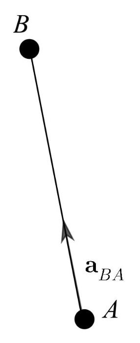

.. _available_acceleration_models:

===============================
Available Acceleration Models
===============================

In this page, all the acceleration models available in tudat(py) are explained. Regardless of the type of acceleration
model, the procedure to link such acceleration model to the bodies exerting and undergoing the acceleration is
explained in this page: :ref:`Acceleration Model Setup`. Therefore, this information will not be repeated in this page.

For each model, both the theoretical basis and the related API reference are provided. In tudat(py), acceleration
models are created through factory functions, which link an object to the ``DynamicsSimulator``. Such object is an
instance of the ``AccelerationSettings`` class (see `API <https://tudatpy.readthedocs.io/en/latest/acceleration.html#tudatpy.numerical_simulation.propagation_setup.acceleration.AccelerationSettings>`_)
or of its derived classes.

.. contents:: List of available acceleration models
    :depth: 3

###########################
Gravitational accelerations
###########################

.. note:: | **Notation**
          | The notation for the following explanation is as follows:
          | - :math:`\mathbf{r}_{BA} = \mathbf{r}_{B} - \mathbf{r}_{A}` - position vector of B with respect to A
          | - :math:`U_{B}=U_{B}\left(\mathbf{r}_{B A}\right)` - gravitational potential due to body B at location :math:`\mathbf{r}_{BA}`
          | - :math:`\mu_B` - gravitational parameter of body B

In general, the gravitational acceleration exerted by a body B, with associated potential :math:`U_{B}`, on a body A
located at `\mathbf{r}_{BA} with respect to body B can be expressed as follows:

.. math::
    \mathbf{a}_{B A}=\nabla U_{B}\left(\mathbf{r}_{B A}\right)

Graphically, this means:

.. _point_mass_acceleration:

Point-mass Gravity
##################

**Theory**

For point-mass gravity, the gravitational potential is:

.. math::
    U_{B}\left(\mathbf{r}_{B A}\right)=\frac{\mu_{B}}{\left\|\mathbf{r}_{B A}\right\|}

which in terms of acceleration means:

.. math::
    \mathbf{a}_{B A}=-\frac{\mu_{B}}{\left\|\mathbf{r}_{B A}\right\|^{2}} \hat{\mathbf{r}}_{B A}

**Code**

The point-mass gravity acceleration model can be created as indicated in the API `here <https://tudatpy.readthedocs.io/en/latest/acceleration.html#tudatpy.numerical_simulation.propagation_setup.acceleration.point_mass_gravity>`_.

It requires the following environment models to be defined:

- Gravity field for body exerting acceleration (see :ref:`environment_gravity_field_model` for non-default models).
- Current state of body exerting acceleration, either from a pre-defined ephemeris model (see :ref:`environment_ephemeris_model`) or from the numerical propagation of the translational dynamics of the body exerting the acceleration.

.. _spherical_harmonic_acceleration:

Spherical Harmonic Gravity
##########################

Settings for a spherical harmonic gravity acceleration. For example of acceleration exerted by Earth:

.. tabs::

   .. tab:: Python

    .. literalinclude:: /_src_snippets/simulation/propagation_setup/acceleration_models/spherical_harmonic_gravity.py
       :language: python

   .. tab:: C++

    .. literalinclude:: /_src_snippets/simulation/propagation_setup/acceleration_models/spherical_harmonic_gravity.cpp
       :language: cpp

where the gravity field will be expanded up to degree and order 12 in the acceleration model. Or, the acceleration up to degree and order 4 where only zonal coefficients are used (since the maximum order is 0 )

.. tabs::

   .. tab:: Python

    .. literalinclude:: /_src_snippets/simulation/propagation_setup/acceleration_models/spherical_harmonic_gravity_zonal.py
       :language: python

   .. tab:: C++

       :language: cpp

Requires the following environment models to be defined:

- Spherical harmonic gravity field for body exerting acceleration. See :ref:`environment_gravity_field_model` for options on how to define one (if the default gravity field model of the exerting body is not spherical harmonic)
- Rotation model from the inertial frame to the body-fixed frame, either from a pre-defined rotation model (:ref:`environment_rotational_model`) or from the numerical propagation of the rotational dynamics of the body exerting the acceleration (Earth in the above example).
- Current state of body exerting acceleration, either from a pre-defined ephemeris model (see :ref:`environment_ephemeris_model`) or from the numerical propagation of the translational dynamics of the body exerting the acceleration (Earth in the above example).

.. note::
  The spherical harmonic acceleration up to degree N and order M includes the point-mass gravity acceleration (which is the degree and order 0 term).

.. _third_body_gravity:

Third Body Gravity & Central Gravity
####################################

Settings for a third-body and central gravitational acceleration are defined identically to direct gravitational accelerations. During the creation and processing of the acceleration models, Tudat distinguishes three different cases, for the body :math:`A` exerting the acceleration, the body :math:`B` undergoing the acceleration, and the body :math:`C` as the center of propagation.

* **Third-body perturbation** The central body is non-inertial (e.g. is not the SSB), and the acceleration *is not* exerted by central body. The acceleration is then computed from:

.. math::

 \mathbf{a}=\nabla U_{B}(\mathbf{r}_{A})-\nabla U_{B}(\mathbf{r}_{C})

This is the typical *third body* perturbation, for instance for the case where :math:`A` is a spacecraft orbiting the Moon, :math:`B` is the Earth and :math:`C` is the Moon

* **Central gravitational acceleration** The central body is non-inertial (e.g. is not the SSB), and the acceleration *is* exerted by the central body. If the body undergoing the acceleration itself possesses a gravity field, the gravitational back-reaction is accounted for when setting up the gravitational acceleration.

.. math::

 \mathbf{a}=\nabla U_{B}(\mathbf{r}_{A})-\nabla U_{A}(\mathbf{r}_{B})

The backreaction (accounted for by the second term) becomes relevant when computing the mutual dynamics of two natural bodies. For instance, when propagating the Moon w.r.t. the Earth, and adding the point-mass gravitational acceleration of the Earth on the Moon, the following acceleration will be used:

.. math::

 \mathbf{a}=-\frac{\mu_{A}+\mu_{B}}{||\mathbf{r}||^{2}}\hat{\mathbf{r}}

with :math:`\mathbf{r}` the position of the Moon w.r.t. the Earth. The backreaction is taken into account by using the sum of the gravitational parameters (as opposed to only the gravitational parameter of the Earth).

* **Direct gravitational acceleration** The central body is inertial (e.g. is the SSB). In this case, the direct acceleration is used:

.. math::

 \mathbf{a}=\nabla U_{B}(\mathbf{r}_{A})

We stress that the above works equally well for **point-mass**, **spherical-harmonic** and **mutual-spherical-harmonic** accelerations. When propagating the dynamics of a spacecraft w.r.t. the Moon, the following will add the third-body point-mass acceleration of the Earth:

.. tabs::

     .. tab:: Python

      .. literalinclude:: /_src_snippets/simulation/propagation_setup/acceleration_models/point_mass_gravity.py
         :language: python

     .. tab:: C++

      .. literalinclude:: /_src_snippets/simulation/propagation_setup/acceleration_models/point_mass_gravity.cpp
         :language: cpp

while the following will add the third-body spherical-harmonic acceleration of the Earth (zonal coefficients up to degree 4)

.. tabs::

   .. tab:: Python

    .. literalinclude:: /_src_snippets/simulation/propagation_setup/acceleration_models/spherical_harmonic_gravity_zonal.py
       :language: python

   .. tab:: C++

    .. literalinclude:: /_src_snippets/simulation/propagation_setup/acceleration_models/spherical_harmonic_gravity_zonal.cpp
       :language: cpp

Note that above two code blocks are identical to those given as example for the :ref:`point_mass_acceleration` and the :ref:`spherical_harmonic_acceleration`. It is through the definition *of the central body* that a direct, central or third-body acceleration is created.

Aerodynamic Acceleration
########################

Settings for an aerodynamic acceleration. For example of acceleration exerted on "Apollo" by "Earth" (e.g. atmosphere model belonging to Earth):

.. tabs::

   .. tab:: Python

    .. toggle-header::
       :header: Required **Show/Hide**

       .. literalinclude:: /_src_snippets/simulation/propagation_setup/acceleration_models/req_acceleration_models.py
          :language: python

    .. literalinclude:: /_src_snippets/simulation/propagation_setup/acceleration_models/aerodynamic.py
       :language: python

    .. toggle-header::
       :header: Required after **Show/Hide**

       .. literalinclude:: /_src_snippets/simulation/propagation_setup/acceleration_models/req_acceleration_models_after.py
          :language: python

   .. tab:: C++

    .. literalinclude:: /_src_snippets/simulation/propagation_setup/acceleration_models/aerodynamic.cpp
       :language: cpp

Requires the following environment models to be defined:

- Atmosphere model for body exerting acceleration, see :ref:`environment_atmosphere_model`.
- Aerodynamic coefficient interface for body undergoing acceleration, see :ref:`environment_aerodynamic_coefficient_interface`.
- Mass model for body undergoing acceleration.
- Current state of body undergoing acceleration and body with atmosphere.

.. warning::
  Defining settings for a vehicle’s orientation, which may influence your aerodynamic force, is done after creating the acceleration models, as discussed :ref:`body_orientation_guidance`.

Cannonball Radiation Pressure
#############################

Settings for a cannonball radiation pressure acceleration. For example of acceleration exerted on "Apollo" by "Sun":

.. tabs::

   .. tab:: Python

    .. toggle-header::
       :header: Required **Show/Hide**

       .. literalinclude:: /_src_snippets/simulation/propagation_setup/acceleration_models/req_cannonball_radiation_pressure.py
          :language: python

    .. literalinclude:: /_src_snippets/simulation/propagation_setup/acceleration_models/cannonball_radiation_pressure.py
       :language: python

    .. toggle-header::
       :header: Required after **Show/Hide**

       .. literalinclude:: /_src_snippets/simulation/propagation_setup/acceleration_models/req_acceleration_models_after.py
          :language: python

   .. tab:: C++

    .. literalinclude:: /_src_snippets/simulation/propagation_setup/acceleration_models/cannonball_radiation_pressure.cpp
       :language: cpp

Requires the following environment models to be defined:

- Cannonball radiation pressure model for body undergoing acceleration (from source equal to body exerting acceleration), see :ref:`environment_radiation_pressure_interface`.
- Current state of body undergoing and body emitting radiation.

Relativistic Acceleration Correction
####################################

A first-order (in 1/c^2) correction to the acceleration due to the influence of relativity. It implements the model of Chapter 10, Section 3 of the IERS 2010 Conventions, consisting of three distinct effects: the Schwarzschild, Lense-Thirring and de Sitter accelerations. In Tudat, these three effects are all handled through a single acceleration model, where each of the three terms can be toggled on or of.

.. tabs::

 .. tab:: Python

  .. literalinclude:: /_src_snippets/simulation/propagation_setup/acceleration_models/relativistic.py
     :language: python

 .. tab:: C++

  .. literalinclude:: /_src_snippets/simulation/propagation_setup/acceleration_models/relativistic.cpp
     :language: cpp

Here, the ``de_sitter_central_body`` for a planetary orbiter should typically be set as the Sun, and only needs to be provided if ``use_de_sitter`` is set to True. Similarly, the angular momentum vector of the orbited body (provided by the ``lense_thirring_angular_momentum``) is only relevant for Lense-Thirring correction, and need not be provided if ``use_lense_thirring`` is set to false. It should be provided in a frame with the global frame orientation. By default, all three effects are set to false, and one of the following three can be used to include only a single effect.

Schwarzschild only:

.. tabs::

 .. tab:: Python

  .. literalinclude:: /_src_snippets/simulation/propagation_setup/acceleration_models/relativistic_1.py
     :language: python

 .. tab:: C++

     :language: cpp

De Sitter only:

.. tabs::

 .. tab:: Python

  .. literalinclude:: /_src_snippets/simulation/propagation_setup/acceleration_models/relativistic_2.py
     :language: python

 .. tab:: C++

     :language: cpp

Lense-Thirring only:

.. tabs::

 .. tab:: Python

  .. literalinclude:: /_src_snippets/simulation/propagation_setup/acceleration_models/relativistic_3.py
     :language: python

 .. tab:: C++

     :language: cpp

Empirical Accelerations
#######################

A constant/once-per-orbit acceleration, expressed in the RSW frame, for which the magnitude is determined empirically (typically during an orbit determination process). The acceleration components are defined according to Montenbruck and Gill (2000), with a total of 9 components: a constant, sine and cosine term (with true anomaly as argument) for each of the three independent directions of the RSW frame. The settings object is created as:

.. tabs::

   .. tab:: Python

    .. literalinclude:: /_src_snippets/simulation/propagation_setup/acceleration_models/empirical.py
       :language: python

   .. tab:: C++

    .. literalinclude:: /_src_snippets/simulation/propagation_setup/acceleration_models/empirical.cpp
       :language: cpp

where in Tudat, the body 'exerting' the acceleration is considered to be the central body, w.r.t. which the true anomaly is calculated. The empirical acceleration is the calculated from:

  .. math::

   \mathbf{a}=R^{I/RSW}\left(\mathbf{a}_{\text{const.}}+\mathbf{a}_{\sin}\sin\theta+\mathbf{a}_{\cos}\cos\theta \right)

Here, :math:`R^{I/RSW}` is the rotation matrix from the RSW frame (of the body undergoing the acceleration w.r.t. the nody exerting the acceleration), :math:`theta` is the true anomaly, and the three constituent acceleration vectors are the inputs provided in the above code block.

Thrust Acceleration
###################

Used to define the resulting accerelations of a thrust force, requiring:

- Mass of body undergoing acceleration.
- Settings for both the direction and magnitude of the thrust force. These models may in turn have additional environmental dependencies.

Setting up a thrust acceleration is discussed in more detail on the page (TODO) Thrust Guidance.

Panelled Radiation Pressure
###########################

Settings for a panelled radiation pressure acceleration. For example of acceleration exerted on “Apollo” by “Sun”:

.. tabs::

   .. tab:: Python

    .. toggle-header::
       :header: Required **Show/Hide**

       .. literalinclude:: /_src_snippets/simulation/propagation_setup/acceleration_models/req_cannonball_radiation_pressure.py
          :language: python

    .. literalinclude:: /_src_snippets/simulation/propagation_setup/acceleration_models/panelled_radiation_pressure.py
       :language: python

    .. toggle-header::
       :header: Required after **Show/Hide**

       .. literalinclude:: /_src_snippets/simulation/propagation_setup/acceleration_models/req_acceleration_models_after.py
          :language: python

   .. tab:: C++

    .. literalinclude:: /_src_snippets/simulation/propagation_setup/acceleration_models/panelled_radiation_pressure.cpp
       :language: cpp

Requires the following environment models to be defined:

- Panelled radiation pressure model for body undergoing acceleration (from source equal to body exerting acceleration), see :ref:`environment_radiation_pressure_interface`.
- Current state of body undergoing and body emitting radiation.

Quasi Impulsive Shot Acceleration
#################################

Settings used to define the resulting acceleration of a quasi-impulsive shot, requiring:

- Mass of the body undergoing acceleration.
- Settings for the characteristics of the quasi-impulsive shots (total duration, rise time, associated deltaVs), as well as the times at which they are applied.

.. tabs::

   .. tab:: Python

    .. toggle-header::
       :header: Required **Show/Hide**

    .. literalinclude:: /_src_snippets/simulation/propagation_setup/acceleration_models/quasi_impulsive_shot.py
       :language: python

    .. toggle-header::
       :header: Required after **Show/Hide**

       .. literalinclude:: /_src_snippets/simulation/propagation_setup/acceleration_models/req_acceleration_models_after.py
          :language: python

   .. tab:: C++

    .. literalinclude:: /_src_snippets/simulation/propagation_setup/acceleration_models/quasi_impulsive_shot.cpp
       :language: cpp

where the input variables represent:

- Midtimes of the quasi-impulsive shots (assumed to be the time at which an ideal impulsive shot would have been applied).
- DeltaVs (three-dimensional vectors) associated with the quasi-impulsive shots.
- Total duration of the quasi-impulsive shots (same value for each of them).
- Rise time, i.e. time required to reach the peak acceleration (same value for each impulsive shot).

Mutual Spherical Harmonic Gravity Acceleration
##############################################

Settings for a mutual spherical harmonic gravity acceleration. This model is typically only used for detailed propagation of planetary systems. For example of acceleration exerted on “Io” by “Jupiter”:

.. tabs::

   .. tab:: Python

    .. toggle-header::
       :header: Required before **Show/Hide**

       .. literalinclude:: /_src_snippets/simulation/propagation_setup/acceleration_models/req_acceleration_models.py
          :language: python

    .. literalinclude:: /_src_snippets/simulation/propagation_setup/acceleration_models/mutual_spherical_harmonic_gravity.py
       :language: python

    .. toggle-header::
       :header: Required after **Show/Hide**

       .. literalinclude:: /_src_snippets/simulation/propagation_setup/acceleration_models/req_acceleration_models_after.py
          :language: python

   .. tab:: C++

    .. literalinclude:: /_src_snippets/simulation/propagation_setup/acceleration_models/mutual_spherical_harmonic_gravity.cpp
       :language: cpp

where the gravity fields of Io and Jupiter will be expanded up to degree and order 12 and 4, respectively, in the acceleration model. Requires the following environment models to be defined:

- Spherical harmonic gravity field for body exerting acceleration and body undergoing acceleration, see :ref:`environment_gravity_field_model` for non-default models.
- Rotation model from the inertial frame to the body-fixed frame and body undergoing acceleration, see :ref:`environment_rotational_model`.
- Current state of bodies undergoing and exerting acceleration, either from an Ephemeris model or from the numerical propagation, see :ref:`environment_ephemeris_model`.

For the case where a third-body mutual spherical harmonic acceleration (e.g. Ganymede on Io when propagating w.r.t. Jupiter), additional parameters have to be provided that denote the expansion degree/order of the central body, so:

.. tabs::

   .. tab:: Python

    .. toggle-header::
       :header: Required before **Show/Hide**

       .. literalinclude:: /_src_snippets/simulation/propagation_setup/acceleration_models/req_acceleration_models.py
          :language: python

    .. literalinclude:: /_src_snippets/simulation/propagation_setup/acceleration_models/mutual_third_body_spherical_harmonic_gravity.py
       :language: python

    .. toggle-header::
       :header: Required after **Show/Hide**

       .. literalinclude:: /_src_snippets/simulation/propagation_setup/acceleration_models/req_acceleration_models_after.py
          :language: python

   .. tab:: C++

    .. literalinclude:: /_src_snippets/simulation/propagation_setup/acceleration_models/mutual_third_body_spherical_harmonic_gravity.cpp
       :language: cpp

where Jupiter now takes the role of central body, instead of body exerting the acceleration.

Tidal effect on natural satellites
##################################

The direct of tidal effects in a satellite system, applied directly as an acceleration (as opposed to a modification of spherical harmonic coefficients). The model is based on Lainey et al. (2007,2012). It can compute either the acceleration due to tides, and in particular tidal dissipation, on a planetary satellites. The accelertion can compute either the effect of tide raised on the satellite by the planet, or on the planet by the satellite. The satellite is assumed to be tidally locked to the planet.

.. tabs::

 .. tab:: Python

  .. toggle-header::
     :header: Required **Show/Hide**

  .. literalinclude:: /_src_snippets/simulation/propagation_setup/acceleration_models/direct_tidal_dissipation.py
     :language: python

  .. toggle-header::
     :header: Required after **Show/Hide**

 .. tab:: C++

  .. literalinclude:: /_src_snippets/simulation/propagation_setup/acceleration_models/direct_tidal_dissipation.cpp
     :language: cpp

Where the three input variables represent:

- Value of the k2 Love number (real value) that is used.
- Value of the tidal time lag (in seconds) that is used.
- Boolean denoting whether the term independent of the time lag is to be computed (default true)
- Boolean denoting whether the tide raised on the planet is to be modelled (if true), or the tide raised on the satellite (if false). Default is true.

.. _acceleration_types:

Acceleration Types
------------------

In certain pieces of code, such as when requesting the saving of a single acceleration, you will need to supply an identified for the type of acceleration. Below is a list of all supported types.

- ``point_mass_gravity_type``
- ``aerodynamic_type``
- ``cannonball_radiation_pressure_type``
- ``spherical_harmonic_gravity_type``
- ``mutual_spherical_harmonic_gravity_type``
- ``thrust_acceleration_type``
- ``relativistic_correction_acceleration_type``
- ``empirical_acceleration_type``
- ``direct_tidal_dissipation_in_central_body_acceleration_type``
- ``direct_tidal_dissipation_in_orbiting_body_acceleration_type``
- ``panelled_radiation_pressure_acceleration_type``
- ``momentum_wheel_desaturation_acceleration_type``
- ``solar_sail_acceleration_type``
