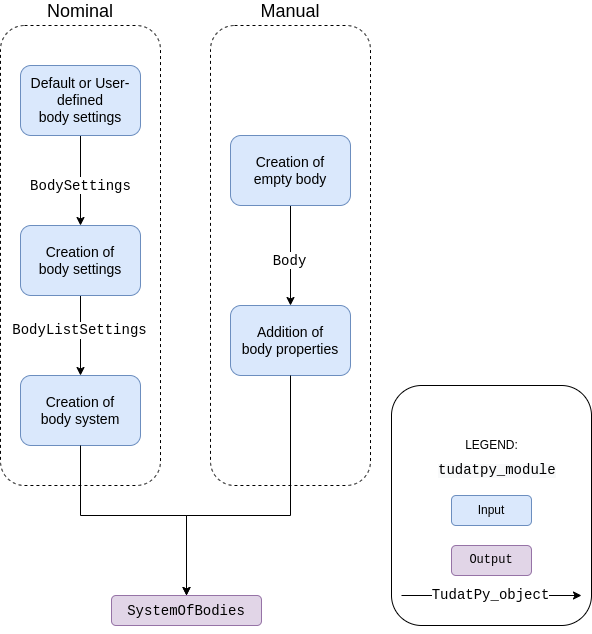

.. _environment_setup:

=================
Environment Setup
=================

.. toctree::
   :titlesonly:
   :hidden:
   :maxdepth: 1

   environment_setup/creating_modifying_bodies
   environment_setup/creation_celestial_body_settings
   environment_setup/environment_models
   environment_setup/default_env_models
   environment_setup/custom_models
   environment_setup/frames_in_environment
   environment_setup/times_and_dates
   environment_setup/available_state_definitions_conversions
   environment_setup/environment_architecture
   environment_setup/thrust_refactor

General information
========================

In TudatPy, the physical environment is defined by a set of bodies, each encapsulated in a
:class:`~tudatpy.numerical_simulation.environment.Body` object. Each body contains a list of properties
(gravity field, ephemeris, *etc.*), which may be interdependent. See :ref:`available_environment_models` for a comprehensive list, and :ref:`specific_environment_considerations` for a number of overall considerations on specific types of environment models. The overall architecture of the environment in Tudat is described in more detail on a dedicated page on :ref:`environment_architecture`.

.. note::
   The :class:`~tudatpy.numerical_simulation.environment.Body` object may represent a celestial body or a
   manmade vehicle. Tudat makes *no* a priori distinction between the two: the distinction is made by the user when
   creating the bodies.

The combination of all Body objects is stored in a
:class:`~tudatpy.numerical_simulation.environment.SystemOfBodies` object (typically named
simple ``bodies`` in the code). During the propagation, all the required properties of bodies are extracted and combined
to evaluated accelerations/torques/guidance/... and compute the state derivative of the system (see :ref:`propagation_setup` for setting up a numerical propagation).

Even though the primary role of the environment is in numerical state propagation, it is also used to define properties of celestial bodies in, for instance, (semi-)analytical trajectory design (see :ref:`transfer_trajectory`).

Body Creation - Procedure
-------------------------

The typical procedure to create the environment is represented in the figure and explained below.

1. **Create body settings**: create settings for bodies which have default settings (see :ref:`default_env_models`),
   customize these settings as desired, and/or manually add settings for bodies without defaults (see :ref:`creation_celestial_body_settings`).

2. **Create system of bodies**: use the settings above to create a set of :class:`~tudatpy.numerical_simulation.environment.Body` objects stored in a  :class:`~tudatpy.numerical_simulation.environment.SystemOfBodies` object, automatically resolving any
   interdependencies  (see :ref:`create_modifying_bodies`). If desired, add additional models and bodies afer this :class:`~tudatpy.numerical_simulation.environment.Body`/:class:`~tudatpy.numerical_simulation.environment.SystemOfBodies` creation, with limitations on interdepenencies with existing bodies (see :ref:`create_empty_body`).

Body Utilization
----------------

In some cases, in particular when setting up a :ref:`custom model <custom_models>`, a user may need to interact with the simulation environment *during* the propagation.
You can find details on how to extract information (states, orientations, altitude, *etc.*) from the simulation during the propagation in :ref:`environment_during_propagation`. 

