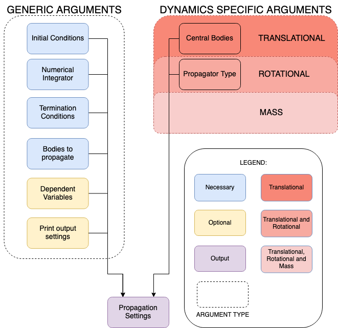

.. _propagation_setup:

=================
Propagation Setup
=================

.. toctree::
   :titlesonly:
   :hidden:
   :maxdepth: 1

   propagation_setup/dynamics_types/translational
   propagation_setup/dynamics_types/rotational
   propagation_setup/dynamics_types/mass
   propagation_setup/dynamics_types/multi_type
   propagation_setup/dynamics_types/multi_body
   propagation_setup/integration_setup
   propagation_setup/propagator_types
   propagation_setup/termination_settings
   propagation_setup/dependent_variables
   propagation_setup/propagation_architecture
   
.. _propagation_setup_intro:

Introduction
============

In Tudat, it is possible to perform the numerical propagation of different types of dynamics, namely:

- :ref:`translational_dynamics`: the translational state of a body is propagated;
- :ref:`rotational_dynamics`: the rotational state of a body is propagated;
- :ref:`mass_dynamics`: the mass of a body is propagated.

Furthermore, any combination of any number of types of dynamics for any number of bodies can be defined. Therefore,
in Tudat we also have:

- :ref:`multi_type_dynamics`: more than one dynamical quantity is propagated for a single body;
- :ref:`multi_body_dynamics`: only one dynamical quantity is propagated for multiple bodies;
- A combination of the two: more than one dynamical quantity is propagated for multiple bodies.

.. note::

   For a given type of dynamics, the propagated state can be formulated through a number of different
   state representations. For the case of translational
   dynamics, for instance, there are various options besides a simple Cartesian state representation. However, even
   when using a non-Cartesian state vector, the Cartesian representation still plays a role in calculating, *e.g.*,
   acceleration models, as well as in defining the initial state. For more information on the role of different state
   representations, please visit the page :ref:`propagator_types`.

Inputs
======

As the figure shows, there are some input arguments common to all types of dynamics, while some others are
specific to the type of propagator. More information about inputs are explained in the dynamic-specific pages linked
above.

