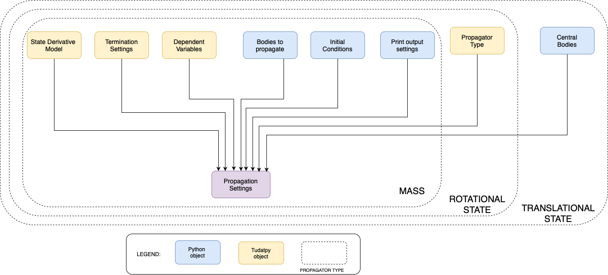

.. _propagation_setup:

=================
Propagation Setup
=================

.. toctree::
   :titlesonly:
   :hidden:
   :maxdepth: 1

   propagation_setup/dynamics_types/translational
   propagation_setup/dynamics_types/rotational
   propagation_setup/dynamics_types/mass
   propagation_setup/dynamics_types/multi_type
   propagation_setup/dynamics_types/multi_body
   propagation_setup/dynamics_types/multi_hybrid_arc
   propagation_setup/propagator_types
   propagation_setup/integration_setup
   propagation_setup/termination_settings
   propagation_setup/dependent_variables
   propagation_setup/console_output
   propagation_setup/propagation_architecture
   

In this part of the user guide, we will explain the relevant inputs as well as present the different
categories of numerical propagation.

.. explain how to define settings for a numerical propagation of
.. different types of dynamics, with a wide variety of available settings. The propagator settings allow you to define:
..
.. - The exact state derivative model (e.g. the equations of motion that are to be solved), including initial and final conditions
.. - The numerical integrator that is to be used to solve these equations of motion
.. - The list of output variables that are to be provided after thee propagation is finished
.. - The output that is to be printed to the console during the propagation
.. - ...

.. _propagation_inputs:

Inputs and setup
================

To perform any numerical propagation, propagation settings need to be defined first. To define the
propagation settings, you must have :ref:`created your physical environment first <environment_setup>`. 
As the figure shows, there are some input arguments common to all types of single-arc
dynamics, while some others are specific to the type of dynamics. On the left there are generic
arguments, which is a list of both necessary and optional arguments that must (or can) be provided
to the Propagation Settings. On the right, there are dynamics specific arguments. Moreover, for mass
dynamics, no additional input is required, whereas for rotational dynamics a propagator must be
defined, and for translational dynamics -- in addition to the propagator -- central bodies need to
be defined. More in-depth information about inputs are explained in the dynamic-specific pages
linked below.

There are various options in the propagator settings that must (or can) be provided by a user to
modify the behaviour before, during and after the propagation. The ones that are common to all dynamics types
are described in more detail in the following pages:

- **List of propagated bodies**: the names of the bodies for which the dynamics is to be propagated.
- **Dependent variables**: which quantities to save as output, in addition to the states, described :ref:`here <dependent_variables>`. These settings are optional (none by default).
- **Numerical integrator**: the solver used to create an approximate solution, described :ref:`here <integrator_setup>`. This setting is mandatory
- **Termination conditions**: when to terminate the propagation, described :ref:`here <termination_settings>`. This setting is mandatory
- **Processing/output settings**: what to print to the terminal before, during and after propagation, and what to do with the numerical results after propagation, both described :ref:`here <auto_processing>`. This setting is optional (no terminal output or resetting of environment by default)

The propagation of a given type of dynamics is defined by calling the `associated factory function
<https://py.api.tudat.space/en/latest/propagator.html#functions>`_. For the different types of
single-arc dynamics, these factory functions return an object (derived from the
:class:`~tudatpy.numerical_simulation.propagation_setup.propagator.SingleArcPropagatorSettings`
class) defining the settings of the propagation. The specifics of how to change the settings for the
different types of dynamics, some of which are specific to the dynamics type (e.g. accelerations for
translational dynamics), and some of which are common to all, are discussed on the specific
pages linked to in the next section

.. _dynamics_types_intro:

Dynamics types
==============

As previously mentioned, there are a few different types of dynamics that Tudat can numerically propagate:

- :ref:`translational_dynamics`: the translational state of a body is propagated;
- :ref:`rotational_dynamics`: the rotational state of a body is propagated;
- :ref:`mass_dynamics`: the mass of a body is propagated.
- Custom Dynamics: an arbitrary user-defined state derivative model, see :func:`~tudatpy.numerical_simulation.propagation_setup.propagator.custom_state` (typically in the context of a multi-type propagation).

Furthermore, any combination of any number of types of dynamics for any number of bodies can be defined. Therefore,
in Tudat we also have:

- :ref:`multi_type_dynamics`: more than one dynamical quantity is propagated for a single body;
- :ref:`multi_body_dynamics`: only one dynamical quantity is propagated for multiple bodies;
- A combination of the two: more than one dynamical quantity is propagated for multiple bodies.

The above list defines different types of dynamics that are propagated over a single continuous arc.
Propagation using a :ref:`multi-arc setup <multi_arc_dynamics>` is also supported in Tudat.

.. note::

   For a given type of dynamics, the propagated state can be formulated through a number of different
   state representations. For the case of translational
   dynamics, for instance, there are various options besides a simple Cartesian state representation. However, even
   when using a non-Cartesian state vector, the Cartesian representation still plays a role in calculating, *e.g.*,
   acceleration models, as well as in defining the initial state. For more information on the role of different state
   representations, please visit the page :ref:`conventional_propagated_states`.

