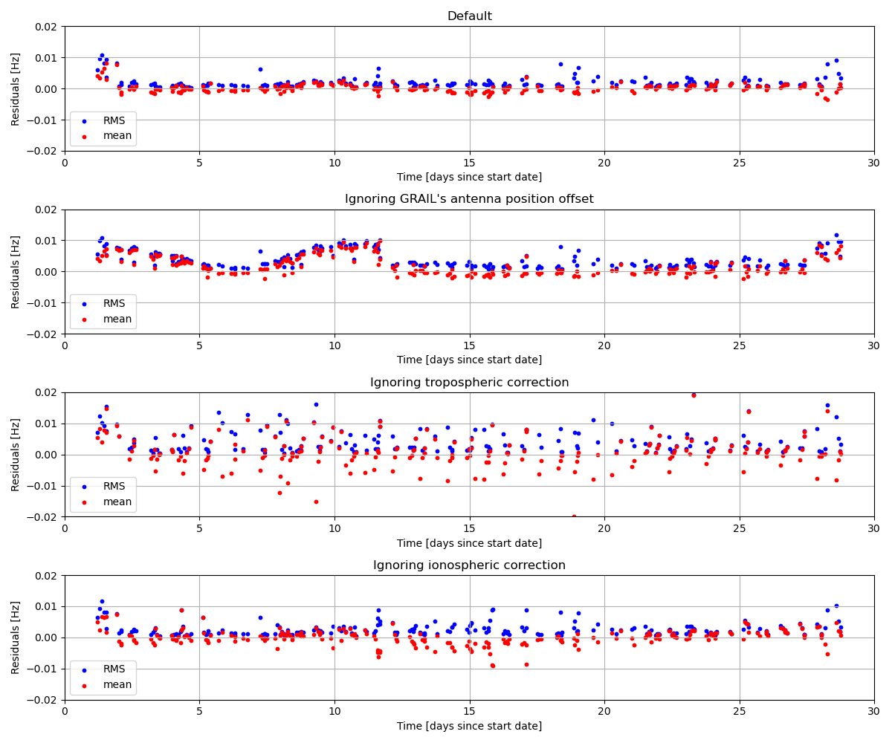
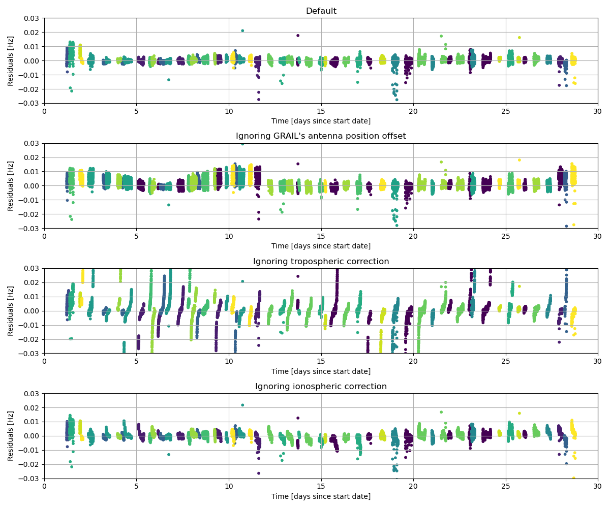

=============================================================================================
GRAIL - Comparing Doppler measurements from ODF files to simulated observables
=============================================================================================

.. literalinclude:: /examples/tudatpy-examples/estimation/grail_residuals.py
    :language: python

------
Output
------

