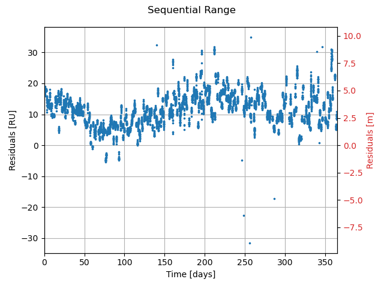
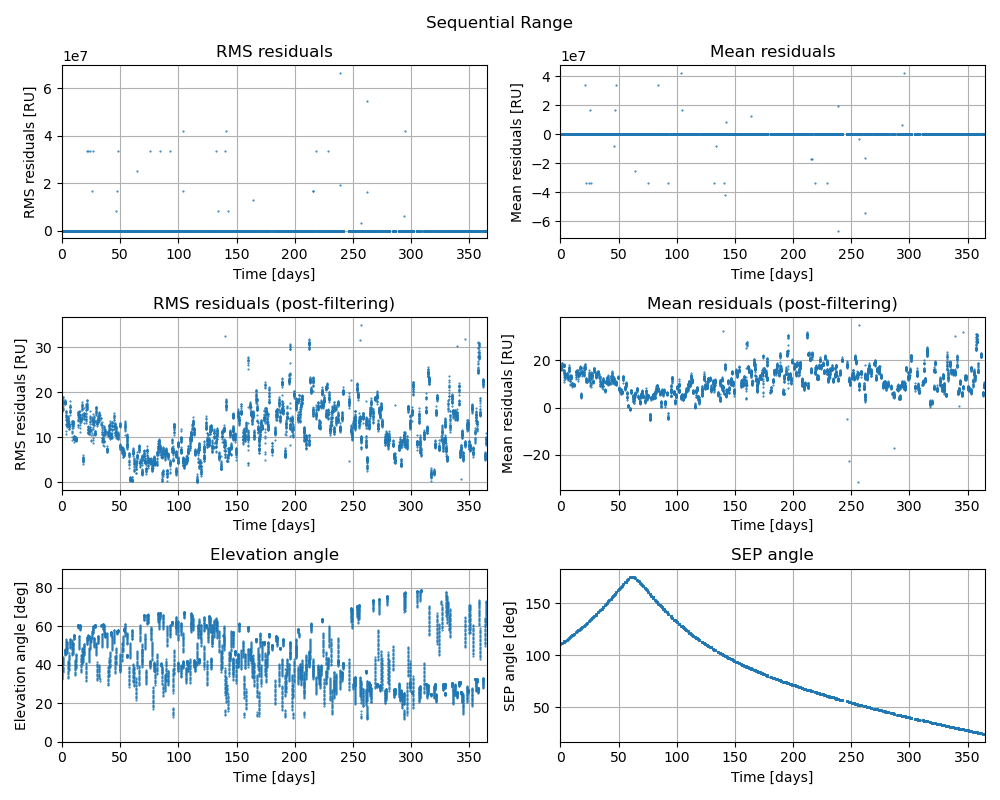
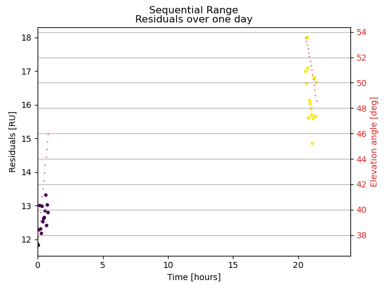
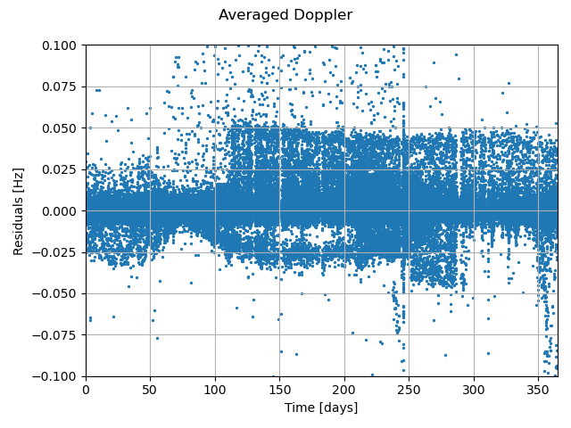
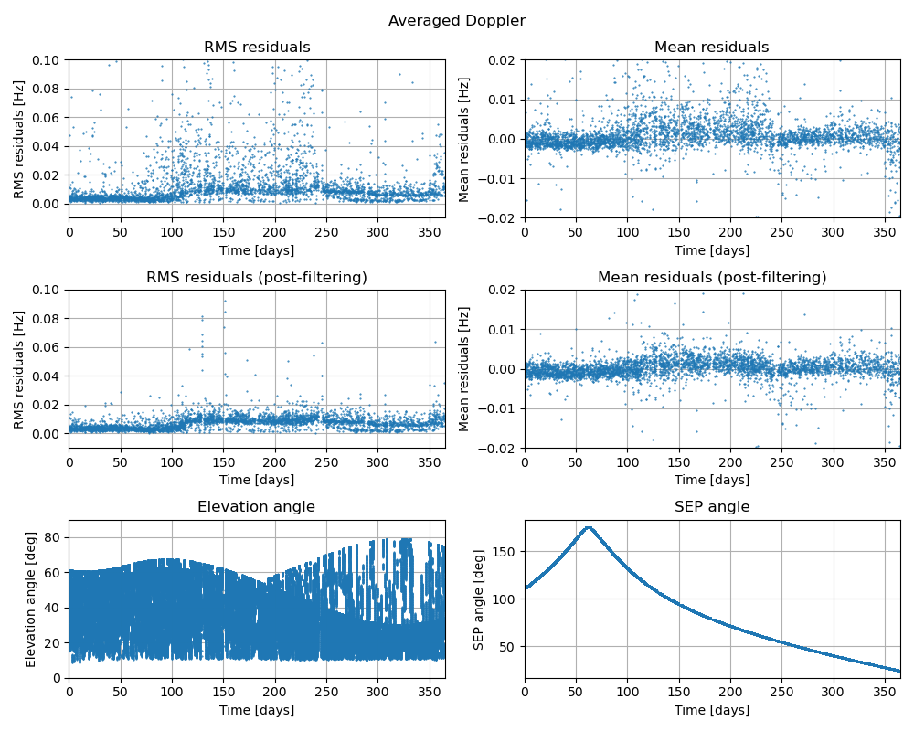
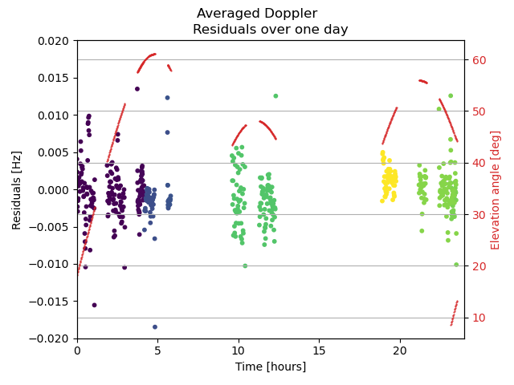

=============================================================================================
MRO - Comparing Doppler and range measurements from ODF files to simulated observables
=============================================================================================

.. literalinclude:: /examples/tudatpy-examples/estimation/mro_tnf_residuals_analysis.py
    :language: python

------
Output
------

________________
Sequential Range
________________

________________
Averaged Doppler
________________

