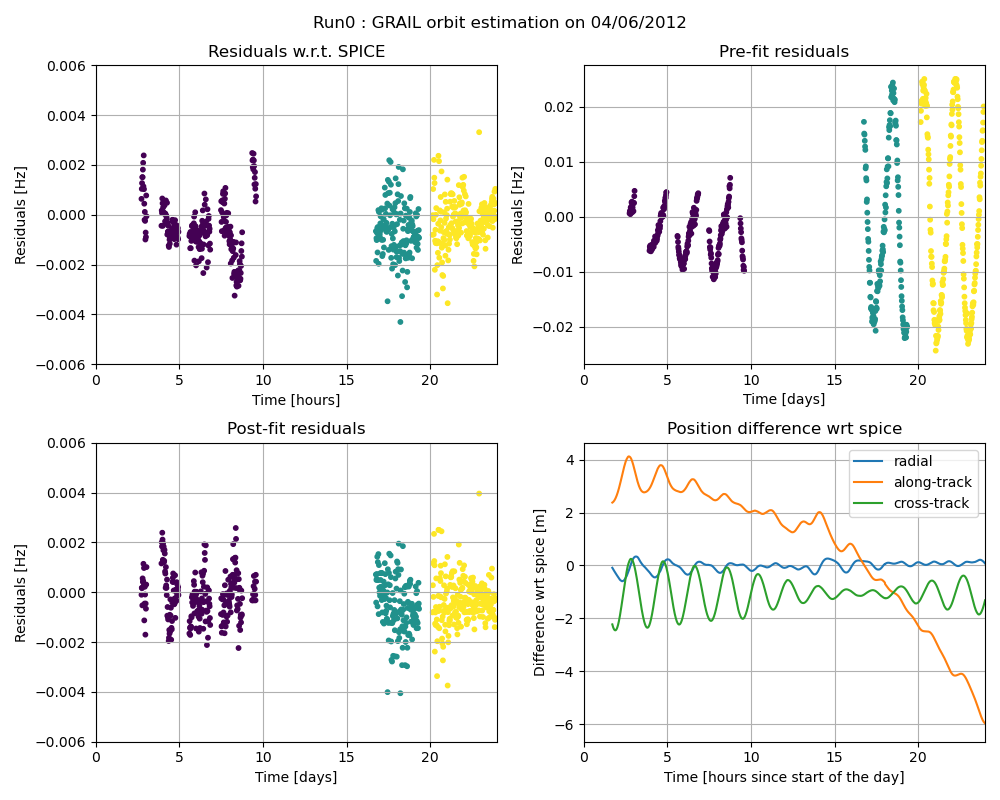
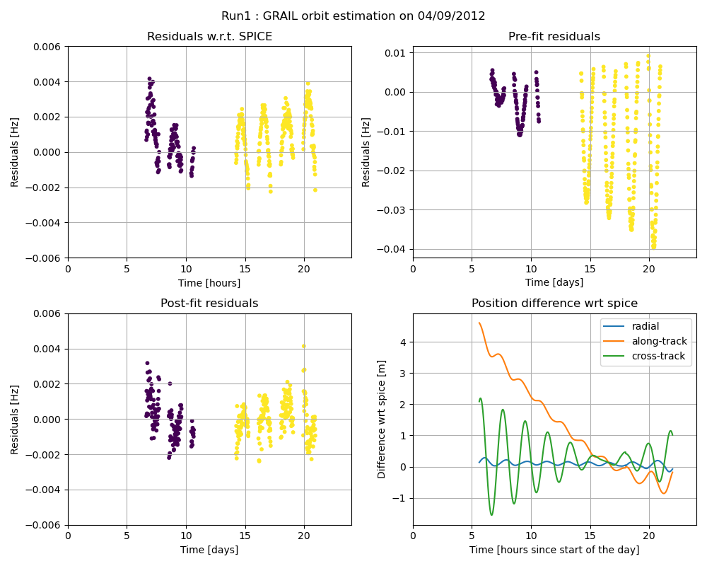
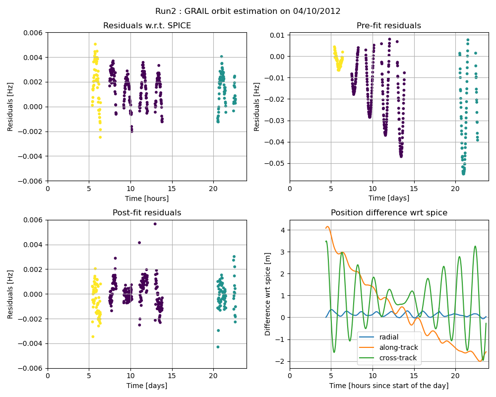
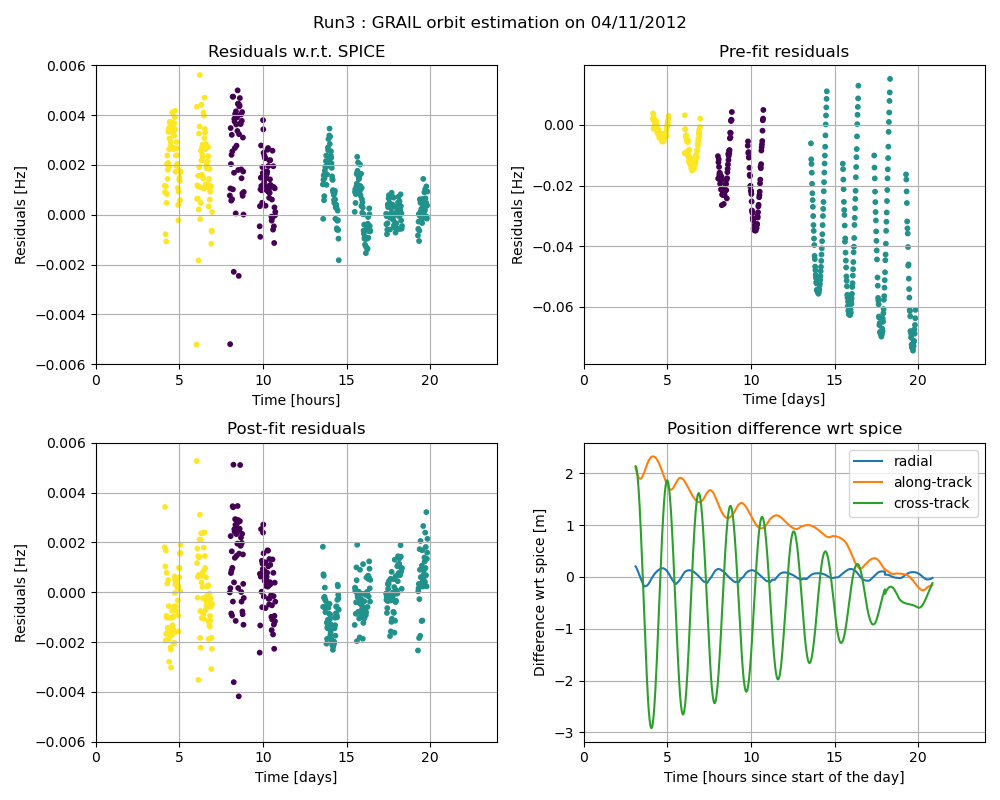
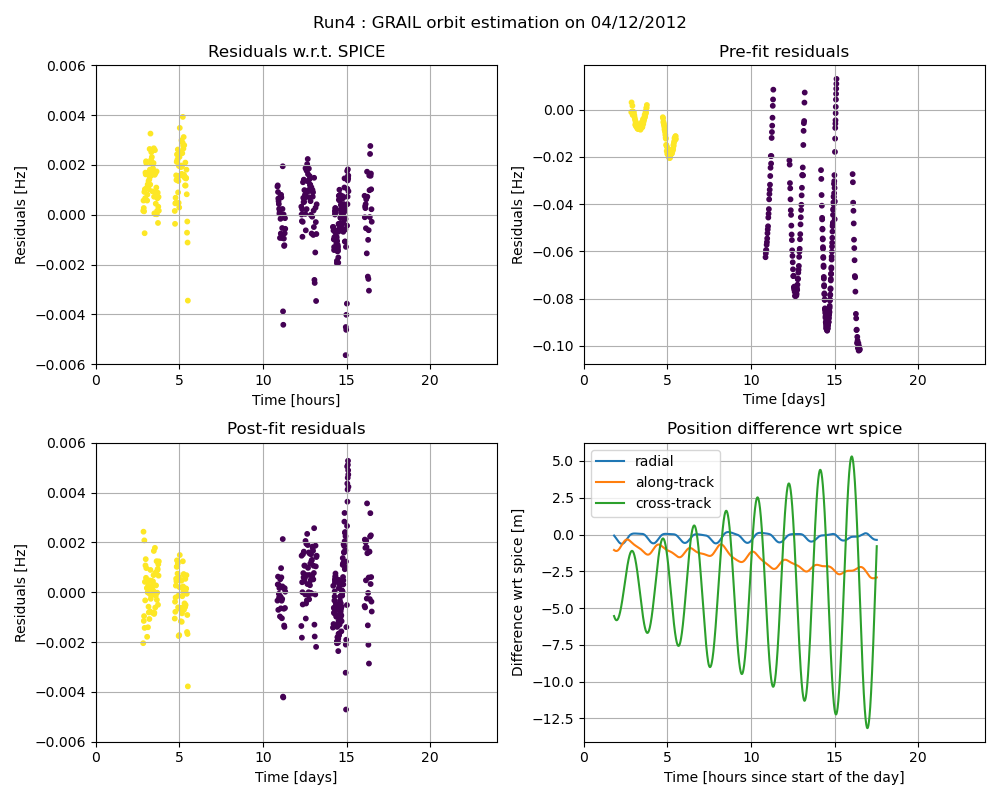

=============================================================================================
GRAIL - Estimating the spacecraft trajectory from ODF Doppler measurements
=============================================================================================

.. literalinclude:: /getting-started/examples/tudatpy-examples/estimation/grail_odf_estimation.py
    :language: python

------
Output
------

