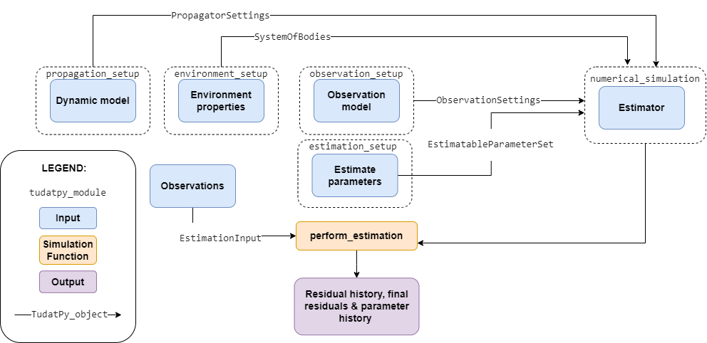

.. _state_estimation:

******************
State Estimation
******************

In this section, we discuss the functionality that is required for state estimation in Tudat. Before starting this
section, make sure to go through our page on :ref:`propagation_setup`, since the state *estimation* function requires
the full functionality from state *propagation*. At the moment, the estimation functionality of Tudat is limited to the
use of batch least-squares. A broad range of parameters (initial translational and rotational state; single-, multi- and
hybrid-arc states; numerous physical properties of the environment) from a diverse set of available observations is
supported. Estimation in Tudat is organized as shown in the figure below.

Estimation Inputs
=================

In addition to the inputs required for state propagation, the following needs to be set up to perform an estimation.

- **Parameter setup**: definition of the parameters that are to be estimated, as discussed :ref:`here <parameter_settings>` in the context of variational equation propagation
- :ref:`linkEndSetup`: define the stations/spacecraft involved in an observation, and define their role for a particular observable (receiver, transmitter, *etc.*)
- :ref:`observationModelSetup`: define the type and properties of a given observation model, such as range, Doppler, including biases, light time corrections *etc.*
- **Providing the observations**, including the values of the observables, associated observation times and additional relevant data such as integration time (depending on the observable). This can be done in one of two ways:

  - :ref:`observationSimulation` For a simulation study, the observations themselves may be simulated inside Tudat
  - **Loading observations**: When analyzing real data, you must load these data from the relevant files/database, and convert them to Tudat-compatible data formats.
- :ref:`estimationSettings`: define the *a priori* knowledge, convergence criteria, *etc.*. Tudat provides settings and options for either a full estimation, or a covariance analysis only.

.. toctree::
   :titlesonly:
   :hidden:
   :maxdepth: 1

   state-estimation/link-ends-setup
   state-estimation/observation-model-setup
   state-estimation/observation-simulation
   state-estimation/estimation-settings

Simulation/Analysis & Output
============================

Once all the settings are in place, the solution can be generated: the (simulated) observations can be fit to the dynamical model that has been defined to perform the fitting. Alternatively, the same functionality can be used for a covariance analysis only, in which case no fit is attempted. Details are provided on :ref:`this page <perform_estimation>`

.. toctree::
   :titlesonly:
   :hidden:
   :maxdepth: 1

   state-estimation/performing-estimation

