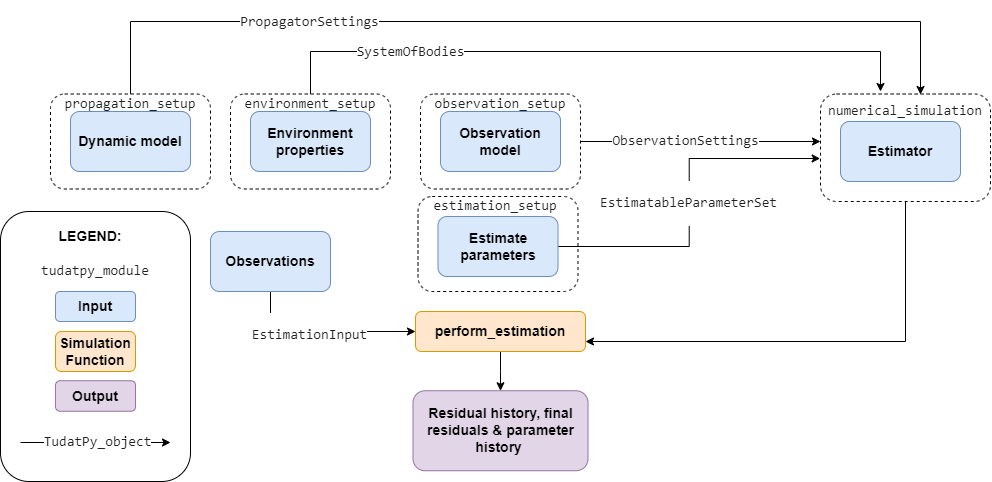

.. _state_estimation:

********************
State Estimation
********************

In this section, we discuss the functionality that is required for parameter estimation in Tudat.
Before starting this section, make sure to go through our page on :ref:`propagation_setup`, since the parameter *estimation* function requires the full functionality from state *propagation*.
In its current implementation, Tudat only implements a batch least-squares filter.
A broad range of parameters (initial translational and rotational state; single-, multi- and hybrid-arc states; numerous physical properties of the environment) from a diverse set of available observations is supported.
Estimation in Tudat is organized as shown in the figure below.

Estimation Inputs
=================

In addition to the inputs required for state propagation, the following needs to be set up to perform an estimation.

- **Parameter setup**: definition of the parameters that are to be estimated, as discussed :ref:`here <parameter_settings>` in the context of variational equation propagation
.. - :ref:`linkEndSetup`: define the stations/spacecraft involved in an observation, and define their role for a particular observable (receiver, transmitter, *etc.*)
- :ref:`observationModelSetup`: define the type, geometry and properties of a given observable model, such as range, Doppler, including biases, light time corrections *etc.*
- :ref:`Providing the observations <observation_handling>`: including the values of the observables, associated observation times and additional relevant data such as integration time (depending on the observable). This can be done in one of two ways:

  - **Simulating observations** For a simulation study, the observations themselves may be simulated inside Tudat
  - **Loading observations**: When analyzing real data, you must load these data from the relevant files/database, and convert them to Tudat-compatible data formats.
- :ref:`estimationSettings`: define the *a priori* knowledge, convergence criteria, *etc.*. Tudat provides settings and options for either a full estimation, or a covariance analysis only.

Simulation/Analysis & Output
============================

Once all the settings are in place, the parameters can be fitted to the observations using the dynamical model defined for the estimation.
Alternatively, the same functionality can be used for a covariance analysis only, in which case no fit is attempted. Details are provided on :ref:`this page <estimationSettings>`.

.. toctree::
   :titlesonly:
   :hidden:
   :maxdepth: 1

   state-estimation/observation-model-setup
   state-estimation/observation-handling
   state-estimation/estimation-settings
