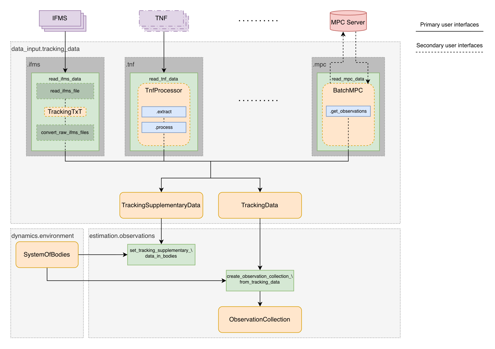

.. _loading_real_data:

==========================
Loading Real Tracking Data
==========================

Tudat has interfaces to load real tracking data from a variety of sources, including:

- Minor Planet Center (MPC) astrometry for small solar system bodies
- NASA Deep Space Network (DSN) closed-loop tracking data from

  - TRK-2-18 Orbit Data Files (ODF)
  - TRK-2-34 Tracking and Navigation Files (TNF)

- ESA ESTRACK Intermediate Frequency & Modem System (IFMS) files 

For an exhaustive list of supported sources, see the :ref:`tudatpy:tracking_data` module and submodules therein.

The architecture of the Tudat tracking data interface is shown in the figure below.

Each data source has its own submodule within the :ref:`tudatpy:tracking_data` module, which contains the necessary functionality to load and process the data.
Besides the lower-level functions, that might differ strongly between data sources, each submodule provides a high-level function named ``read_<data_source>_data`` for convenience, that reads/retrieves the data and outputs it in a standardized format.

Regardless of the source, the data is converted into :class:`~tudatpy.data_input.tracking_data.TrackingData` and :class:`~tudatpy.data_input.tracking_data.TrackingSupplementaryData` objects, which are both composed of primitive data types and not yet linked to the Tudat environment.
:class:`~tudatpy.data_input.tracking_data.TrackingData` objects hold the raw observables, time tags and link-end information, while :class:`~tudatpy.data_input.tracking_data.TrackingSupplementaryData` objects hold supplementary information from the tracking files, that is stored in the Tudat environment, such as ramp tables for closed-loop tracking observables.

These primitive objects can then be converted into an :class:`~tudatpy.estimation.observations.ObservationCollection` using the :func:`~tudatpy.estimation.observations.create_observation_collection_from_tracking_data` function.
Internally, the function resolves the link-end information to the relevant Tudat environment, and performs the necessary conversions (e.g. time scale conversions to TDB) to create a Tudat-compatible observation collection.
The supplementary data is stored in the Tudat environment using the :func:`~tudatpy.estimation.observations.set_tracking_supplementary_data_in_bodies` function.

Usage Example
-------------

The following example shows how to load real tracking data, in this case from a TRK-2-34 TNF file, and convert it into a Tudat-compatible observation collection.
For complete examples of loading and using real tracking data from various sources, see the :ref:`estimation_using_real_observations` page and examples therein.

We first load the tracking data from the TNF file using the :func:`~tudatpy.data_input.tracking_data.tnf.read_tnf_data` function.
This returns :class:`~tudatpy.data_input.tracking_data.TrackingData` and a :class:`~tudatpy.data_input.tracking_data.TrackingSupplementaryData` objects, which contain the raw observables and ramp tables.

.. code-block:: python

    from tudatpy.data_input.tracking_data.tnf import read_tnf_data

    tnf_files = [
        "mromagr2012_001_2220xmmmv1.tnf",
    ]

    tracking_data, tracking_supplementary_data = read_tnf_data(
        tnf_files,
        ["doppler"],
        spacecraft_name="MRO",
    )

We then setup our simulation environment, including the ground station and spacecraft, and create a :class:`~tudatpy.dynamics.environment.SystemOfBodies` object.
Note that this step is only sketched here, and typically requires a more complete setup for high-fidelity analysis, see again the :ref:`estimation_using_real_observations` page for more details.

.. code-block:: python

    from tudatpy.dynamics import environment_setup

    bodies_to_create = [
        "Earth",
        "Sun",
        "Mars",
    ]
    global_frame_origin = "SSB"
    global_frame_orientation = "ECLIPJ2000"

    body_settings = environment_setup.get_default_body_settings(
        bodies_to_create,
        global_frame_origin,
        global_frame_orientation,
    )
    body_settings.get(
        "Earth"
    ).ground_station_settings = environment_setup.ground_station.dsn_stations()
    
    body_settings.add_empty_settings("MRO")

    ...

    bodies = environment_setup.create_system_of_bodies(body_settings)

With the tracking data and the Tudat environment set up, we can now convert the tracking data into an :class:`~tudatpy.estimation.observations.ObservationCollection`.
We also store the ramp tables in the ground station objects using the :func:`~tudatpy.estimation.observations.set_tracking_supplementary_data_in_bodies` function, which is required to simulate the observations.

.. code-block:: python

    from tudatpy.estimation import observations

    observation_collection = observations.create_observation_collection_from_tracking_data(
        tracking_data, bodies
    )
    observations.set_tracking_supplementary_data_in_bodies(
        bodies, tracking_supplementary_data
    )

The observation collection can now be processed further, as explained in :ref:`observation_collection_manipulation`, or used directly for a pre-fit analysis or full estimation, see the :ref:`estimationSettings` page for more details.