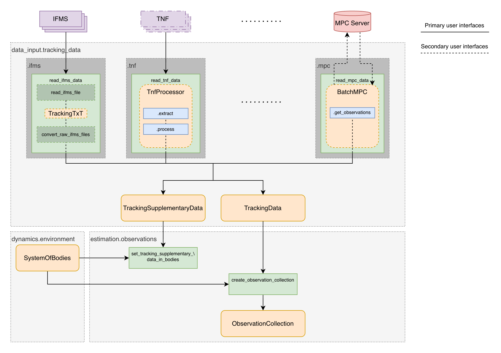

.. _loading_real_data:

==========================
Loading Real Tracking Data
==========================

Tudat has interfaces to load real tracking data from a variety of sources, including:

- Minor Planet Center (MPC) astrometry for small solar system bodies
- NASA Deep Space Network (DSN) closed-loop tracking data from

  - TRK-2-18 Orbit Data Files (ODF)
  - TRK-2-34 Tracking and Navigation Files (TNF)

- ESA ESTRACK Intermediate Frequency & Modem System (IFMS) files 

For an exhaustive list of supported sources, see the :ref:`tudatpy:tracking_data` module and submodules therein.

The architecture of the Tudat tracking data interface is shown in the figure below.

.. todo::

    Update the figure with the final syntax

Each data source has its own submodule within the :ref:`tudatpy:tracking_data` module, which contains the necessary functionality to load and process the data.
Besides the lower-level functions, that might differ strongly between data sources, each submodule provides a high-level function named ``read_<data_source>_data`` for convenience, that reads/retrieves the data and outputs it in a standardized format.

Regardless of the source, the data is converted into :class:`~tudatpy.data_input.tracking_data.TrackingData` and :class:`~tudatpy.data_input.tracking_data.TrackingSupplementaryData` objects, which are both composed of primitive data types and not yet linked to the Tudat environment.
:class:`~tudatpy.data_input.tracking_data.TrackingData` objects hold the raw observables, time tags and link-end information, while :class:`~tudatpy.data_input.tracking_data.TrackingSupplementaryData` objects hold supplementary information from the tracking files, that is stored in the Tudat environment, such as ramp tables for closed-loop tracking observables.

These primitive objects can then be converted into an :class:`~tudatpy.estimation.observations.ObservationCollection` using the :func:`~tudatpy.estimation.observations.create_observation_collection_from_tracking_data` function.
Internally, the function resolves the link-end information to the relevant Tudat environment, and performs the necessary conversions (e.g. time scale conversions to TDB) to create a Tudat-compatible observation collection.
The supplementary data is stored in the Tudat environment using the :func:`~tudatpy.estimation.observations.set_tracking_supplementary_data_in_bodies` function.

.. todo::

    Move the documentation of the individual data sources to the API documentation of the respective submodules, if relevant

.. todo::

    Add a sample workflow for loading real tracking data

Deep Space Tracking Radio Data
==============================

Radio tracking data from planetary spacecraft (Doppler, range, astrometry) collected by networks like NASA's Deep Space Network (DSN), ESA's ESTRACK, and the Joint Institute for VLBI ERIC (JIVE) is disseminated through a number of channels, most notably the `PDS geosciences Node <https://pds-geosciences.wustl.edu/dataserv/radio_science.htm>`_, in a variety of data formats.

Tudat supports reading multiple tracking data formats from DSN, ESTRACK and JIVE:

TRK-2-34 Tracking and Navigation File (TNF)
-------------------------------------------

The TRK-2-34 Tracking and Navigation File format is documented `here <https://pds-geosciences.wustl.edu/radiosciencedocs/urn-nasa-pds-radiosci_documentation/dsn_trk-2-34/dsn_trk-2-34.2021-06-03.pdf>`_. This is another format used by the DSN to store tracking data. Like ODF files, TRK-2-34 files are binary files but have a different internal structure. The :doc:`data/processTrk234` module provides specialized converters to handle the unique structure of these files and extract tracking observables.
It makes heavy use of the `PyTrk234 <https://github.com/NASA-PDS/PyTrk234/>`_ library for parsing of the binary files and extraction of the raw data records.

Processing Architecture
^^^^^^^^^^^^^^^^^^^^^^^

The :doc:`data/processTrk234` module uses a modular converter-based architecture:

1. **Binary File Parsing**: TRK-2-34 files are read and parsed according to their specific binary format structure, extracting raw data records using the `PyTrk234 <https://github.com/NASA-PDS/PyTrk234/>`_ library.

2. **Observable-Specific Converters**:

   - **converter.py**: Main converter interface that coordinates the processing of different data types
   - **derivedDoppler.py**: Processes Doppler observables, handling frequency measurements and their conversion to Doppler observables
   - **derivedSraRange.py**: Processes Sequential Ranging Assembly (SRA) range data with appropriate calibrations and corrections
   - **radioBase.py**: Provides base functionality for radio observable processing

3. **Ramp Table Processing** (ramp.py): Extracts frequency ramp information describing how ground station transmission frequencies vary over time.

Usage Example
^^^^^^^^^^^^^

.. code-block:: python

    from tudatpy.data.processTrk234 import Trk234Processor

    # Process TRK-2-34 files
    tnf_file_paths = ["path/to/file1.tnf", "path/to/file2.tnf"]

    mex_processor = Trk234Processor(
        tnf_file_paths, requested_types=["doppler", "range"], spacecraft_name="MarsExpress"
    )

    observations = mex_processor.process()

Intermediate Frequency & Modem System (IFMS) Files
--------------------------------------------------

The Intermediate Frequency & Modem System (IFMS) files contain tracking data from ESA's ESTRACK network with a hybrid structure: open-loop data-sets are binary files (except the first one, containing only the standard header), while all other data-sets are stored as ASCII text files.

IFMS files can contain multiple types of tracking observables that are automatically extracted during processing.

File Structure
^^^^^^^^^^^^^^

IFMS files are ASCII text files with 12 columns separated by commas, spaces, or tabs:

1. **sample_number**: Sequential observation identifier
2. **utc_datetime_string**: Observation time in ISO string format (YYYY-MM-DDTHH:MM:SS)
3. **utc_day_of_year**: Day of year representation
4. **tdb_seconds_since_j2000**: Reception time in TDB (seconds since J2000)
5. **reference_body_distance**: Distance to reference body (km, converted to m)
6. **ramp_reference_time**: UTC reference time for frequency ramp (ISO string format)
7. **transmission_frequency_constant_term**: Base transmission frequency (Hz)
8. **transmission_frequency_linear_term**: Frequency ramp rate (Hz/s)
9. **doppler_averaged_frequency_hz**: Time-averaged Doppler frequency shift (Hz)
10. **doppler_predicted_frequency_hz**: Predicted Doppler frequency shift (Hz)
11. **doppler_troposphere_correction**: Tropospheric delay correction (Hz)
12. **doppler_noise_hz**: Noise estimate (Hz)

Lines starting with ``#`` are treated as comments and ignored during processing.

Supported Observable Types
^^^^^^^^^^^^^^^^^^^^^^^^^^

IFMS files can contain data for the following observable types, which are automatically detected and extracted:

1. **dsn_n_way_averaged_doppler**: Time-averaged Doppler frequency measurements (from ``doppler_averaged_frequency_hz`` column)
2. **doppler_measured_frequency**: Instantaneous Doppler frequency measurements (if ``doppler_measured_frequency_hz`` column is present)
3. **n_way_range**: Range measurements derived from light-time data (if ``n_way_light_time`` column is present)

The most common observable type in IFMS files is **dsn_n_way_averaged_doppler**, which represents Doppler measurements averaged over an integration time period.

Loading IFMS Files
^^^^^^^^^^^^^^^^^^

**Single Ground Station**

For observations from a single ground station:

.. code-block:: python

    from tudatpy.estimation.observations_setup.observations_wrapper import observations_from_ifms_files
    from tudatpy.estimation.observations_setup.ancillary_settings import FrequencyBands

    # Load IFMS files for single station
    observation_collection = observations_from_ifms_files(
        ifms_file_names=["path/to/ifms_file1.txt", "path/to/ifms_file2.txt"],
        bodies=bodies,
        target_name="MarsExpress",
        ground_station_name="CEBREROS",
        reception_band=FrequencyBands.x_band,
        transmission_band=FrequencyBands.x_band,
        apply_troposphere_correction=True
    )

**Multiple Ground Stations**

For observations from multiple ESTRACK ground stations (one file per station):

.. code-block:: python

    from tudatpy.estimation.observations_setup.observations_wrapper import observations_from_multi_station_ifms_files
    from tudatpy.estimation.observations_setup.ancillary_settings import FrequencyBands

    # Load IFMS files for multiple stations
    observation_collection = observations_from_multi_station_ifms_files(
        ifms_file_names=["path/to/cebreros_file.txt", "path/to/newNorcia_file.txt"],
        bodies=bodies,
        target_name="MarsExpress",
        ground_station_names=["CEBREROS", "NEW_NORCIA"],
        reception_band=FrequencyBands.x_band,
        transmission_band=FrequencyBands.x_band,
        apply_troposphere_correction=True
    )

.. important::
   The ``ifms_file_names`` and ``ground_station_names`` lists must have the same length, with each file corresponding to the ground station at the same index.

IFMS Processing Steps
^^^^^^^^^^^^^^^^^^^^^

The IFMS file processing automatically performs the following operations:

1. **File Parsing**:

   - Reads ASCII text format with comma, space, or tab separators
   - Ignores comment lines (starting with ``#``)
   - Handles missing columns gracefully with the ``ignoreOmittedColumns`` option
   - Extracts observation data and metadata

2. **Observable Type Detection**:

   - Scans the file columns to identify available tracking data types
   - Determines which observable types can be created based on ``observableRequiredDataTypesMap``:

     - ``doppler_averaged_frequency`` → ``dsn_n_way_averaged_doppler``
     - ``doppler_measured_frequency`` → ``doppler_measured_frequency``
     - ``n_way_light_time`` → ``n_way_range``

3. **Time Conversion**:

   - Converts observation times from UTC (ISO string format) to TDB (Barycentric Dynamical Time)
   - Uses SPICE for accurate time scale conversion
   - TDB times are stored as seconds since J2000

4. **Troposphere Corrections** (optional):

   - If ``apply_troposphere_correction=True``, subtracts the tropospheric delay correction from the averaged Doppler frequency:

     .. code-block:: python

         doppler_averaged_frequency -= doppler_troposphere_correction

   - Correction is performed at the file reading stage before observable creation
   - This accounts for signal propagation delays through Earth's troposphere

5. **Ramp Table Extraction**:

   - Extracts transmission frequency information from the file:

     - **Constant term** (``transmission_frequency_constant_term``): Base transmission frequency in Hz
     - **Linear term** (``transmission_frequency_linear_term``): Frequency ramp rate in Hz/s

   - Creates time-dependent frequency models for each ground station
   - Frequency at time :math:`t` is calculated as: :math:`f(t) = f_{\text{constant}} + f_{\text{linear}} \times (t - t_{\text{ramp reference}})`
   - Sets ramp tables in the ground station models within the ``bodies`` system

6. **Observation Collection Creation**:

   - Converts processed data into Tudat's :class:`~tudatpy.estimation.observations.ObservationCollection` format
   - Organizes observations by observable type and link ends
   - Stores ancillary settings (frequency bands, integration times, etc.)

Ground Station Configuration
^^^^^^^^^^^^^^^^^^^^^^^^^^^^

When processing IFMS files, the ground station properties are automatically configured in the ``bodies`` system:

.. code-block:: python

    # After loading IFMS data, ground stations are automatically set up with:
    # - Transmitting frequency models (including time-dependent ramp tables)
    # - Proper link geometry (transmitter → reflector → receiver)
    # - Frequency band information for signal modeling

The link geometry for IFMS observations follows this structure:

- **Transmitter**: ESTRACK ground station on Earth
- **Reflector**: Spacecraft (e.g., Mars Express, ExoMars TGO)
- **Receiver**: Same ESTRACK ground station on Earth (two-way configuration)

Example: Complete IFMS Processing Workflow
^^^^^^^^^^^^^^^^^^^^^^^^^^^^^^^^^^^^^^^^^^

.. code-block:: python

    from tudatpy.dynamics import environment_setup
    from tudatpy.estimation.observations_setup.observations_wrapper import observations_from_multi_station_ifms_files
    from tudatpy.estimation.observations_setup.ancillary_settings import FrequencyBands

    # Create system of bodies
    bodies_to_create = ["Earth", "Mars", "Sun", "Moon"]
    global_frame_origin = "SSB"
    global_frame_orientation = "J2000"
    body_settings = environment_setup.get_default_body_settings(
        bodies_to_create, global_frame_origin, global_frame_orientation
    )
    bodies = environment_setup.create_system_of_bodies(body_settings)

    # Add spacecraft
    bodies.create_empty_body("MarsExpress")
    # ... configure spacecraft properties ...

    # Add ESTRACK ground stations to Earth
    environment_setup.add_ground_station(
        bodies.get_body("Earth"),
        "CEBREROS",
        station_position_itrf  # ITRF Cartesian position
    )
    environment_setup.add_ground_station(
        bodies.get_body("Earth"),
        "NEW_NORCIA",
        station_position_itrf  # ITRF Cartesian position
    )

    # Load IFMS tracking data from multiple stations
    observation_collection = observations_from_multi_station_ifms_files(
        ifms_file_names=[
            "data/cebreros_2024_100.txt",
            "data/cebreros_2024_101.txt",
            "data/newNorcia_2024_100.txt"
        ],
        bodies=bodies,
        target_name="MarsExpress",
        ground_station_names=["CEBREROS", "CEBREROS", "NEW_NORCIA"],
        reception_band=FrequencyBands.x_band,
        transmission_band=FrequencyBands.x_band,
        apply_troposphere_correction=True
    )

    # The observation_collection now contains:
    # - All dsn_n_way_averaged_doppler observations (and any other available types)
    # - Observations sorted by observable type and link ends
    # - Proper time tags in TDB
    # - Ground station frequency models (ramp tables) set in bodies
    # - Tropospheric corrections applied
    # - Ready for use in orbit determination
    print(f"Number of observation sets: {observation_collection.get_number_of_observation_sets()}")
    print(f"Observable types: {observation_collection.get_observable_types()}")

FDETS Files
-----------

Tudat also supports the loading of Very Long Baseline Interferometry (VLBI) data in the FDETS format. This format is provided by the Joint Institute for VLBI ERIC (JIVE), a European research infrastructure for radio astronomy. The process for loading these files is similar to handling ODF files, involving parsing the raw file and converting its contents into the standard :class:`~tudatpy.estimation.observations.ObservationCollection` structure. FDETS files are ASCII text format files containing open-loop Doppler measurements, typically produced from the `European VLBI Network (EVN) <https://www.evlbi.org/>`_.

.. code-block:: python

    from tudatpy.estimation.observations_setup.observations_wrapper import observations_from_fdets_files
    from tudatpy.estimation.observations_setup.ancillary_settings import FrequencyBands

    observation_collection = observations_from_fdets_files(
        ifms_file_name="path/to/fdets_file.txt",
        base_frequency=8.4e9,  # X-band uplink frequency in Hz
        column_types=["utc_datetime_string", "signal_to_noise_ratio", 
                      "normalised_spectral_max", "doppler_measured_frequency_hz", 
                      "doppler_noise_hz"],
        target_name="Cassini",
        transmitting_station_name="DSS-43",
        receiving_station_name="DSS-43",
        reception_band=FrequencyBands.x_band,
        transmission_band=FrequencyBands.x_band
    )
