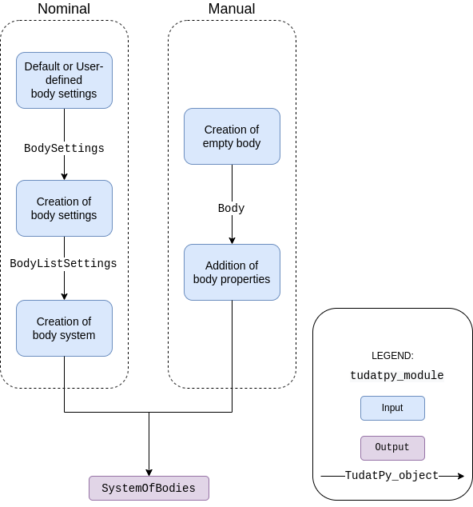

.. _environment_setup:

=================
Environment Setup
=================

.. toctree::
   :titlesonly:
   :hidden:
   :maxdepth: 1

   environment-setup/creation-celestial-body-settings
   environment-setup/creating-modifying-bodies
   environment-setup/environment-models
   environment-setup/default-env-models
   environment-setup/custom-models
   environment-setup/frames-in-environment
   environment-setup/times-and-dates
   environment-setup/available-state-definitions-conversions
   environment-setup/environment-architecture

General information
========================

In Tudat, the physical environment is defined by a set of bodies, each encapsulated in a
:class:`~tudatpy.numerical_simulation.environment.Body` object. Each body contains a list of properties
(gravity field, ephemeris, *etc.*), which may be interdependent.

.. note::
   The :class:`~tudatpy.numerical_simulation.environment.Body` object may represent a celestial body or an
   artificial vehicle. Tudat makes *no* a priori distinction between the two: the distinction is made by the user when
   creating the bodies.

The combination of all :class:`~tudatpy.numerical_simulation.environment.Body` objects is stored in a
:class:`~tudatpy.numerical_simulation.environment.SystemOfBodies` object (typically named
simple ``bodies`` in the code). This object constitutes "the environment" in Tudat.
During the propagation, all the required properties of bodies are extracted from here and combined
to evaluate accelerations/torques/guidance/..., and compute the state derivative of the system
(see :ref:`propagation_setup` for details on how to do this).

Even though the primary role of the environment is in numerical state propagation,
it is also used to define properties of celestial bodies in, for instance, (semi-)analytical trajectory design
(see :ref:`transfer_trajectory`).

There are many different types of environment models in Tudat (e.g. ephemerides, rotation models, atmosphere models, *etc.*). See :ref:`environment_model_overview` for
a comprehensive list. The overall architecture of the environment in Tudat is described in more
detail on a dedicated page on :ref:`environment_architecture` (for advanced users and developers).

Body Creation - Procedure
-------------------------

The :class:`~tudatpy.numerical_simulation.environment.Body` objects, and the :class:`~tudatpy.numerical_simulation.environment.SystemOfBodies` object
that holds them, are not directly created by the user. Instead, settings for each body
are created by a user and stored in a :class:`~tudatpy.numerical_simulation.environment_setup.BodySettings` object.
A set of such objects (one for each body) is in turn stored in a :class:`~tudatpy.numerical_simulation.environment_setup.BodyListSettings` object,
from which the environment is created using the :func:`~tudatpy.numerical_simulation.environment_setup.create_system_of_bodies` function.

The typical procedure to create the environment is represented in the figure and explained below.

1. **Create body settings**: create settings for bodies which have default settings (see :ref:`default_env_models`),
   customize these settings as desired, and/or manually add settings for bodies without defaults (see :ref:`creation_celestial_body_settings`).

2. **Create system of bodies**: use the settings above to create a set of :class:`~tudatpy.numerical_simulation.environment.Body`
   objects stored in a  :class:`~tudatpy.numerical_simulation.environment.SystemOfBodies` object, automatically resolving any
   interdependencies  (see :ref:`create_bodies_from_settings_first`).

3. **Modify bodies** If desired, additional models and bodies can be added after this
   :class:`~tudatpy.numerical_simulation.environment.Body`/:class:`~tudatpy.numerical_simulation.environment.SystemOfBodies`
   creation, with limitations on interdependencies with existing bodies (see :ref:`create_empty_body`).

Body Utilization
----------------

Although the :class:`~tudatpy.numerical_simulation.environment.Body` objects contain all information on the environment,
the direct interaction with these objects in a simple numerical propagation is very limited. The bodies interact mostly
with the numerical simulation framework, which uses the information on the environment to set up and solve teh equations of motion.

In some cases, in particular when setting up a :ref:`custom model <custom_models>`, a user may need to interact with the
simulation environment *during* the propagation. You can find details on how to extract information (states, orientations, altitude, *etc.*)
from the simulation during the propagation in :ref:`environment_during_propagation`.

Many properties of the environment, either static quantities (*e.g.* gravitational parameter) or time-varying quantities (*e.g.* ephemerides)
are also useful to extract outside of the scope of a numerical propagation. This is discussed in more detail in TODO :ref:`environment_outside_propagation`.

