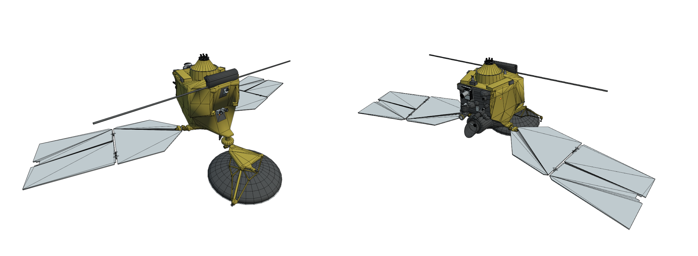
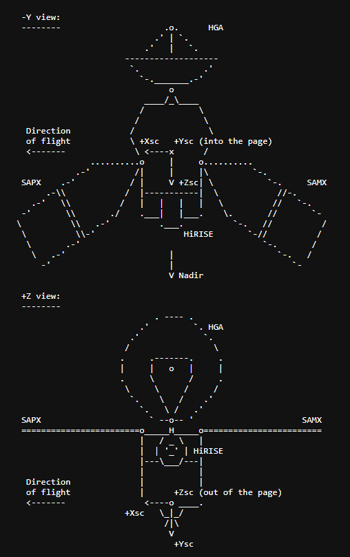
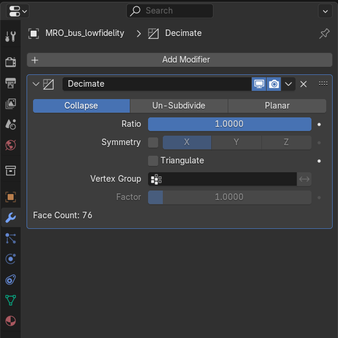
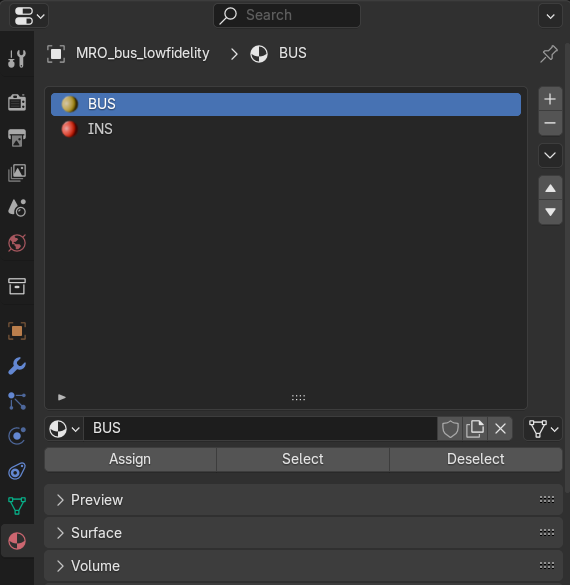
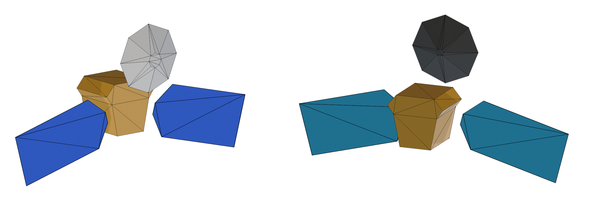

.. _spacecraft_macromodels:

===================================================
Spacecraft macromodels
===================================================

The macromodel of a spacecraft is simplified by a series of panels, which can be defined independently depending on their type (frame-fixed, time-variable, body-tracking) using the functions of the module :class:`~tudatpy.dynamics.environment_setup.vehicle_systems`.

Manually defining each spacecraft panel takes time. To make things easier, the functions below let you define several panels at once.

Box-wing model
--------------

This is the simplest macromodel available and consists of 8 panels, 6 for the bus and 2 for the solar arrays. The bus is fixed to the rotation frame defined for the spacecraft, while the solar arrays are set to track the Sun. 

The dimensions of the spacecraft must be defined as inputs to the function :func:`~tudatpy.dynamics.environment_setup.vehicle_systems.box_wing_panelled_body_settings`, which creates a :class:`~tudatpy.dynamics.environment_setup.vehicle_systems.FullPanelledBodySettings` object.

Full macromodel
---------------

For more complex geometries it might become necessary to define a larger number of panels. Usually macromodels are distributed or can be modelled as CAD files. These files can be imported into `Blender <https://www.blender.org/>`_ (a middle step to make the files compatible with Tudat, more information in :ref:`spacecraft_macromodels_tutorial`) and later exported as `.dae` file format.

The function :func:`~tudatpy.dynamics.environment_setup.vehicle_systems.body_panel_settings_list_from_dae` allows to load the macromodel from a DAE file and creates a list of :class:`~tudatpy.dynamics.environment_setup.vehicle_systems.BodyPanelSettings`. 

.. _spacecraft_macromodels_tutorial:

How to create and load a full macromodel
----------------------------------------

A complete a macromodel is a powerful tool that requires multiple steps to set up. This tutorial will 
cover all the steps from the creation of the macromodel in a CAD software to the loading in Tudat. The spacecraft used in this 
example is NASA Mars Reconnaissance Orbiter (MRO).

Creating the CAD model
~~~~~~~~~~~~~~~~~~~~~~
Precise spacecraft models are usually available but the surface is discretised in a large number of panels 
which would significantly increase the computational load. For this reason, the user should aim to reduce the number of panels in the 100s.
On top of that, spacecraft models are usually static and do not have built-in joints for the moving parts (if present).

   
   MRO spacecraft model (around 15000 panels) from `NASA website <https://science.nasa.gov/resource/mars-reconnaissance-orbiter-3d-model/>`_.

Therefore, the first step requires to create the CAD model by simplifying the structure and modelling each part as a standalone CAD model.
It's paramount to remain consistent with the rotational frames these parts are attached to, especially their origin (which is usually the rotation gimball) and the axis orientation.
For most scientific missions, the frame origin and axis orientation are defined in SPICE Frame Kernels (FK).

   
   Example of MRO spacecraft Bus Frame from `NASA NAIF website <https://naif.jpl.nasa.gov/pub/naif/pds/data/mro-m-spice-6-v1.0/mrosp_1000/data/fk/mro_v16.tf>`_.

After having retrieved all the dimensions and frame informations, with some creativity and patience, all parts should be created in CAD accordingly.

.. warning::
   The user should make sure to model each part as a standalone file if planning to use moving parts. The parts **must not** intersect when assembled together!
   Due to meshing constraints, the user **must not** use non-planar geometries like spheres, paraboloids, or similar shapes.

Post-processing the CAD model in Blender
~~~~~~~~~~~~~~~~~~~~~~~~~~~~~~~~~~~~~~~~
After all the parts have been modelled in any CAD software of choice, they must be exported in `.stl` format, making sure the *export units* match the units set while modelling.
The part can then be loaded in Blender using `File -> Import -> STL`. In the pop-up menu on the left under `General -> Scale`, the scale can be adjusted from the unit used during modelling 
to meters (dafault unit in Blender), this option is also available in Tudat when loading the model. 

.. note::
    Consistency between units is fundamental to the correct implementation of the model. It is possible to check the size of the panels in `Edit Mode` by 
    toggling on the options `Edge Length` and `Face Aerea` (as in the image below).
    After exporting the model in `.dae` format (which is unitless), it is possible to double-check manually the units once more.

    .. figure:: blender_check_units.png
        :width: 300px
        :align: center

By default, Blender will mesh the part automatically but not always in the most efficient way possible. 
To force a smaller number of panels go to `Object Mode`, then `Modifiers -> Add modifier -> Generate -> Decimate`, toggle on `Triangulate` and reduce the ratio until 
right before the object starts deforming. In the left corner of the tab it is possible to see the `Face count` (see the figure below). Once done, click on the drop down menu in 
the same tab and hit `Apply`, then inspect the new mesh in `Edit Mode`.

After the meshing, it important to define group of panels with the same material properties. 
Note that at this point no properties can be defined (this will be dealt at the Tudat level), only the grouping of the panels.
To do so, in `Edit Mode` in the `Materials` tab add as many materials as needed (see the figure below). 
Only the name matters, as it will be the one used in Tudat. The color is only used to distinguish the panels visually.

The post-processing is now completed, the file can be exported using `File -> Export -> Collada (.dae)`. Make sure to inspect the file manually to double-check the units.

        Example of MRO spacecraft macromodel assembled in Blender with panels grouped by material, 112 panels.

Loading the macromodel
~~~~~~~~~~~~~~~~~~~~~~
To load one part in Tudat, the function :func:`~tudatpy.dynamics.environment_setup.vehicle_systems.body_panel_settings_list_from_dae` is used.
The code snippet below summarises the loading process and the definition of rotation settings for the High Gain Antenna (HGA) part. 
On top of the path to the files, the function requires a dictionary of :class:`~tudatpy.dynamics.environment_setup.vehicle_systems.MaterialProperties` 
(where the keys are the name of the materials set in Blender), a dictionary of reradiation settings (same keys), 
and the frame origin in Cartesian coordinates in the body-fixed frame (in this case, the HGA gimball position), the units used, and lastly the frame ID.

.. tab-set::
   :sync-group: coding-language

   .. tab-item:: Python
      :sync: python

      .. dropdown:: Required
         :color: muted

         .. literalinclude:: /_snippets/simulation/environment_setup/req_create_vehicle.py

      .. literalinclude:: /_snippets/simulation/environment_setup/load_macromodel.py
         :language: python

The following code snippet assumes all the other parts have been loaded too and proceeds to merge the list 
of panels and rotation settings to then create a :class:`~tudatpy.dynamics.environment_setup.vehicle_systems.FullPanelledBodySettings` object using :func:`~tudatpy.dynamics.environment_setup.vehicle_systems.full_panelled_body_settings`.

.. tab-set::
   :sync-group: coding-language

   .. tab-item:: Python
      :sync: python

      .. dropdown:: Required
         :color: muted

         .. literalinclude:: /_snippets/simulation/environment_setup/req_create_vehicle.py

      .. literalinclude:: /_snippets/simulation/environment_setup/create_full_body_panelled_settings.py
         :language: python

The macromodel is now fully loaded and can be used to compute panelled radiation pressure and aerodynamic coefficients with and without self-shadowing.