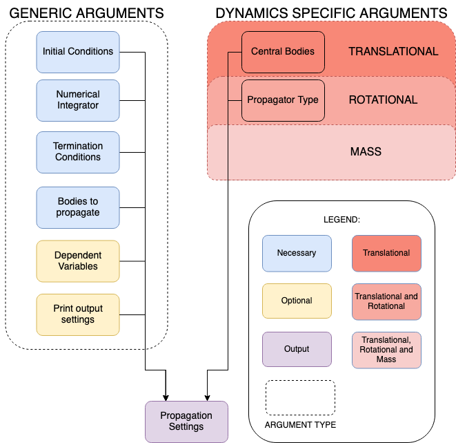

.. _propagation_setup:

=================
Propagation Setup
=================

.. toctree::
   :titlesonly:
   :hidden:
   :maxdepth: 1

   propagation-setup/translational
   propagation-setup/rotational
   propagation-setup/mass
   propagation-setup/multi-type
   propagation-setup/multi-body
   propagation-setup/multi-hybrid-arc
   propagation-setup/processed-propagated-elements
   propagation-setup/integration-setup
   propagation-setup/termination-settings
   propagation-setup/dependent-variables
   propagation-setup/printing-processing-results
   

In this part of the user guide, we will explain the relevant inputs as well as present the different
categories of numerical propagation.

.. explain how to define settings for a numerical propagation of
.. different types of dynamics, with a wide variety of available settings. The propagator settings allow you to define:
..
.. - The exact state derivative model (e.g. the equations of motion that are to be solved), including initial and final conditions
.. - The numerical integrator that is to be used to solve these equations of motion
.. - The list of output variables that are to be provided after thee propagation is finished
.. - The output that is to be printed to the console during the propagation
.. - ...

.. _propagation_inputs:

Inputs and setup
================

Using Tudat, you can propagate different kinds of equations of motion, including those for translation and/or rotational dynamics.
These equations can be propagated for one or more bodies, and over a single arc or multiple arcs.
The figure below gives an overview of the inputs that are required to define so-called propagator settings in Tudat

On the left is a list of arguments (some optional) that can be provided
to the propagator settings, regardless of their type:

- **Initial conditions** The initial time and state for the numerical propagation
- **Numerical integrator**: the solver used to create an approximate solution, described :ref:`here <integrator_setup>`. This setting is mandatory
- **List of propagated bodies**: the names of the bodies for which the dynamics is to be propagated.
- **Termination conditions**: when to terminate the propagation, described :ref:`here <termination_settings>`. This setting is mandatory
- **Dependent variables**: which quantities to save as output, in addition to the states, described :ref:`here <dependent_variables>`. These settings are optional (none by default).
- **Processing/output settings**: what to print to the terminal before, during and after propagation, and what to do with the numerical results after propagation, both described :ref:`here <auto_processing>`. This setting is optional (no terminal output or resetting of environment by default)

.. note::

   The initial state should always be provided in the 'typical' formulation (also called 'processed' formulation, for instance the Cartesian state for translational dynamics),
   regardless of propagator type (for translational dynamics, for instance, even wen using an Encke propagator)
   For more information, see :ref:`processed_propagated_states`.

.. _dynamics_types_intro:

Dynamics types
==============

There are a number different types of dynamics that Tudat can numerically propagate, settings for which are created by calling the associated functions in the `propagator module <https://py.api.tudat.space/en/latest/propagator.html#functions>`_. Below, we provide links for pages discussing each type in more detail

- :ref:`translational_dynamics`: the translational state of a body is propagated;
- :ref:`rotational_dynamics`: the rotational state of a body is propagated;
- :ref:`mass_dynamics`: the mass of a body is propagated.
- Custom Dynamics: an arbitrary user-defined state derivative model, see :func:`~tudatpy.numerical_simulation.propagation_setup.propagator.custom_state` (typically in the context of a multi-type propagation).

Furthermore, any combination of any number of types of dynamics for any number of bodies can be defined. Therefore,
in Tudat we also have:

- :ref:`multi_type_dynamics`: more than one dynamical quantity is propagated for a single body;
- :ref:`multi_body_dynamics`: only one dynamical quantity is propagated for multiple bodies;
- A combination of the two: more than one dynamical quantity is propagated for multiple bodies.

The above list defines different types of dynamics that are propagated over a single continuous arc.
Propagation using a :ref:`multi-arc setup <multi_arc_dynamics>` is also supported in Tudat.

